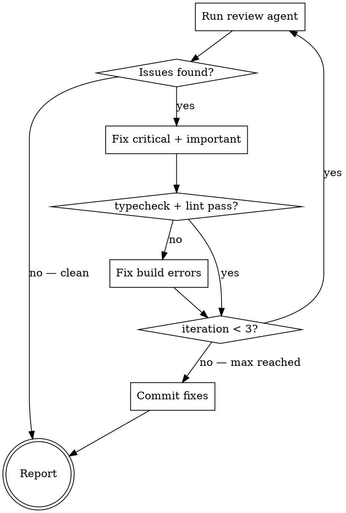

# SDK Review

Review and fix local changes (committed + staged + unstaged vs main) against project conventions in a loop until clean.

**Core principle:** The review agent reads CLAUDE.md/agent_docs — don't re-teach conventions here. This skill's value is the loop mechanics, prioritization rules, and expert knowledge about what review agents get wrong.

---

## Detect Changes

```bash
git diff --name-only main...HEAD   # committed
git diff --name-only --cached       # staged
git diff --name-only                # unstaged
```

Merge into one deduplicated set. If empty, report "Nothing to review" and stop.

---

## Review-Fix Loop (max 3 iterations)



---

## Step 1: Review

Launch an agent that reads CLAUDE.md (which loads Agents.md and agent_docs/ via `@` references), gets the full diff (`git diff main...HEAD` + `git diff --cached` + `git diff`), and returns a structured report classifying issues as **Critical**, **Important**, or **Suggestion** with file:line, violated rule, and recommended fix.

**Review scope: diff lines only.** Read full files for context (imports, class structure, surrounding code) but ONLY flag issues on lines that appear in the diff. Pre-existing issues on unchanged lines are out of scope — even if they violate conventions.

### Review agent calibration — what agents get wrong in this codebase

The conventions in agent_docs are comprehensive, but review agents consistently misjudge these areas:

**Over-reported (false positives to ignore):**
- JSDoc style preferences on existing methods not touched in the diff
- Suggesting `interface extends` when `type` intersection is the correct pattern per conventions.md
- Flagging `param || {}` on genuinely optional parameters (only flag on required params)
- Reporting missing tests for private helper methods — only public methods need tests
- Flagging field map entries that look like "case-only" renames but are actually semantic renames

**Under-reported (agents miss these — explicitly check):**
- `@track` decorator missing on new public methods — agents skip this 50% of the time
- JSDoc on ServiceModel not synced with service class implementation
- `export type * from` in barrel files instead of `export * from` (drops runtime values silently)
- Mock factories typed as `{Entity}GetResponse` instead of `Raw{Entity}GetResponse`
- Missing `docs/oauth-scopes.md` entry for new methods

**Ambiguous (ask user, don't auto-fix):**
- Whether a new method should have bound methods (depends on entity lifecycle)
- Endpoint grouping structure for new API domains
- Whether a field is optional or required in the response type (needs live API check)

---

## Step 2: Fix

Fix in priority order: **Critical** first, then **Important**.

**NEVER fix:**
- **Suggestions** — report to user, may involve design decisions
- **Files not in the diff** — pre-existing issues are out of scope
- **Public API type signatures** — changing return types or parameter types can break consumers; report instead
- **Test assertions** — changing what tests assert can mask real failures; report instead

After fixing, run `npm run typecheck` and `npm run lint`. If either fails, fix the build error before the next review iteration. If a build error persists after 2 attempts, stop and report it — don't loop on the same failure.

---

## Step 3: Commit

Only reached when fixes were made. Stage and commit:

```bash
git add <fixed files>
git commit -m "fix: address convention review comments"
```

**Do NOT push.** The user or calling skill (sdk-ship) decides when to push.

---

## Step 4: Report

```markdown
## SDK Review Summary

**Iterations:** X/3
**Status:** Clean | X issues remaining

### Fixed (Y items)
- [file:line] Brief description

### Remaining (if any)
- [file:line] Brief description — why not auto-fixed

### Suggestions (not auto-fixed)
- [file:line] Brief description — user decision needed
```

---

## NEVER

- **NEVER review files not in the diff** — pre-existing issues are not this skill's job
- **NEVER fix and re-review in the same iteration** — fix first, THEN re-run the review agent fresh
- **NEVER auto-fix the same issue differently across iterations** — if iteration 1 fixed X one way and iteration 2 flags X again, stop and report; don't oscillate
- **NEVER suppress typecheck/lint failures** — if a fix breaks the build, the fix is wrong
- **NEVER commit if no files were modified** — if review is clean from the start, skip commit entirely
- **NEVER continue past 3 iterations** — if issues remain, report them; infinite loops waste tokens and patience
