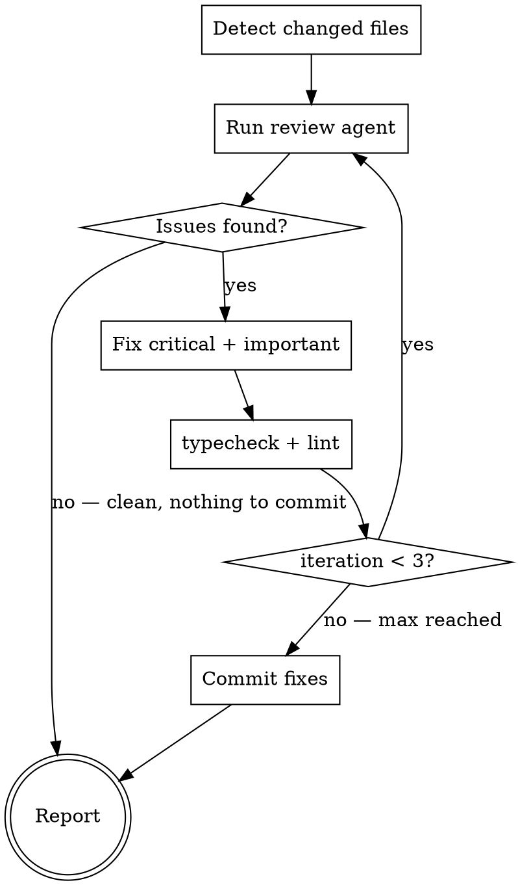

# SDK Review

Review and fix all local changes (committed + staged + unstaged vs main) against project conventions. Loops up to 3 times until clean, then commits fixes.

---

## Detect Changes

```bash
git diff --name-only main...HEAD   # committed
git diff --name-only --cached       # staged
git diff --name-only                # unstaged
```

Merge all three into one deduplicated set of changed files. If empty, report "Nothing to review" and stop.

---

## Review-Fix Loop (max 3 iterations)



When the review finds no issues, the loop exits immediately — no commit needed. Commit only happens when fixes were made (either after a clean re-review or after max iterations).

---

## Step 1: Review

Launch an agent to review all changed files against project conventions. The agent must:

1. **Read conventions** — CLAUDE.md, Agents.md, agent_docs/architecture.md, agent_docs/conventions.md, agent_docs/rules.md
2. **Get the full diff** — combine `git diff main...HEAD`, `git diff --cached`, and `git diff`
3. **Read each changed file in full** for context beyond the diff
4. **Review against conventions**, including:
   - Type naming (Response, Options, Raw types)
   - Service conventions (BaseService, `@track`, constructor JSDoc)
   - Endpoint constants (`as const`, parameterized functions, grouping)
   - Export conventions (barrel exports, subpath exports)
   - Test conventions (Arrange-Act-Assert, constants, mock factories, error scenarios)
   - Transform pipeline correctness
   - JSDoc quality (ServiceModel, `@example`, `@param`, `@returns`, synced with service class)
   - Code hygiene (no unused code, no `any`, no `as unknown as`)
   - Pagination and documentation updates
5. **Classify** each issue as **Critical**, **Important**, or **Suggestion**
6. **Return** file path, line number, violated rule (cite agent_docs), and recommended fix

---

## Step 2: Fix

Fix issues in priority order:

1. **Critical** — convention violations, bugs, missing required elements
2. **Important** — quality concerns, sync issues, redundant code

**Do NOT fix:**
- **Suggestions** — report to user (may involve design decisions)
- **Issues in files not changed on this branch** — pre-existing, out of scope

After fixing, run `npm run typecheck` and `npm run lint`. If either fails, fix before next iteration.

---

## Step 3: Commit

Only reached when fixes were made. Stage and commit:

```bash
git add <fixed files>
git commit -m "fix: address convention review comments"
```

**Do NOT push.** The user or calling skill (e.g., sdk-ship) decides when to push.

---

## Step 4: Report

```markdown
## SDK Review Summary

**Iterations:** X/3
**Status:** Clean | X issues remaining

### Fixed (Y items)
- [file:line] Brief description

### Remaining (if any)
- [file:line] Brief description — why not auto-fixed

### Suggestions (not auto-fixed)
- [file:line] Brief description — user decision needed
```
