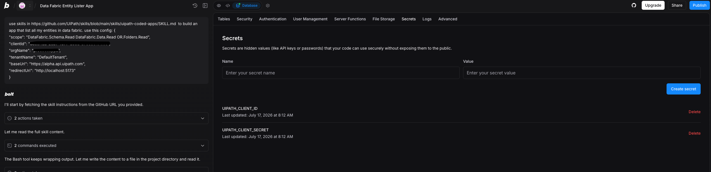
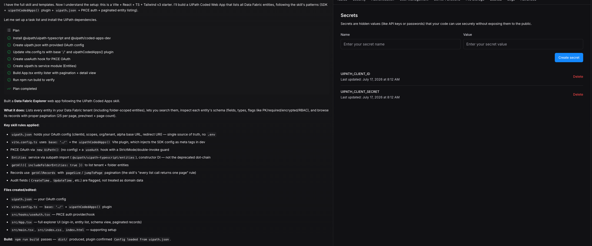
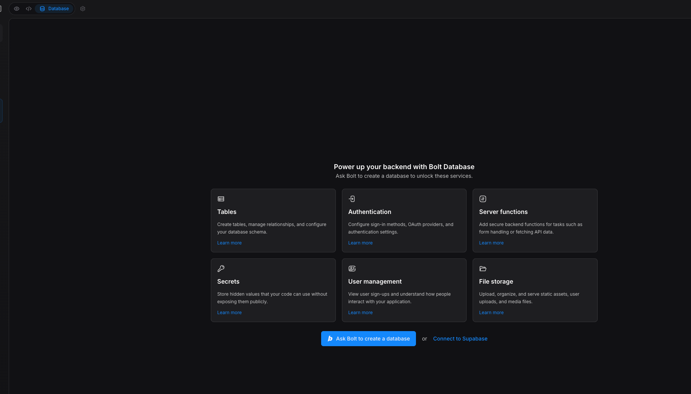
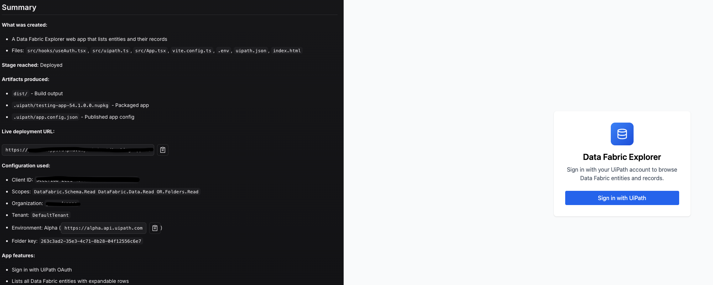

# Bolt

Build a UiPath coded web app in Bolt and deploy it to UiPath using `@uipath/uipath-typescript` and the `uip` CLI. Bolt generates the app in an in-browser WebContainer; you deploy it to UiPath from Bolt's terminal.

!!! info "Builds on Coded Apps"
    Bolt apps deploy as standard UiPath **coded apps**. This page covers the Bolt-specific steps; for platform, SDK, and CLI details see [Coded Apps](../coded-apps/getting-started.md).

---

## How it works

You build the app in Bolt with the UiPath coded-apps skill (so it uses `@uipath/uipath-typescript` and the correct coded-app structure), then deploy it with the `uip` CLI — build → pack → publish → deploy — directly from Bolt. The deployed app is served at `https://<org>.uipath.host/<app>`.

## Prerequisites

- A UiPath **Automation Cloud** account.
- Two external OAuth apps (UiPath Admin → **External Applications**):
    - a **non-confidential (public)** app — `clientId` + scopes, used for end-user **sign-in** inside the app (baked into the build; safe to expose in the browser).
    - a **confidential** app — `clientId` + `clientSecret`, used at **deploy** time by `uip login`. Give it scopes `Apps`, `OR.Folders.Read`, `OR.Execution`, and **assign it to the Orchestrator folder** you will deploy to.

See [Coded Apps → Getting Started](../coded-apps/getting-started.md) for the full external-app and `uipath.json` setup.

---

## Step 1 — Load the UiPath coded-apps skill

Pick one:

**Option 1 — reference the skill in your prompt (simplest).** Add this line to your Step 2 build prompt so Bolt's agent loads the skill directly from source:

```text
Use the UiPath coded-apps skill at https://github.com/UiPath/skills/blob/main/skills/uipath-coded-apps/SKILL.md
```

**Option 2 — install from npm.** Run `npm i @uipath/skills` in the Bolt terminal (Bolt's WebContainer can reach npm) and point your prompt at the coded-apps skill in that package. This pulls the published skill with no manual file prep, and always gets the latest version.



---

## Step 2 — Build your app

Prompt Bolt to build your app, passing your **public** sign-in config so the generated app can authenticate end users:

```text
Build a <describe your app> as a UiPath coded app using the uipath-coded-apps skill. Use this config:
{ "clientId": "<public-app-client-id>", "scope": "<scopes>", "orgName": "<org>", "tenantName": "<tenant>", "baseUrl": "https://api.uipath.com" }
```

!!! warning "Must be a static SPA"
    Coded apps are static sites — the build must emit `index.html` at the **dist root**. The skill scaffolds this for you; if the builder defaults to a server-rendered (SSR) framework, switch it to a static/SPA build. Bolt commonly scaffolds Vite apps — keep `base: './'` so assets resolve under the deployed base path.

---

## Step 3 — Add your deploy credentials

Bolt runs in an in-browser WebContainer. Provide your **confidential** app's secret to the deploy **without committing it**: enter it in the Bolt **terminal** at deploy time (for example `read -s UIPATH_CLIENT_SECRET`), or store it in a Bolt-managed secret/database and reference it from the terminal. Never paste the secret into chat or into a committed file.





---

## Step 4 — Deploy

In the Bolt terminal, supply the confidential secret (Step 3) and run the deploy. Bolt's WebContainer can reach npm and `*.uipath.com` (note: GitHub access is blocked in WebContainer):

```bash
uip login --client-id $UIPATH_CLIENT_ID --client-secret $UIPATH_CLIENT_SECRET \
  --organization <org> --tenant <tenant> \
  --scope "Apps OR.Folders.Read OR.Execution"
npm run build
uip codedapp pack dist -n <app-name> --version 1.0.0
uip codedapp publish
uip codedapp deploy --folder-key <folder-key>
```

Your app is live at:

```text
https://<org>.uipath.host/<app-name>
```



---

## Troubleshooting

- **GitHub-based steps fail** — Bolt's WebContainer blocks GitHub; use npm (`@uipath/skills`, `@uipath/cli`) rather than cloning from GitHub.
- **Secret not available to the shell** — Bolt does not expose secrets to the build shell the way Replit does; enter the secret in the terminal at deploy time (`read -s`).

Common to all builders:

- **`index.html not found` during `uip codedapp pack`** — the build is SSR or the dist root is nested. Switch to a static SPA build so `index.html` sits at the top of `dist/`.
- **`401` on publish/deploy** — the deploy identity lacks access. Use a **confidential app** (client id + secret) or a **PAT** with the scopes above, and make sure it is **assigned to the target Orchestrator folder**.
- **Assets 404 after deploy** — set Vite `base: './'` and use `getAppBase()` as your router basename. See [Coded Apps → Getting Started](../coded-apps/getting-started.md#pre-deployment-checklist).

---

## Related docs

- [Coded Apps → Getting Started](../coded-apps/getting-started.md)
- [Coded Apps → CLI Reference](../coded-apps/cli-reference.md)
- [CI/CD: GitHub Actions](../coded-apps/ci-cd-github-actions.md)
- [Authentication](../authentication.md)
