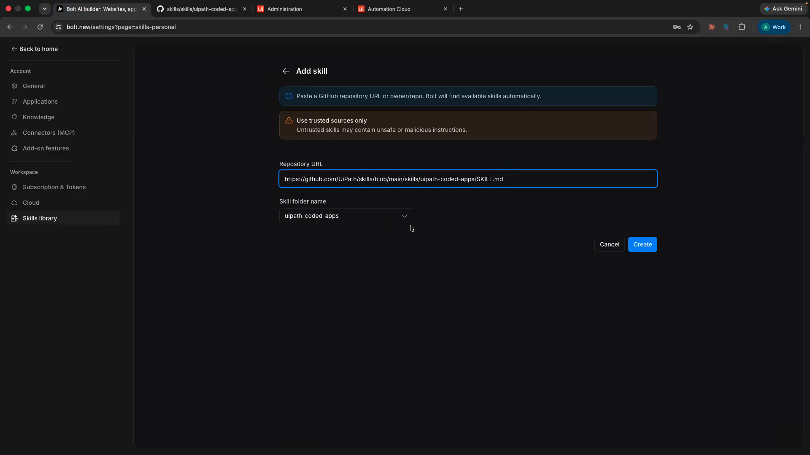
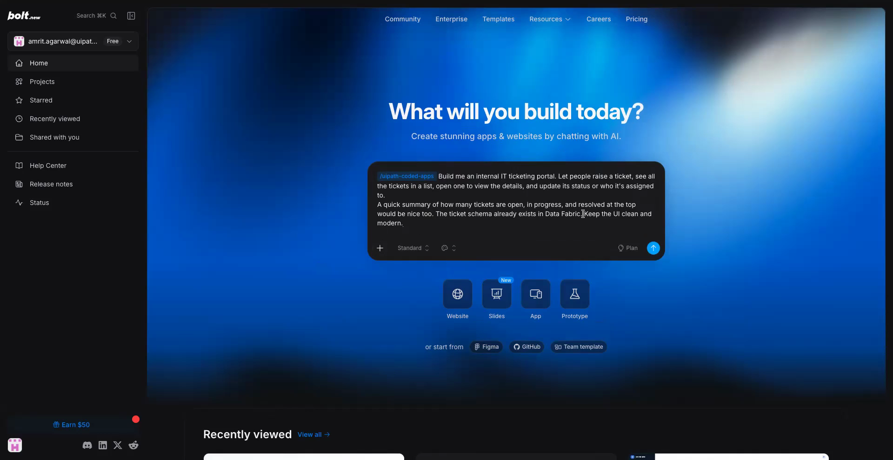
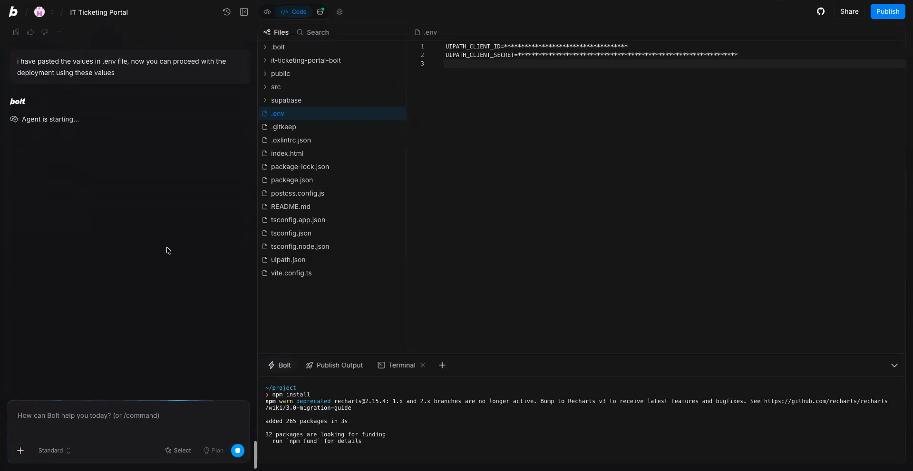
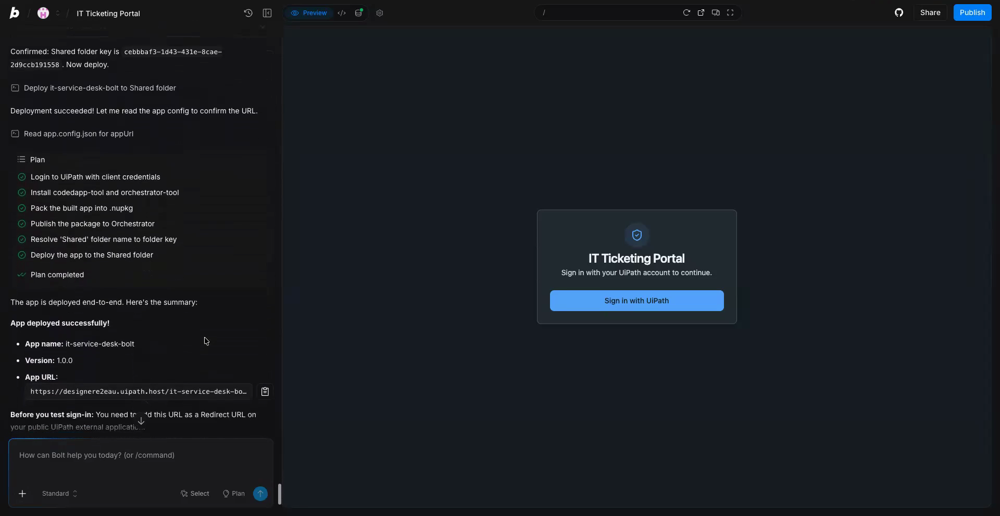
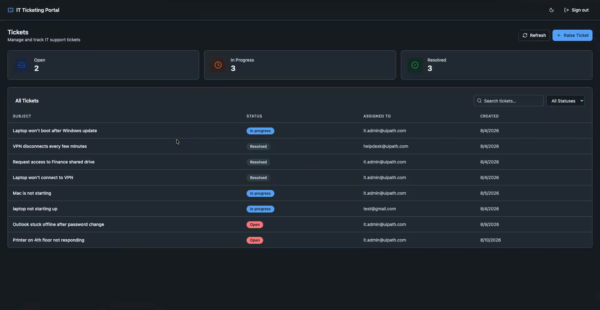

# Bolt

Build a UiPath coded web app in Bolt and deploy it to UiPath using `@uipath/uipath-typescript` and the `uip` CLI. Bolt generates the app in an in-browser WebContainer and deploys it for you, running the CLI in that same container.

!!! info "Builds on Coded Apps"
    Bolt apps deploy as standard UiPath **coded apps**. This page covers the Bolt-specific steps; for platform, SDK, and CLI details see [Coded Apps](../coded-apps/getting-started.md).

---

## Watch the walkthrough

The full build, start to finish — prompt to a live app on a UiPath tenant.

<div class="yt-embed">
  <iframe src="https://www.youtube-nocookie.com/embed/KVNzIzVjyn8?rel=0"
          title="Building and deploying a UiPath coded app with Bolt"
          loading="lazy" allowfullscreen
          allow="accelerometer; clipboard-write; encrypted-media; picture-in-picture; web-share"></iframe>
</div>

The other builders are in [Guides](guides/index.md).

---

## How it works

You build the app in Bolt with the UiPath coded-apps skill (so it uses `@uipath/uipath-typescript` and the correct coded-app structure), then ask it to deploy — the skill runs the `uip` CLI for you (build → pack → publish → deploy) inside Bolt. The deployed app is served at `https://<org>.uipath.host/<app>`.

## Prerequisites

- A UiPath **Automation Cloud** account.
- Two external OAuth apps (UiPath Admin → **External Applications**):
    - a **non-confidential (public)** app — `clientId` + scopes, used for end-user **sign-in** inside the app (baked into the build; safe to expose in the browser).
    - a **confidential** app — `clientId` + `clientSecret`, used at **deploy** time by `uip login`. Give it `Apps.Read` and `Apps.Write`, and **assign it to the Orchestrator folder** you will deploy to.

See [Coded Apps → Getting Started](../coded-apps/getting-started.md) for the full external-app and `uipath.json` setup.

---

## Step 1 — Load the UiPath coded-apps skill

Pick one:

**Option 1 — add it to your Skills library from GitHub (recommended).** In Bolt: **Settings → Skills library → Add skill → From GitHub**, paste the skill's link, and create it:

```text
https://github.com/UiPath/skills/blob/main/skills/uipath-coded-apps/SKILL.md
```

The skill lands in your workspace library. In the chat composer, attach it from the **+** menu (**+ → Skills → uipath-coded-apps**) or invoke it with `/uipath-coded-apps` — it appears in the prompt as a tag.



**Option 2 — reference the skill in your prompt.** Add the same link as a line in your Step 2 build prompt so Bolt's agent loads the skill directly from source:

```text
Use the UiPath coded-apps skill at https://github.com/UiPath/skills/blob/main/skills/uipath-coded-apps/SKILL.md
```

!!! warning "Enable the skill for the project"
    A workspace-library skill is not automatically active in a project. Open the project's **Settings → Skills** and enable `uipath-coded-apps` there too — otherwise Bolt reports the skill as unavailable even though it is in your library.

!!! note "Importing the skill as a ZIP"
    If you upload the skill as a ZIP instead, two Bolt-specific constraints apply:

    - Bolt's importer accepts **`.md` files only** — it rejects any other extension (`.css`, `.gz`, `.mjs`, …). Remove or wrap non-markdown assets before zipping.
    - Remove the `allowed-tools:` line from the `SKILL.md` frontmatter. It whitelists Claude Code tool names; Bolt enforces the list literally against its own (differently named) tools, which blocks every tool call — including the one needed to deactivate the skill — and deadlocks the agent.


---

## Step 2 — Build your app

With the skill loaded, just describe the app you want in plain language — there is no special wording or UiPath boilerplate to add. The skill handles the coded-app scaffolding for you.

The builder asks for the connection details it needs — organization, tenant, Data Fabric entity, and the public app's client ID — as it goes, so you don't supply them up front.



!!! warning "Must be a static SPA"
    Coded apps are static sites — the build must emit `index.html` at the **dist root**. The skill scaffolds this for you; if the builder defaults to a server-rendered (SSR) framework, switch it to a static/SPA build. Bolt commonly scaffolds Vite apps — keep `base: './'` so assets resolve under the deployed base path.

---

## Step 3 — Add your deploy credentials

Bolt's managed secrets are **not exposed to the shell** its agent runs commands in, so the practical route is a **`.env` file** in the project:

1. Ask Bolt to create a `.env` with empty `UIPATH_CLIENT_ID` and `UIPATH_CLIENT_SECRET` keys and add `.env` to `.gitignore`.
2. Fill the two values in yourself, **directly in the file** — Bolt's editor masks `.env` values on screen.

Never paste the secret into chat: chat is stored with the project (visible to anyone it's shared with), it enters the model's context, and agents have been known to hard-code pasted secrets into generated source. Typing the values into `.env` yourself keeps them out of both.



---

## Step 4 — Deploy

Just ask Bolt to deploy. Name the Orchestrator folder you want the app in — the skill resolves it and runs the whole `uip` pipeline in Bolt's terminal, reading the `.env` you filled in (Step 3):

```text
Deploy this app to UiPath in the <folder-name> folder, using the credentials in .env.
```

Bolt's WebContainer can reach npm and `*.uipath.com`, so the whole pipeline runs in place (note: GitHub access is blocked in WebContainer). The skill signs in, builds, packs, publishes and deploys, then reports the hosted URL:

```text
https://<org>.uipath.host/<app-name>
```



Open that URL and sign in to see the finished app:



!!! tip "Alternative — run the deploy yourself"
    If prompting gives you trouble (agent stuck mid-deploy, `.env` not picked up), open Bolt's **terminal** and run the same steps by hand:

    ```bash
    set -a; source .env; set +a   # .env is not auto-loaded into the shell
    uip login --client-id $UIPATH_CLIENT_ID --client-secret $UIPATH_CLIENT_SECRET \
      --organization <org> --tenant <tenant> \
      --scope "OR.Default Apps.Read Apps.Write"
    npm run build
    uip codedapp pack dist -n <app-name> --version 1.0.0
    uip codedapp publish
    uip codedapp deploy --folder-key <folder-key>   # uip or folders list --output json
    ```

---

## Troubleshooting

- **Agent says the skill "isn't available" although it's in your library** — the skill isn't enabled for this project. Project **Settings → Skills** → enable it, then start a new chat.
- **Agent locks up after activating the skill ("not in the allowed-tools union")** — the skill was ZIP-imported with its `allowed-tools:` frontmatter intact. Delete the custom skill, strip that line from `SKILL.md`, re-upload, and start a new chat (see Step 1).
- **ZIP import rejects a file ("unsupported extension")** — Bolt's skill importer accepts only `.md` files. Remove or markdown-wrap other assets before zipping.
- **GitHub-based steps fail in the terminal** — Bolt's WebContainer blocks GitHub; use npm (`@uipath/skills`, `@uipath/cli`) rather than cloning from GitHub.
- **Secret not available to the shell** — Bolt does not expose its managed secrets to the shell; use the `.env` route from Step 3.
- **Sign-in fails with `Invalid redirect_uri` in the preview** — the WebContainer preview URL (`https://…webcontainer-api.io`) is the app's real origin; `localhost` never works there. Set `uipath.json` → `redirectUri` to the preview URL and register it (with and without trailing slash — matching is exact) on the **public** external app. The hostname changes between sessions, so for anything beyond a quick test register the app's published URL instead.
- **Deploy says the app is "already deployed" and won't upgrade** — an app with that name was deployed from a *different* project; the CLI can only upgrade deployments made from the same registration. Publish and deploy under a new name (or delete the existing deployed app in UiPath first).
- **Deploy says the version "has not been published yet"** — usually caused by passing `--version`; omit it so deploy targets Latest, and keep publish and deploy in the same `uip login` session.

Common to all builders:

- **`index.html not found` during `uip codedapp pack`** — the build is SSR or the dist root is nested. Switch to a static SPA build so `index.html` sits at the top of `dist/`.
- **`401` on publish/deploy** — the deploy identity lacks access. Use a **confidential app** (client id + secret) or a **PAT** with the scopes above, and make sure it is **assigned to the target Orchestrator folder**.
- **Assets 404 after deploy** — set Vite `base: './'` and use `getAppBase()` as your router basename. See [Coded Apps → Getting Started](../coded-apps/getting-started.md#pre-deployment-checklist).

---

## Related docs

- [App Builder Integrations → Getting Started](getting-started.md)
- [Coded Apps → Getting Started](../coded-apps/getting-started.md)
- [Coded Apps → CLI Reference](../coded-apps/cli-reference.md)
- [CI/CD: GitHub Actions](../coded-apps/ci-cd-github-actions.md)
- [Authentication](../authentication.md)
