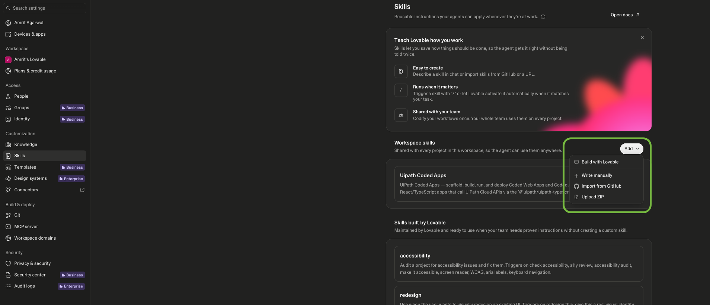
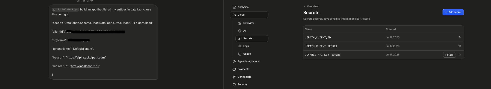
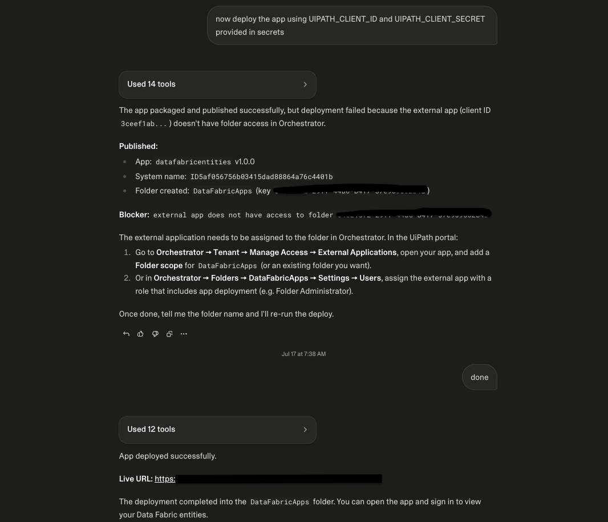

# Lovable

Build a UiPath coded web app in Lovable and deploy it to UiPath using `@uipath/uipath-typescript` and the `uip` CLI. Lovable generates the app; you deploy it to UiPath from Lovable, which can read secrets stored in Lovable Cloud from its build sandbox.

!!! info "Builds on Coded Apps"
    Lovable apps deploy as standard UiPath **coded apps**. This page covers the Lovable-specific steps; for platform, SDK, and CLI details see [Coded Apps](../coded-apps/getting-started.md).

---

## How it works

You build the app in Lovable with the UiPath coded-apps skill (so it uses `@uipath/uipath-typescript` and the correct coded-app structure), then deploy it with the `uip` CLI — build → pack → publish → deploy — directly from Lovable. The deployed app is served at `https://<org>.uipath.host/<app>`.

## Prerequisites

- A UiPath **Automation Cloud** account.
- Two external OAuth apps (UiPath Admin → **External Applications**):
    - a **non-confidential (public)** app — `clientId` + scopes, used for end-user **sign-in** inside the app (baked into the build; safe to expose in the browser).
    - a **confidential** app — `clientId` + `clientSecret`, used at **deploy** time by `uip login`. Give it scopes `Apps`, `OR.Folders.Read`, `OR.Execution`, and **assign it to the Orchestrator folder** you will deploy to.

See [Coded Apps → Getting Started](../coded-apps/getting-started.md) for the full external-app and `uipath.json` setup.

---

## Step 1 — Load the UiPath coded-apps skill

Pick one:

**Option 1 — reference the skill in your prompt (simplest).** Add this line to your Step 2 build prompt so Lovable's agent loads the skill directly from source:

```text
Use the UiPath coded-apps skill at https://github.com/UiPath/skills/blob/main/skills/uipath-coded-apps/SKILL.md
```

**Option 2 — import it as a workspace skill (zip).** Download **only** the [`skills/uipath-coded-apps`](https://github.com/UiPath/skills/tree/main/skills/uipath-coded-apps) folder from the UiPath skills repo — not the whole repo, which is far too large to load as a skill — zip that folder, and add it as a workspace skill. Importing directly from a git URL is not reliable today because the skills repo uses symlinks, so use a zip of just this folder.



---

## Step 2 — Build your app

Prompt Lovable to build your app, passing your **public** sign-in config so the generated app can authenticate end users:

```text
Build a <describe your app> as a UiPath coded app using the uipath-coded-apps skill. Use this config:
{ "clientId": "<public-app-client-id>", "scope": "<scopes>", "orgName": "<org>", "tenantName": "<tenant>", "baseUrl": "https://api.uipath.com" }
```

!!! warning "Must be a static SPA"
    Coded apps are static sites — the build must emit `index.html` at the **dist root**. The skill scaffolds this for you. If Lovable defaults to a **server-rendered** app (for example TanStack Start), switch it to a **static SPA** build (enable SPA mode) so `npm run build` emits `index.html` at the dist root — otherwise `uip codedapp pack` will reject it.

---

## Step 3 — Add your deploy credentials

Add your **confidential** app's credentials in **Lovable Cloud → Secrets**: `UIPATH_CLIENT_ID` and `UIPATH_CLIENT_SECRET`. These secrets are securely accessible to Lovable's build sandbox, so `uip login` can read them at deploy time — the secret stays out of chat and code.



---

## Step 4 — Deploy

Prompt Lovable to deploy. It runs the CLI in the sandbox, reading the stored secrets (if the CLI is not preinstalled it is invoked via `npx @uipath/cli`):

```bash
uip login --client-id <UIPATH_CLIENT_ID> --client-secret <UIPATH_CLIENT_SECRET> \
  --organization <org> --tenant <tenant> \
  --scope "Apps OR.Folders.Read OR.Execution"
npm run build
uip codedapp pack dist -n <app-name> --version 1.0.0
uip codedapp publish
uip codedapp deploy --folder-key <folder-key>
```

Your app is live at:

```text
https://<org>.uipath.host/<app-name>
```



---

## Troubleshooting

- **Skill import from a git URL fails** — upload the coded-apps skill as a zip instead (the skills repo's symlinks break direct git import).

Common to all builders:

- **`index.html not found` during `uip codedapp pack`** — the build is SSR or the dist root is nested. Switch to a static SPA build so `index.html` sits at the top of `dist/`.
- **`401` on publish/deploy** — the deploy identity lacks access. Use a **confidential app** (client id + secret) or a **PAT** with the scopes above, and make sure it is **assigned to the target Orchestrator folder**.
- **Assets 404 after deploy** — set Vite `base: './'` and use `getAppBase()` as your router basename. See [Coded Apps → Getting Started](../coded-apps/getting-started.md#pre-deployment-checklist).

---

## Related docs

- [Coded Apps → Getting Started](../coded-apps/getting-started.md)
- [Coded Apps → CLI Reference](../coded-apps/cli-reference.md)
- [CI/CD: GitHub Actions](../coded-apps/ci-cd-github-actions.md)
- [Authentication](../authentication.md)
