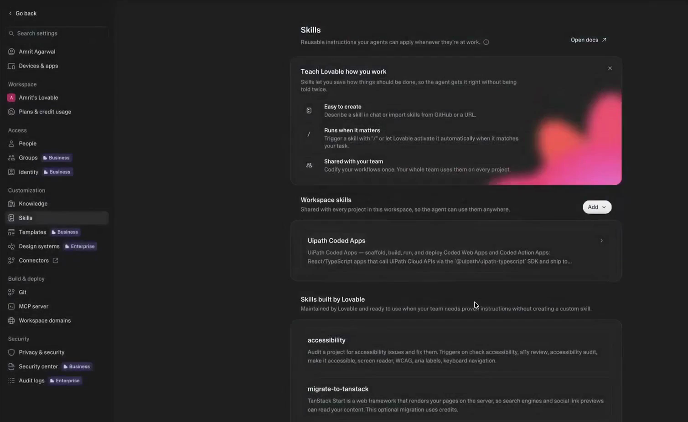
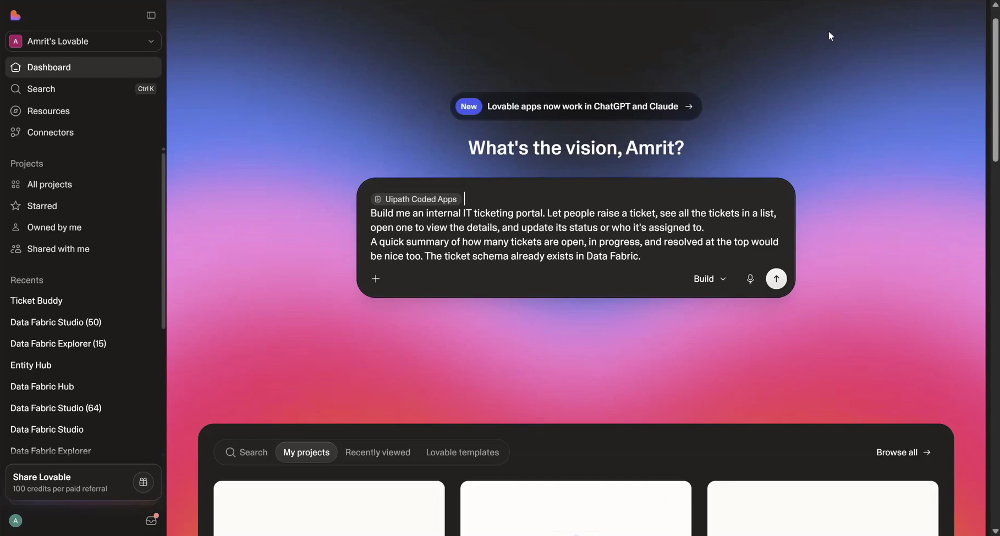
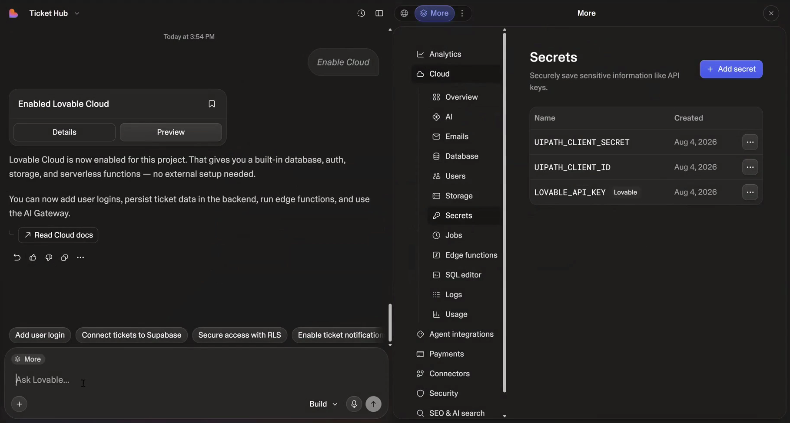
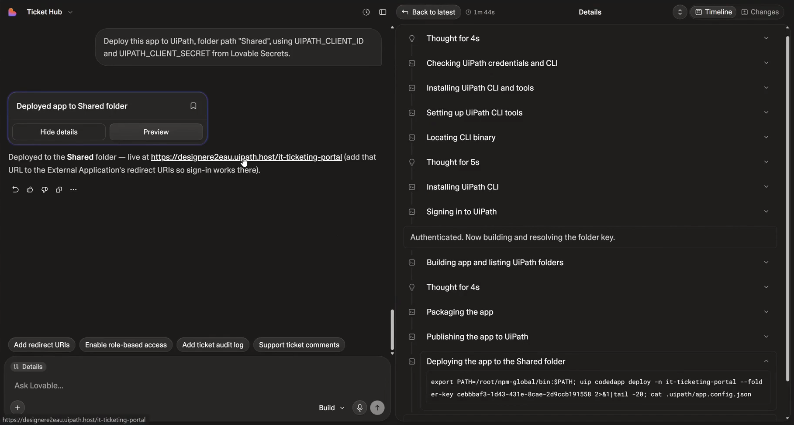
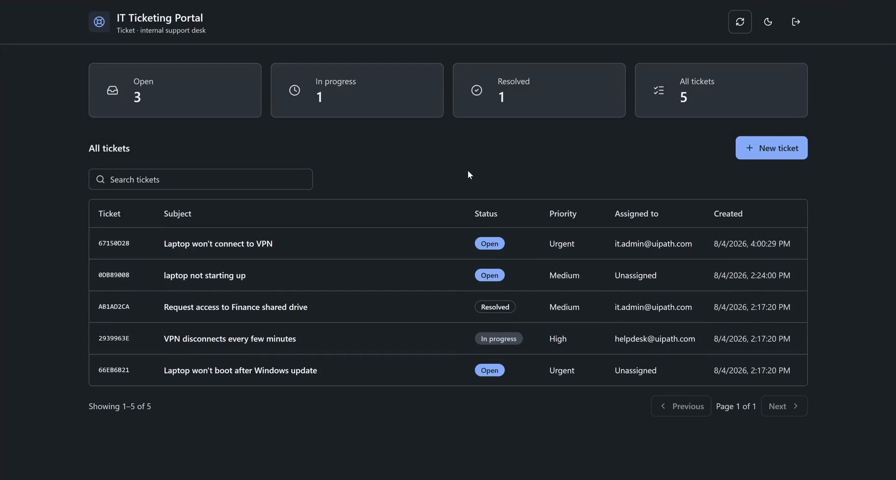

# Lovable

Build a UiPath coded web app in Lovable and deploy it to UiPath using `@uipath/uipath-typescript` and the `uip` CLI. Lovable generates the app and deploys it for you, running the CLI in its build sandbox, which can read secrets stored in Lovable Cloud.

!!! info "Builds on Coded Apps"
    Lovable apps deploy as standard UiPath **coded apps**. This page covers the Lovable-specific steps; for platform, SDK, and CLI details see [Coded Apps](../coded-apps/getting-started.md).

---

## Watch the walkthrough

The full build, start to finish — prompt to a live app on a UiPath tenant.

<div class="yt-embed">
  <iframe src="https://www.youtube-nocookie.com/embed/nqDI5v1z3hs?rel=0"
          title="Building and deploying a UiPath coded app with Lovable"
          loading="lazy" allowfullscreen
          allow="accelerometer; clipboard-write; encrypted-media; picture-in-picture; web-share"></iframe>
</div>

The other builders are in the [video gallery](videos.md).

---

## How it works

You build the app in Lovable with the UiPath coded-apps skill (so it uses `@uipath/uipath-typescript` and the correct coded-app structure), then ask it to deploy — the skill runs the `uip` CLI for you (build → pack → publish → deploy) inside Lovable. The deployed app is served at `https://<org>.uipath.host/<app>`.

## Prerequisites

- A UiPath **Automation Cloud** account.
- Two external OAuth apps (UiPath Admin → **External Applications**):
    - a **non-confidential (public)** app — `clientId` + scopes, used for end-user **sign-in** inside the app (baked into the build; safe to expose in the browser).
    - a **confidential** app — `clientId` + `clientSecret`, used at **deploy** time by `uip login`. Give it `Apps.Read` and `Apps.Write`, and **assign it to the Orchestrator folder** you will deploy to.

See [Coded Apps → Getting Started](../coded-apps/getting-started.md) for the full external-app and `uipath.json` setup.

---

## Step 1 — Load the UiPath coded-apps skill

Pick one:

**Option 1 — reference the skill in your prompt (simplest).** Add this line to your Step 2 build prompt so Lovable's agent loads the skill directly from source:

```text
Use the UiPath coded-apps skill at https://github.com/UiPath/skills/blob/main/skills/uipath-coded-apps/SKILL.md
```

**Option 2 — import it as a workspace skill (zip).** Download **only** the [`skills/uipath-coded-apps`](https://github.com/UiPath/skills/tree/main/skills/uipath-coded-apps) folder from the UiPath skills repo — not the whole repo, which is far too large to load as a skill — zip that folder, and add it as a workspace skill. Importing directly from a git URL is not reliable today because the skills repo uses symlinks, so use a zip of just this folder.



---

## Step 2 — Build your app

With the skill loaded, just describe the app you want in plain language — there is no special wording or UiPath boilerplate to add. The skill handles the coded-app scaffolding for you.

The builder asks for the connection details it needs — organization, tenant, Data Fabric entity, and the public app's client ID — as it goes, so you don't supply them up front.



!!! warning "Must be a static SPA"
    Coded apps are static sites — the build must emit `index.html` at the **dist root**. The skill scaffolds this for you. If Lovable defaults to a **server-rendered** app (for example TanStack Start), switch it to a **static SPA** build (enable SPA mode) so `npm run build` emits `index.html` at the dist root — otherwise `uip codedapp pack` will reject it.

---

## Step 3 — Add your deploy credentials

Add your **confidential** app's credentials in **Lovable Cloud → Secrets**: `UIPATH_CLIENT_ID` and `UIPATH_CLIENT_SECRET`. These secrets are securely accessible to Lovable's build sandbox, so `uip login` can read them at deploy time — the secret stays out of chat and code.



---

## Step 4 — Deploy

Just ask Lovable to deploy. Name the Orchestrator folder you want the app in — the skill resolves it and runs the whole `uip` pipeline in the sandbox, reading the secrets you stored in Step 3:

```text
Deploy this app to UiPath in the <folder-name> folder, using UIPATH_CLIENT_ID and UIPATH_CLIENT_SECRET from Lovable Cloud secrets.
```

The skill signs in, builds, packs, publishes and deploys (invoking the CLI via `npx @uipath/cli` if it isn't preinstalled), then reports the hosted URL:

```text
https://<org>.uipath.host/<app-name>
```



Open that URL and sign in to see the finished app:



---

## Troubleshooting

- **Skill import from a git URL fails** — upload the coded-apps skill as a zip instead (the skills repo's symlinks break direct git import).

Common to all builders:

- **`index.html not found` during `uip codedapp pack`** — the build is SSR or the dist root is nested. Switch to a static SPA build so `index.html` sits at the top of `dist/`.
- **`401` on publish/deploy** — the deploy identity lacks access. Use a **confidential app** (client id + secret) or a **PAT** with the scopes above, and make sure it is **assigned to the target Orchestrator folder**.
- **Assets 404 after deploy** — set Vite `base: './'` and use `getAppBase()` as your router basename. See [Coded Apps → Getting Started](../coded-apps/getting-started.md#pre-deployment-checklist).
- **Sign-in fails (`invalid_scope` / `Invalid redirect_uri`) or deploy behaves oddly** — see [Troubleshooting sign-in](getting-started.md#troubleshooting-sign-in-all-builders) and [Deploy pitfalls](getting-started.md#deploy-pitfalls-all-builders).

---

## Related docs

- [AI App Builders → Getting Started](getting-started.md)
- [Coded Apps → Getting Started](../coded-apps/getting-started.md)
- [Coded Apps → CLI Reference](../coded-apps/cli-reference.md)
- [CI/CD: GitHub Actions](../coded-apps/ci-cd-github-actions.md)
- [Authentication](../authentication.md)
