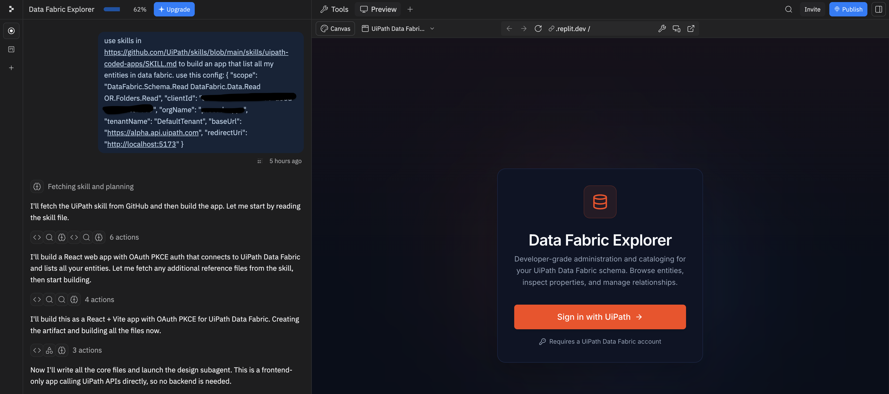
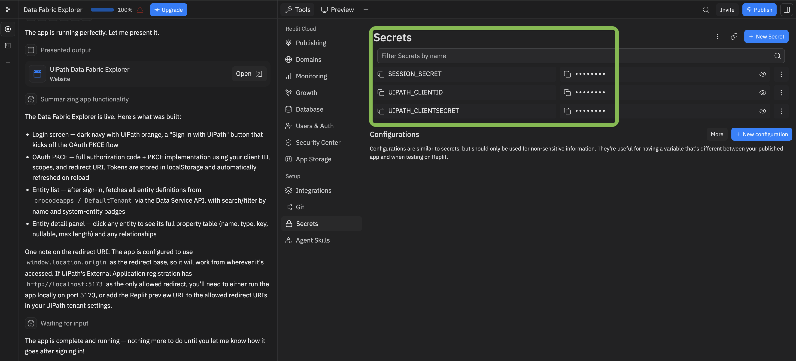
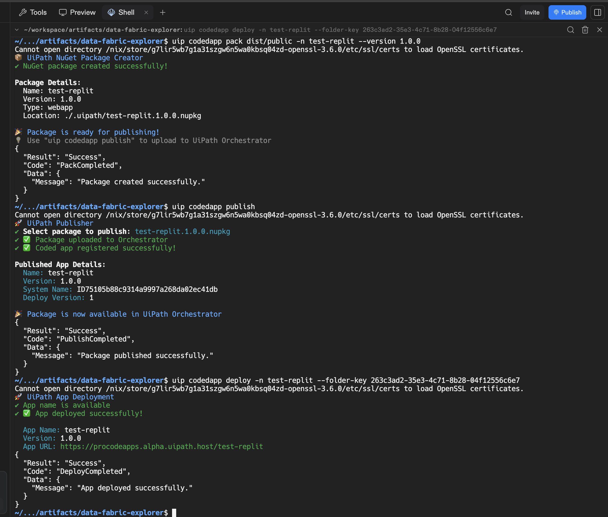

# Replit

Build a UiPath coded web app in Replit and deploy it to UiPath using `@uipath/uipath-typescript` + the `uip` CLI. Replit generates the app; you deploy it to UiPath from the Replit shell, which can read your stored Secrets.

!!! info "Builds on Coded Apps"
    Replit apps deploy as standard UiPath **coded apps**. This page covers the Replit-specific steps; for platform, SDK, and CLI details see [Coded Apps](../coded-apps/getting-started.md).

---

## How it works

You build the app in Replit with the UiPath coded-apps skill (so it uses `@uipath/uipath-typescript` and the correct coded-app structure), then deploy it with the `uip` CLI — build → pack → publish → deploy — directly from Replit. The deployed app is served at `https://<org>.uipath.host/<app>`.

## Prerequisites

- A UiPath **Automation Cloud** account.
- Two external OAuth apps (UiPath Admin → **External Applications**):
    - a **non-confidential (public)** app — `clientId` + scopes, used for end-user **sign-in** inside the app (baked into the build; safe to expose in the browser).
    - a **confidential** app — `clientId` + `clientSecret`, used at **deploy** time by `uip login`. Give it scopes `Apps`, `OR.Folders.Read`, `OR.Execution`, and **assign it to the Orchestrator folder** you will deploy to.

See [Coded Apps → Getting Started](../coded-apps/getting-started.md) for the full external-app and `uipath.json` setup.

---

## Step 1 — Load the UiPath coded-apps skill

Pick one:

**Option 1 — reference the skill in your prompt (simplest).** Add this line to your Step 2 build prompt so Replit's agent loads the skill directly from source:

```text
Use the UiPath coded-apps skill at https://github.com/UiPath/skills/blob/main/skills/uipath-coded-apps/SKILL.md
```

**Option 2 — install from npm.** Replit has a shell, so run `npm i @uipath/skills` in the **Shell** and point your prompt at the coded-apps skill in that package. This pulls the published skill with no manual download or zip, and always gets the latest version.

**Option 3 — import it as a Replit skill (zip).** For a persistent workspace skill: download **only** the [`skills/uipath-coded-apps`](https://github.com/UiPath/skills/tree/main/skills/uipath-coded-apps) folder from the UiPath skills repo — not the whole repo, which is far too large to load as a skill — zip that folder, and upload it via **Import code or design**. (On paid plans you can install a folder as a skill directly.)



---

## Step 2 — Build your app

Prompt Replit to build your app, passing your **public** sign-in config so the generated app can authenticate end users:

```text
Build a <describe your app> as a UiPath coded app using the uipath-coded-apps skill. Use this config:
{ "clientId": "<public-app-client-id>", "scope": "<scopes>", "orgName": "<org>", "tenantName": "<tenant>", "baseUrl": "https://api.uipath.com" }
```

!!! warning "Must be a static SPA"
    Coded apps are static sites — the build must emit `index.html` at the **dist root**. The skill scaffolds this for you; if the builder defaults to a server-rendered (SSR) framework, switch it to a static/SPA build.

---

## Step 3 — Add your deploy credentials

Add your **confidential** app's credentials in Replit's built-in **Secrets** (Tools → Secrets): `UIPATH_CLIENT_ID` and `UIPATH_CLIENT_SECRET`. Replit exposes Secrets as environment variables **in the shell**, so `uip login` can read them at deploy time — no secret in chat or code.



---

## Step 4 — Deploy

In the Replit **Shell**, run the deploy; `uip login` reads the Secrets you set in Step 3:

```bash
uip login --client-id $UIPATH_CLIENT_ID --client-secret $UIPATH_CLIENT_SECRET \
  --organization <org> --tenant <tenant> \
  --scope "Apps OR.Folders.Read OR.Execution"
npm run build
uip codedapp pack dist -n <app-name> --version 1.0.0
uip codedapp publish
uip codedapp deploy --folder-key <folder-key>
```

Your app is live at:

```text
https://<org>.uipath.host/<app-name>
```



---

## Troubleshooting

- **Skill *import* won't accept a git URL** — Replit's skill-import UI takes a zip (or a folder on paid plans), not an arbitrary git URL. This is only about the import UI: referencing the skill's `SKILL.md` URL in your *prompt* (Step 1, Option 1) still works. So for a persistent imported skill, use a zip.

Common to all builders:

- **`index.html not found` during `uip codedapp pack`** — the build is SSR or the dist root is nested. Switch to a static SPA build so `index.html` sits at the top of `dist/`.
- **`401` on publish/deploy** — the deploy identity lacks access. Use a **confidential app** (client id + secret) or a **PAT** with the scopes above, and make sure it is **assigned to the target Orchestrator folder**.
- **Assets 404 after deploy** — set Vite `base: './'` and use `getAppBase()` as your router basename. See [Coded Apps → Getting Started](../coded-apps/getting-started.md#pre-deployment-checklist).

---

## Related docs

- [Coded Apps → Getting Started](../coded-apps/getting-started.md)
- [Coded Apps → CLI Reference](../coded-apps/cli-reference.md)
- [CI/CD: GitHub Actions](../coded-apps/ci-cd-github-actions.md)
- [Authentication](../authentication.md)
