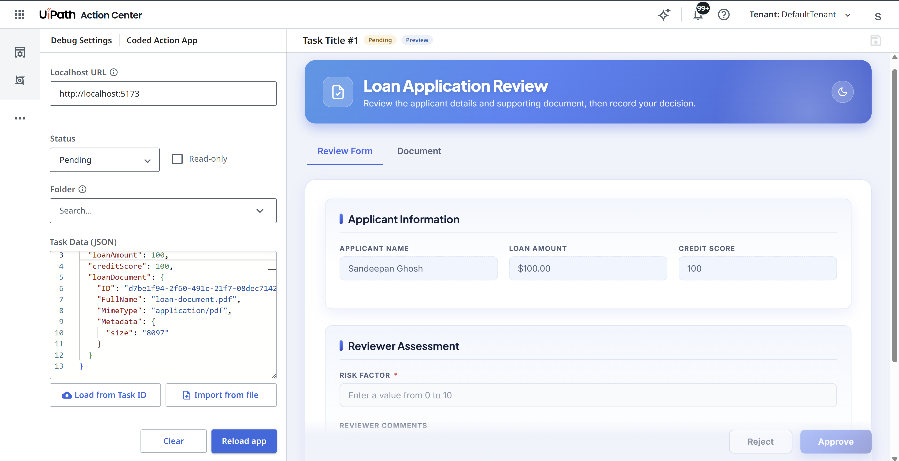

# Getting Started

**Coded Action Apps** let you build the user interface for Action Center tasks as custom web applications. This gives full control over the task layout, behavior, integrations and lets the app surface data from other UiPath services and external systems so reviewers have the context they need to complete the task.

!!! warning "Cloud only"
    Coded Action Apps are currently available on **UiPath Automation Cloud** only. Automation Suite and Dedicated deployments are not supported at this time.

!!! tip "Communicating with Action Center"
    To exchange task data with Action Center from within your app (receive the task, notify of changes, complete the task), use the [`@uipath/coded-action-app` SDK](../coded-action-app-sdk/getting-started.md).

---

## Prerequisites

- **Node.js** 20.x or higher
- **npm** 8.x or higher

## Install the CLI

<!-- termynal -->

```bash
$ npm install -g @uipath/cli

$ uip tools install codedapp
```

!!! info "Minimum versions"
    Coded Action Apps requires **CLI version >= 0.9.0** and **codedapp tool version >= 0.9.0**.

    Check your installed CLI version:

    ```bash
    uip --version
    ```

    Check your installed codedapp tool version:

    ```bash
    uip tools list
    ```

    To update the codedapp tool to the latest version:

    ```bash
    uip tools update
    ```

---

## Install the Coded Action App SDK

A coded action app runs inside a sandboxed iframe rendered by Action Center, so it can't read or write task data directly — the action app and its Action Center host live in separate browsing contexts. The [`@uipath/coded-action-app`](../coded-action-app-sdk/getting-started.md) SDK bridges that gap and wraps the underlying `window.postMessage` protocol behind a small, typed `CodedActionApp` API.

Use the SDK to:

- **Receive** the task and its data when your app loads — `getTask()`
- **Notify** Action Center when the user edits the form, so it can enable the Save button — `setTaskData()`
- **Complete** the task with the chosen action and final payload — `completeTask()`
- **Display** toast messages inside Action Center — `showMessage()`

A minimal flow looks like this:

```typescript
import { CodedActionApp } from '@uipath/coded-action-app';

const service = new CodedActionApp();

// 1. Load the task when the app starts
const task = await service.getTask();
console.log(task.title, task.data);

// 2. Tell Action Center the form changed (enables Save button)
service.setTaskData({ ...task.data, approved: true });

// 3. Complete the task when the user submits
const result = await service.completeTask('Approve', { approved: true, notes: 'Looks good' });
if (!result.success) {
  console.error(result.errorMessage);
}
```

See the [SDK Getting Started guide](../coded-action-app-sdk/getting-started.md) for the full API and usage details.

---

### Which SDKs do I need in my coded action app?

Every coded action app uses **two packages**, recommended to always use both for deployment compatibility using UiPath Solutions:

- **`@uipath/coded-action-app`** — talks to Action Center (`getTask`, `setTaskData`, `completeTask`, `showMessage`). This is the package shown above.
- **[`@uipath/uipath-typescript`](https://www.npmjs.com/package/@uipath/uipath-typescript)** (`npm install @uipath/uipath-typescript`) — provides `getAppBase()`, which you must use to set your app's base path so it resolves correctly behind the `<base href>` Action Center injects (see [Configure router base path](#2-configure-router-base-path-if-using-a-router)).

Whether you need an OAuth `clientId` depends only on **what your app does** — not on which SDKs you install:

| If your app: | Needs `clientId`? |
|----------------|-------------------|
| Reads/completes the task only | No |
| Also calls other UiPath services (Orchestrator, Data Fabric, etc.) | **Yes** |

!!! note "`getAppBase()` does not require a `clientId`"
    `@uipath/uipath-typescript` serves two **independent** purposes. Calling `getAppBase()` to set your base path is a purely client-side helper and needs **no** OAuth `clientId`. You only need a `clientId` (from a registered external application) when you use the same SDK to call UiPath service APIs.

---

## Configure `uipath.json`

Create a `uipath.json` at the root of your project. This file holds SDK and OAuth configuration used both during local development and at deployment time.

```json
{
  "clientId": "your-oauth-client-id",
  "scope": "your-scopes",
  "orgName": "your-org",
  "tenantName": "your-tenant",
  "baseUrl": "https://api.uipath.com",
  "redirectUri": "Irrelevant for coded action apps, use any non-empty string"
}
```

| Field | Required | Description |
|-------|----------|-------------|
| `clientId` | Conditional | A **non-confidential** OAuth client ID from an external application registered in your UiPath org. **Required only if your app calls other UiPath services**; not needed for apps that only interact with Action Center |
| `scope` | Conditional | OAuth scopes your app needs. Only applies when `clientId` is set — scopes are bound to the client, so with no `clientId` there is no `scope`. Defaults to all scopes registered with the provided `clientId` |
| `orgName` | No | Your UiPath organization name or ID |
| `tenantName` | No | Your UiPath tenant name or ID |
| `baseUrl` | No | UiPath platform base URL (defaults to `https://api.uipath.com`) |
| `redirectUri` | No | OAuth redirect URI (only needed for local dev) |

!!! tip
    If `uipath.json` doesn't exist, `uip codedapp pack` creates it with empty values and warns you to fill in the required fields.

---

## Set Up Local Development (Optional)

### 1. Install `@uipath/coded-apps-dev`
Install `@uipath/coded-apps-dev` - a bundler plugin that injects SDK configuration into your app during local development, so you can run and test it against your UiPath tenant without any manual config.

=== "npm"

    <!-- termynal -->

    ```bash
    $ npm install --save-dev @uipath/coded-apps-dev
    ```

=== "yarn"

    <!-- termynal -->

    ```bash
    $ yarn add --dev @uipath/coded-apps-dev
    ```

=== "pnpm"

    <!-- termynal -->

    ```bash
    $ pnpm add --save-dev @uipath/coded-apps-dev
    ```

Then add the plugin to your bundler config:

=== "Vite"

    ```typescript title="vite.config.ts"
    import { defineConfig } from 'vite'
    import react from '@vitejs/plugin-react'
    import { uipathCodedApps } from '@uipath/coded-apps-dev/vite'

    export default defineConfig({
      base: './',
      plugins: [
        react(),
        uipathCodedApps(),
      ],
    })
    ```

=== "Webpack"

    ```javascript title="webpack.config.js"
    const { uipathCodedApps } = require('@uipath/coded-apps-dev/webpack')

    module.exports = {
      plugins: [uipathCodedApps()],
    }
    ```

=== "Rollup"

    ```javascript title="rollup.config.js"
    import { uipathCodedApps } from '@uipath/coded-apps-dev/rollup'

    export default {
      plugins: [uipathCodedApps()],
    }
    ```

=== "esbuild"

    ```javascript title="esbuild.config.js"
    const { uipathCodedApps } = require('@uipath/coded-apps-dev/esbuild')

    require('esbuild').build({
      plugins: [uipathCodedApps()],
    })
    ```

The plugin reads `uipath.json` and injects the following `<meta>` tags into your `index.html` during local development:

```html
<meta name="uipath:client-id"    content="your-oauth-client-id">
<meta name="uipath:scope"        content="OR.Execution OR.Folders">
<meta name="uipath:org-name"     content="your-org">
<meta name="uipath:tenant-name"  content="your-tenant">
<meta name="uipath:base-url"     content="https://api.uipath.com">
<meta name="uipath:redirect-uri" content="http://localhost:5173">
```

When deployed, the platform injects these config tags automatically — the plugin is only needed for local development. At deployment, the platform also injects:

```html
<meta name="uipath:app-base"  content="/your-app-name/">
<base href="/your-app-name/">
```

### 2. Add Action Center redirect uri in your external application
Add redirect uri `https://cloud.uipath.com/<orgId>/<tenantId>/actions_` to the external application you are using in `uipath.json`. Ignore if it already exists.
(It is added automatically the first time any coded action app using this external application is deployed.)

### 3. Open Action Center Coded Action App Debug page
Action Center offers a task-simulation experience for coded action apps running on localhost.
Open `https://cloud.uipath.com/<orgName>/<tenantName>/actions_/debug/coded-action-app`.
Fill in the details in the page and load the app.




---

## Pre-deployment Checklist

A coded action app is served behind the injected `<base href="/your-app-name/">` in your `index.html`. Make sure your app handles this correctly by following the best practices below:

### 1. Configure relative asset paths

Your bundler must output relative asset paths so they resolve correctly via the injected `<base href>`. Without this, assets will fail to load when deployed.

=== "Vite"

    ```typescript title="vite.config.ts"
    export default defineConfig({
      base: './',
      plugins: [react(), uipathCodedApps()],
    })
    ```

=== "Angular"

    ```json title="angular.json"
    {
      "projects": {
        "your-app": {
          "architect": {
            "build": {
              "options": {
                "baseHref": "./",
                "deployUrl": "./"
              }
            }
          }
        }
      }
    }
    ```

!!! note "Vite: asset references in JS/TS code"
    With `base: './'`, Vite rewrites paths in HTML and CSS automatically. For JS/TS code, import assets as ES modules or use `import.meta.env.BASE_URL` for files in the public folder:

    ```typescript
    // ✅ ES module import — Vite handles the path
    import logo from './assets/logo.svg'

    // ✅ Public folder — use BASE_URL, not an absolute path
    const src = `${import.meta.env.BASE_URL}vite.svg`

    // ❌ Breaks when deployed
    const src = '/vite.svg'
    ```

### 2. Configure router base path (if using a router)

If your app uses client-side routing, use `getAppBase()` as the router `basename`. It reads the `uipath:app-base` meta tag injected by the platform at runtime, and falls back to `'/'` locally — safe to use unconditionally.

=== "React (Vite)"

    ```tsx title="main.tsx"
    import { getAppBase } from '@uipath/uipath-typescript'
    import { BrowserRouter } from 'react-router-dom'

    createRoot(document.getElementById('root')!).render(
      <BrowserRouter basename={getAppBase()}>
        {/* your routes */}
      </BrowserRouter>
    )
    ```

=== "React Router v6 (createBrowserRouter)"

    ```tsx title="main.tsx"
    import { getAppBase } from '@uipath/uipath-typescript'
    import { createBrowserRouter, RouterProvider } from 'react-router-dom'

    const router = createBrowserRouter(routes, {
      basename: getAppBase(),
    })
    ```

=== "Angular Router"

    ```typescript title="app.config.ts"
    import { getAppBase } from '@uipath/uipath-typescript'
    import { APP_BASE_HREF } from '@angular/common'

    export const appConfig = {
      providers: [
        { provide: APP_BASE_HREF, useValue: getAppBase() },
      ],
    }
    ```
---

## Deploy

Coded action apps are published with `--type Action`, which registers the app so it can be selected as the user interface for an Action Center task.

<!-- termynal -->

```bash
$ uip login
$ npm run build
$ uip codedapp pack dist -n <appName> --version 1.0.0
$ uip codedapp publish --type Action
$ uip codedapp deploy
```

Once deployed, the app is available in Action Center and can be assigned as the interface for a task.

Refer to [CLI Reference](cli-reference.md) for details.

---

## Network requirements

Coded action apps have the same network requirements as coded apps. [Coded Apps Network Requirements](../../coded-apps/getting-started/#network-requirements)
