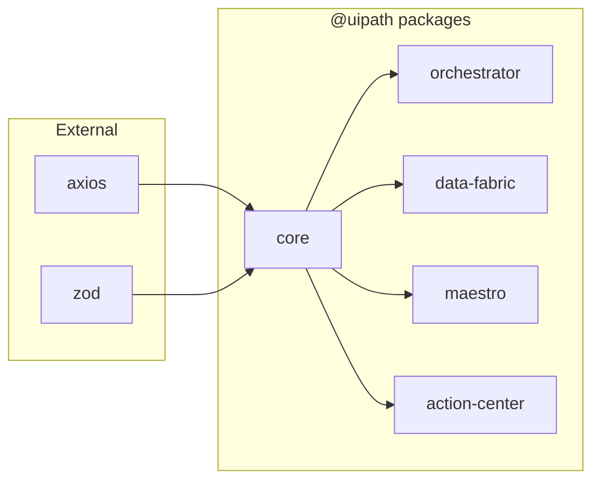

# UiPath TypeScript SDK Modularization Plan

## Executive Summary

This document outlines the plan to modularize the UiPath TypeScript SDK from a monolithic package into separate, independently importable packages following industry standards set by libraries like Material-UI and Lodash.

## 1. Requirements Analysis

### 1.1 What They Want

Transform the SDK to support **modular, scoped package imports** instead of importing everything from a single package.

**Current Import Pattern:**
```typescript
import { UiPath } from '@uipath/uipath-typescript'

const client = new UiPath(config);
const processes = client.processes;
const tasks = client.tasks;
```

**Desired Import Pattern:**
```typescript
import { ProcessService } from '@uipath/orchestrator'
import { EntityService } from '@uipath/data-fabric'
import { TaskService } from '@uipath/action-center'
import { CaseInstancesService } from '@uipath/maestro'
```

### 1.2 Benefits of Modularization

- **Reduced Bundle Size**: Applications only include the services they use
- **Better Tree-shaking**: Modern bundlers can eliminate unused code more effectively
- **Independent Versioning**: Services can be updated independently
- **Clearer Dependencies**: Explicit about which UiPath services are being used
- **Improved Developer Experience**: IntelliSense and documentation per package

## 2. Current State Analysis

### 2.1 Current Architecture

```
@uipath/uipath-typescript (single package)
├── Core Components
│   ├── Authentication
│   ├── Configuration
│   ├── HTTP Client
│   └── Error Handling
├── Services
│   ├── Orchestrator (Processes, Assets, Queues, Buckets)
│   ├── Data Fabric (Entities)
│   ├── Maestro (Cases, Process Instances)
│   └── Action Center (Tasks)
└── Single Entry Point (UiPath class)
```

### 2.2 Current Limitations

- **Monolithic Bundle**: ~17.5KB+ even if using single service
- **Tight Coupling**: All services initialized through single UiPath instance
- **No Selective Import**: Cannot import individual services
- **Single Version**: All services updated together

## 3. Proposed Architecture

### 3.1 Package Structure

```
@uipath/
├── core                 # Shared utilities, auth, config
├── orchestrator        # Process, Asset, Queue, Bucket services
├── data-fabric        # Entity service
├── maestro           # Case, Process Instance services
├── action-center     # Task service
└── sdk              # Meta-package for backward compatibility
```

### 3.2 Dependency Graph

```mermaid
graph TD
    A[@uipath/core] --> B[@uipath/orchestrator]
    A --> C[@uipath/data-fabric]
    A --> D[@uipath/maestro]
    A --> E[@uipath/action-center]
    B --> F[@uipath/sdk]
    C --> F
    D --> F
    E --> F
```

## 4. Implementation Options

### Option A: NPM/Yarn Workspaces Monorepo (Recommended ✅)

**Structure:**
```
uipath-typescript/
├── package.json (workspace root)
├── packages/
│   ├── core/
│   │   ├── package.json
│   │   ├── src/
│   │   └── tsconfig.json
│   ├── orchestrator/
│   │   ├── package.json
│   │   ├── src/
│   │   └── tsconfig.json
│   └── ...
```

**Pros:**
- Industry standard approach (Material-UI, Babel, React)
- Excellent tooling support
- Shared dependency management
- Easy cross-package development

**Cons:**
- Initial setup complexity
- Requires monorepo tooling knowledge

### Option B: Path-based Exports (Like Lodash)

**Structure:**
```typescript
// package.json
{
  "exports": {
    "./orchestrator": "./dist/orchestrator/index.js",
    "./data-fabric": "./dist/data-fabric/index.js"
  }
}
```

**Pros:**
- Simpler initial implementation
- Single package to maintain

**Cons:**
- Not true package separation
- Cannot version independently
- Larger initial bundle downloads

### Option C: Build-time Package Generation

**Pros:**
- Single source of truth
- Automated package generation

**Cons:**
- Complex build pipeline
- Harder to debug
- Non-standard approach

## 5. Detailed Implementation Plan

### Phase 1: Repository Setup (Week 1)

#### 1.1 Initialize Workspace Configuration
```json
// package.json (root)
{
  "name": "uipath-typescript",
  "private": true,
  "workspaces": [
    "packages/*"
  ],
  "scripts": {
    "build": "lerna run build",
    "test": "lerna run test",
    "publish": "lerna publish"
  }
}
```

#### 1.2 Setup Lerna Configuration
```json
// lerna.json
{
  "version": "independent",
  "packages": ["packages/*"],
  "npmClient": "npm",
  "command": {
    "publish": {
      "conventionalCommits": true,
      "message": "chore(release): publish"
    }
  }
}
```

### Phase 2: Core Package Creation (Week 2)

#### 2.1 Extract Core Functionality
```
packages/core/
├── src/
│   ├── auth/
│   │   ├── service.ts
│   │   ├── token-manager.ts
│   │   └── types.ts
│   ├── config/
│   │   ├── config.ts
│   │   └── sdk-config.ts
│   ├── http/
│   │   └── api-client.ts
│   ├── errors/
│   │   └── index.ts
│   └── index.ts
├── package.json
└── tsconfig.json
```

#### 2.2 Core Package Configuration
```json
// packages/core/package.json
{
  "name": "@uipath/core",
  "version": "1.0.0",
  "main": "./dist/index.cjs",
  "module": "./dist/index.mjs",
  "types": "./dist/index.d.ts",
  "exports": {
    ".": {
      "import": "./dist/index.mjs",
      "require": "./dist/index.cjs",
      "types": "./dist/index.d.ts"
    }
  },
  "dependencies": {
    "axios": "^1.12.0",
    "zod": "^3.22.4"
  }
}
```

### Phase 3: Service Package Extraction (Weeks 3-4)

#### 3.1 Orchestrator Package
```typescript
// packages/orchestrator/src/index.ts
export { ProcessService } from './services/processes';
export { AssetService } from './services/assets';
export { QueueService } from './services/queues';
export { BucketService } from './services/buckets';

// Re-export types
export * from './types';
```

#### 3.2 Service Implementation
```typescript
// packages/orchestrator/src/services/processes.ts
import { BaseService, UiPathConfig } from '@uipath/core';

export class ProcessService extends BaseService {
  constructor(config: UiPathConfig) {
    super(config);
  }
  
  async list() {
    // Implementation
  }
  
  async get(id: string) {
    // Implementation
  }
}
```

### Phase 4: Build System Configuration (Week 5)

#### 4.1 Individual Package Builds
```javascript
// packages/orchestrator/rollup.config.js
export default {
  input: 'src/index.ts',
  external: ['@uipath/core'],
  output: [
    {
      file: 'dist/index.cjs',
      format: 'cjs'
    },
    {
      file: 'dist/index.mjs',
      format: 'es'
    }
  ],
  plugins: [
    typescript(),
    resolve(),
    commonjs()
  ]
};
```

#### 4.2 Root Build Script
```json
// package.json (root)
{
  "scripts": {
    "build": "npm run build:core && npm run build:packages",
    "build:core": "npm run build --workspace=@uipath/core",
    "build:packages": "npm run build --workspace=@uipath/orchestrator --workspace=@uipath/data-fabric"
  }
}
```

### Phase 5: Backward Compatibility (Week 6)

#### 5.1 Meta Package Creation
```typescript
// packages/sdk/src/index.ts
import { ProcessService } from '@uipath/orchestrator';
import { EntityService } from '@uipath/data-fabric';
import { TaskService } from '@uipath/action-center';
import { UiPathConfig, AuthService } from '@uipath/core';

/**
 * @deprecated Use individual service imports instead
 */
export class UiPath {
  private config: UiPathConfig;
  
  constructor(config: UiPathConfig) {
    console.warn('UiPath class is deprecated. Import services directly from their packages.');
    this.config = config;
  }
  
  get processes() {
    return new ProcessService(this.config);
  }
  
  get entities() {
    return new EntityService(this.config);
  }
  
  get tasks() {
    return new TaskService(this.config);
  }
}
```

### Phase 6: Testing & Migration (Week 7)

#### 6.1 Migration Guide
```typescript
// Before
import { UiPath } from '@uipath/uipath-typescript';
const client = new UiPath(config);
const processes = await client.processes.list();

// After
import { ProcessService } from '@uipath/orchestrator';
import { createConfig } from '@uipath/core';

const config = createConfig({...});
const processService = new ProcessService(config);
const processes = await processService.list();
```

#### 6.2 Codemod Script
```javascript
// codemods/transform-imports.js
module.exports = function(fileInfo, api) {
  const j = api.jscodeshift;
  return j(fileInfo.source)
    .find(j.ImportDeclaration, {
      source: { value: '@uipath/uipath-typescript' }
    })
    .replaceWith(/* transformation logic */);
};
```

## 6. Pre-Implementation Checklist

### Technical Requirements
- [ ] Node.js version compatibility (>=16)
- [ ] TypeScript version alignment (>=5.0)
- [ ] Bundle size targets defined
- [ ] Tree-shaking verification strategy

### Infrastructure
- [ ] NPM organization access (@uipath)
- [ ] CI/CD pipeline updates
- [ ] Documentation hosting
- [ ] Package registry configuration

### Quality Assurance
- [ ] Unit test migration plan
- [ ] Integration test updates
- [ ] Performance benchmarks
- [ ] Bundle size analysis tools

### Developer Experience
- [ ] Migration documentation
- [ ] Code examples update
- [ ] API documentation per package
- [ ] Deprecation warnings implementation

## 7. Risk Mitigation

### Breaking Changes
- **Risk**: Existing applications break
- **Mitigation**: Provide compatibility layer and migration tools

### Package Versioning
- **Risk**: Version conflicts between packages
- **Mitigation**: Use fixed versioning initially, move to independent later

### Build Complexity
- **Risk**: Complex build pipeline failures
- **Mitigation**: Comprehensive build documentation and scripts

### Adoption Resistance
- **Risk**: Developers resist change
- **Mitigation**: Clear benefits documentation, easy migration path

## 8. Success Metrics

- **Bundle Size Reduction**: 50-70% for single-service usage
- **Build Time**: <30 seconds for full monorepo build
- **Migration Success**: 90% of existing apps migrated within 3 months
- **Developer Satisfaction**: Positive feedback on modular approach

## 9. Timeline

| Phase | Duration | Deliverables |
|-------|----------|--------------|
| Phase 1: Setup | 1 week | Monorepo structure, tooling |
| Phase 2: Core | 1 week | @uipath/core package |
| Phase 3: Services | 2 weeks | Individual service packages |
| Phase 4: Build | 1 week | Build pipeline, publishing |
| Phase 5: Compatibility | 1 week | Migration tools, meta-package |
| Phase 6: Testing | 1 week | Tests, documentation |
| **Total** | **7 weeks** | **Complete modular SDK** |

## 10. Example Usage After Modularization

### Basic Usage
```typescript
import { ProcessService } from '@uipath/orchestrator';
import { createConfig, authenticate } from '@uipath/core';

const config = createConfig({
  baseUrl: 'https://cloud.uipath.com',
  orgName: 'myorg',
  tenantName: 'mytenant'
});

await authenticate(config, { clientId: '...', clientSecret: '...' });

const processService = new ProcessService(config);
const processes = await processService.list();
```

### Advanced Usage with Multiple Services
```typescript
import { ProcessService } from '@uipath/orchestrator';
import { EntityService } from '@uipath/data-fabric';
import { TaskService } from '@uipath/action-center';
import { createConfig, AuthManager } from '@uipath/core';

const config = createConfig({...});
const auth = new AuthManager(config);

const services = {
  processes: new ProcessService(config, auth),
  entities: new EntityService(config, auth),
  tasks: new TaskService(config, auth)
};

// Use services independently
const processes = await services.processes.list();
const entities = await services.entities.query();
const tasks = await services.tasks.getPending();
```

## 11. References

- [Material-UI Package Structure](https://github.com/mui/material-ui)
- [Lodash Modular Builds](https://github.com/lodash/lodash)
- [Lerna Documentation](https://lerna.js.org/)
- [NPM Workspaces](https://docs.npmjs.com/cli/v8/using-npm/workspaces)

## Appendix A: Package Dependencies



## Appendix B: File Structure Comparison

### Before (Monolithic)
```
dist/
├── index.cjs (450KB)
├── index.mjs (445KB)
└── index.d.ts (125KB)
```

### After (Modular)
```
@uipath/core/dist/
├── index.cjs (45KB)
├── index.mjs (43KB)
└── index.d.ts (12KB)

@uipath/orchestrator/dist/
├── index.cjs (85KB)
├── index.mjs (82KB)
└── index.d.ts (25KB)

// App using only orchestrator: ~130KB vs 450KB (71% reduction)
```