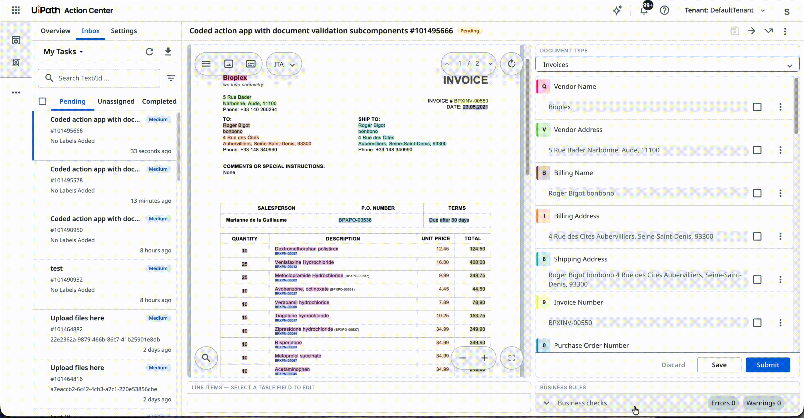

# Action App With Document Validation (Subcomponents)

A UiPath Coded Action App that composes the **Document Understanding Validation Station** from its five individual subcomponents instead of the all-in-one widget, laying them out in a custom grid.

Use this variant when the standard layout doesn't fit — you need to rearrange or hide panels, or embed one of them inside your own screen. If the standard layout is fine, use [`action-app-with-document-validation`](../action-app-with-document-validation) instead; it is the same review flow with far less wiring.

The five panels are linked by a single shared `instanceId`, which is the only wiring they need: selecting a field in the form highlights it in the document, picking a table field opens the line-item editor, and clicking a business rule focuses the offending field.

---

## Pre-requisites

- **Node.js** 20.x or later
- **npm** 8.x or later
- A **UiPath Automation Cloud** tenant with:
  - **Document Understanding**, and a workflow that raises validation actions (so there is a task to open)
  - A non-confidential **External Application** (OAuth client) registered with the following:
    - Scopes:
        - `OR.Buckets` (to read the document and its extraction artifacts from the storage bucket, and write the validated result back)
        - `OR.Tasks` (to record an exception report against the task)
    - Redirect URI `https://<host>/<orgId>/<tenantId>/actions_`, where `<host>` is the environment you sign in to (`cloud.uipath.com`, `alpha.uipath.com`, …) and `<orgId>`/`<tenantId>` are the **GUIDs — not the org and tenant names shown in the browser address bar**. This is normally added the first time a coded action app using this external application is deployed, but confirm it is there: a missing or name-based entry fails with `invalid_request` / `Invalid redirect_uri`. To read the exact value your app sends, open it and copy `redirect_uri` from the `/identity_/connect/authorize` request in the browser's network tab.
- Install [UiPath CLI](https://github.com/UiPath/cli#installation)
  
  ```bash
  npm i -g @uipath/cli
  ```

---

## Setup

### 1. Install dependencies

```bash
npm install
```

### 2. Configure `uipath.json`

Copy the committed template and fill in your values:

```bash
cp uipath.json.example uipath.json
```

```json
{
  "scope": "OR.Tasks OR.Buckets",
  "clientId": "<external-application-clientId>"
}
```

- **`clientId`** — the App ID of your registered External Application in UiPath Cloud
- **`scope`** - the scopes required by the app. This must be a subset of the scopes granted to the external client above.

### 3. Run it locally

A coded action app is an iframe inside Action Center, and it gets its task over `postMessage`
from the page around it. Opening `http://localhost:5173` directly therefore fails with
**"Discarding event from invalid origin"** — there is no host to hand it a task. Action Center
provides a debug page that plays that host:

```bash
npm run dev
```

Then open `https://<host>/<orgName>/<tenantName>/actions_/debug/coded-action-app` (`<host>` being
the environment you sign in to, and org and tenant addressed here by **name**) and fill in:

| Field | Value |
|---|---|
| Localhost URL | `http://localhost:5173` |
| Folder | the folder holding the storage bucket named in your payload |
| Task Data (JSON) | `{ "contentValidationData": { … } }` |

The quickest way to get a real `contentValidationData` is **Load from Task ID** with the id of an
existing Document Understanding validation action; otherwise paste the payload from one. It has to
name a bucket the signed-in user can read, or the widget loads no document.

The redirect URI from the pre-requisites must already be registered, or the app loads and then
fails to fetch a token.

### 4. Deploy to UiPath Cloud

Build and deploy using the [`UiPath CLI`](https://uipath.github.io/uipath-typescript/coded-apps/getting-started/#deploy):

```bash
uip login
npm run build
uip codedapp pack dist -n <appName> --version 1.0.0
uip codedapp publish --type Action
uip codedapp deploy
```

> The Validation Station ships as a **separate web-component bundle**, loaded at runtime from `<app base>/du-vs-wc` by the `configureValidationStationWc()` call in `src/main.tsx`. `scripts/stage-du-wc.mjs` copies that bundle out of `node_modules` into `public/du-vs-wc` — it runs automatically via the `predev` and `prebuild` hooks, so `npm run dev` and `npm run build` both take care of it. Vite serves `public/` verbatim in dev and copies it to `dist/` on build, so after `npm run build` you should see `dist/du-vs-wc/` with `main.js`, `polyfills.js`, `styles.css` and `du-assets/`.

---

## Action Schema

The action schema that drives this app expects the following input (defined in `action-schema.json`):

### Inputs

| Field | Type | Required | Description |
|---|---|---|---|
| `contentValidationData` | ContentValidationData | Yes | Document Understanding payload locating the document, its taxonomy and its extraction results in the storage bucket |

`ContentValidationData` is a dedicated action-schema field type — not an `object` with the members spelled out.

### Outputs

_None._ Everything the reviewer changes travels back through the storage bucket, because the fields form writes the validated result there itself.

### Outcomes

| Outcome | Triggered by |
|---|---|
| `Submit` | A successful **Submit** in the fields form |

Reporting an exception does not complete the action — `submitExceptionReport` transitions the task on the Document Understanding side.

---

## How the panels are composed

| Panel | Subcomponent | Role |
|---|---|---|
| Document | `DocumentViewer` | Document / text view with bounding boxes. Read-only |
| Document type | `CompactDocTypeField` | Document-type selector |
| Fields | `CompactFieldsForm` | Extraction fields, editable. **The only panel that persists** |
| Line items | `CompactTableEditor` | Inline editor for table fields |
| Business rules | `CompactBusinessRules` | Evaluated rules, read-only |

Three rules govern the composition, and each one is a silent failure if broken:

1. **Fetch the artifacts once.** `useDuDocumentArtifacts` runs in the parent and the same `artifacts` object is passed to all five panels. Calling it per panel re-downloads the same document once per panel.
2. **Only `CompactFieldsForm` gets `sdk` + `data`.** It owns persistence — submit, save-as-draft and report-exception. The other four take the pre-fetched artifacts only.
3. **`persistent: false`.** These panels live in a static grid and are never re-parented. Left on, React StrictMode's throwaway unmount calls `forceDestroy()` and the panel renders blank.

Because the doc-type and business-rules panels are rendered standalone, the fields form hides its built-in copies via `options: { hideBusinessRules: true, hideDocumentTypeField: true }` — otherwise each appears twice.

---

## Viewing the coded action app in Action Center

This is the **deployed** app driven by a real process. To run the version on your machine
against a simulated task instead, see [Run it locally](#3-run-it-locally) above.

1. Import the [Template With Document Validation Subcomponents.uis](./Template%20With%20Document%20Validation%20Subcomponents.uis) solution in **Studio Web**.

   <!-- TODO: attach screenshot — importing the solution in Studio Web -->
   _Screenshot placeholder — importing the solution in Studio Web._

2. In the **Properties** panel of the User Task node, update the **Action App** field to point to your deployed coded action app.

   <!-- TODO: attach screenshot — User Task properties, Action App field -->
   _Screenshot placeholder — pointing the User Task at the deployed app._

3. Click **Debug** to run the process — this will create an Action Center task backed by your app.
4. Open Action Center and complete the task to verify the full flow end-to-end.

--- OR ---

Create the task using an RPA workflow in **Studio Desktop** that uses the **Create App Task** activity, pointing to your deployed coded action app and passing the required inputs.

<!-- TODO: attach screenshot — Create App Task activity in Studio Desktop -->
_Screenshot placeholder — the Create App Task activity._

---

## Expected Results

When the app loads inside Action Center:

1. **Composed layout** — Five panels in one grid: the document on the left spanning both rows, the document type and extraction fields stacked on the right, and the line-item editor and business rules along the bottom. Below 1100px they stack into a single column, since Action Center's task pane is often narrower than the browser window.

2. **Linked selection** — Selecting a field in the fields form highlights its bounding box in the document and vice versa; picking a table field opens the line-item editor; clicking a business rule focuses the offending field. All of it comes from the shared `instanceId`.

3. **Save as draft** — Uploads the in-progress data to the storage bucket and shows a confirmation. The action stays open and reopens with the reviewer's edits intact.

4. **Submit** — The fields form validates and uploads the result, then the app completes the action with the `Submit` outcome and it leaves the reviewer's queue.

5. **Report as exception** — The reason is recorded against the task and a confirmation appears. The app does not complete the action itself.

6. **Theme** — The app follows the Action Center theme preference, including the high-contrast variants. There is no in-app toggle.

7. **Read-only mode** — If the task is already completed or the current user does not have edit access, every panel renders non-editable.

---

## Preview


