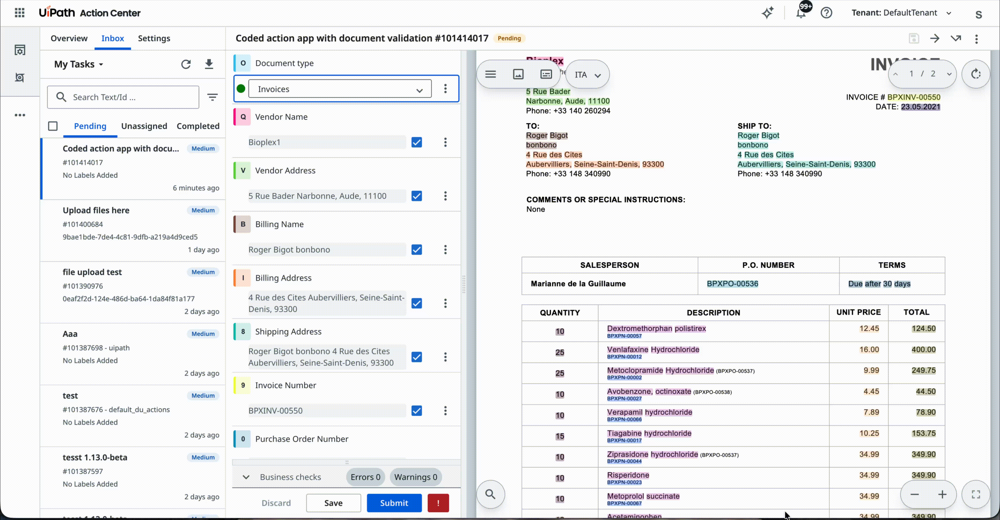

# Action App With Document Validation

A UiPath Coded Action App whose entire UI is the **Document Understanding Validation Station** widget. When a Document Understanding workflow raises a validation action, the reviewer corrects the extracted fields, edits line-item tables, and submits — or reports the document as an exception.

Unlike the other samples here, the review UI is supplied by UiPath rather than written by hand: the app reads the task, hands the payload to the widget, and completes the action once the widget reports it is done. There is no task list or portal chrome — Action Center routes the reviewer to a single action.

---

## Pre-requisites

- **Node.js** 20.x or later
- **npm** 8.x or later
- A **UiPath Automation Cloud** tenant with:
  - **Document Understanding**, and a workflow that raises validation actions (so there is a task to open)
  - A non-confidential **External Application** (OAuth client) registered with the following:
    - Scopes:
        - `OR.Buckets` (to read the document and its extraction artifacts from the storage bucket, and write the validated result back)
        - `OR.Tasks` (to record an exception report against the task)
    - Redirect URI `https://cloud.uipath.com/<orgId>/<tenantId>/actions_` (It is added automatically the first time any coded action app using this external application is deployed)
- Install [UiPath CLI](https://github.com/UiPath/cli#installation)
  
  ```bash
  npm i -g @uipath/cli
  ```

---

## Setup

### 1. Install dependencies

```bash
npm install
```

### 2. Configure `uipath.json`

Copy the committed template and fill in your values:

```bash
cp uipath.json.example uipath.json
```

```json
{
  "scope": "OR.Tasks OR.Buckets",
  "clientId": "<external-application-clientId>"
}
```

- **`clientId`** — the App ID of your registered External Application in UiPath Cloud
- **`scope`** - the scopes required by the app. This must be a subset of the scopes granted to the external client above.

### 3. Deploy to UiPath Cloud

Build and deploy using the [`UiPath CLI`](https://uipath.github.io/uipath-typescript/coded-apps/getting-started/#deploy):

```bash
uip login
npm run build
uip codedapp pack dist -n <appName> --version 1.0.0
uip codedapp publish --type Action
uip codedapp deploy
```

> The Validation Station's web component loads its stylesheets, fonts and PDF assets **at runtime**, so `vite.config.ts` copies them next to the build output. A green build does not prove this worked — after `npm run build`, check that `dist/assets/` contains `du-assets/`, `media/`, `styles.css` and `fonts.css`.

---

## Action Schema

The action schema that drives this app expects the following input (defined in `action-schema.json`):

### Inputs

| Field | Type | Required | Description |
|---|---|---|---|
| `contentValidationData` | ContentValidationData | Yes | Document Understanding payload locating the document, its taxonomy and its extraction results in the storage bucket |

`ContentValidationData` is a dedicated action-schema field type — not an `object` with the members spelled out.

### Outputs

_None._ Everything the reviewer changes travels back through the storage bucket, because the widget writes the validated result there itself.

### Outcomes

| Outcome | Triggered by |
|---|---|
| `Submit` | A successful **Submit** in the Validation Station |

Reporting an exception does not complete the action — `submitExceptionReport` transitions the task on the Document Understanding side.

---

## Viewing the coded action app in Action Center

1. Import the [Template With Document Validation.uis](./Template%20With%20Document%20Validation.uis) solution in **Studio Web**.

   <!-- TODO: attach screenshot — importing the solution in Studio Web -->
   _Screenshot placeholder — importing the solution in Studio Web._

2. In the **Properties** panel of the User Task node, update the **Action App** field to point to your deployed coded action app.

   <!-- TODO: attach screenshot — User Task properties, Action App field -->
   _Screenshot placeholder — pointing the User Task at the deployed app._

3. Click **Debug** to run the process — this will create an Action Center task backed by your app.
4. Open Action Center and complete the task to verify the full flow end-to-end.

--- OR ---

Create the task using an RPA workflow in **Studio Desktop** that uses the **Create App Task** activity, pointing to your deployed coded action app and passing the required inputs.

<!-- TODO: attach screenshot — Create App Task activity in Studio Desktop -->
_Screenshot placeholder — the Create App Task activity._

---

## Expected Results

When the app loads inside Action Center:

1. **Document review** — The Validation Station fills the action pane: the document viewer on one side, the extracted fields on the other, with its own action bar. Selecting a field highlights its bounding box in the document, and vice versa. Paging, zoom, table editing and business-rule evaluation all come from the widget.

2. **Save as draft** — Uploads the in-progress data to the storage bucket and shows a confirmation. The action stays open and reopens with the reviewer's edits intact.

3. **Submit** — The widget validates and uploads the result, then the app completes the action with the `Submit` outcome and it leaves the reviewer's queue.

4. **Report as exception** — The reason is recorded against the task and a confirmation appears. The app does not complete the action itself.

5. **Theme** — The app follows the Action Center theme preference, including the high-contrast variants. There is no in-app toggle.

6. **Read-only mode** — If the task is already completed or the current user does not have edit access, the widget renders the same view non-editable and its action bar is suppressed.

---

## Preview


