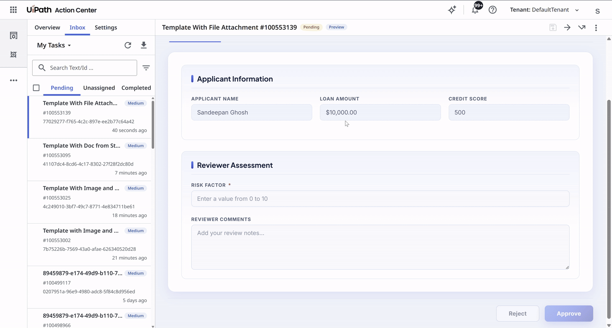

# Action App With File Attachment Document

A UiPath Coded Action App template for **Loan Application Review** with direct file attachments. Reviewers can assess an applicant's details, preview and download a directly attached PDF document, upload a supporting document of their own, and complete the task with an Approve or Reject decision.

This template demonstrates how to handle direct file attachments in coded action apps, as opposed to referencing files from Storage Buckets — both reading the file the task arrived with and attaching one back to the job.

## Preview



---

## Pre-requisites

- **Node.js** 20.x or later
- **npm** 8.x or later
- A **UiPath Automation Cloud** tenant with:
  - A non-confidential **External Application** (OAuth client) registered with the following:
    - Scopes:
        - `OR.Folders.Read` — reading the attachment the task arrived with
        - `OR.Folders.Write` — creating the attachment for the file the reviewer uploads
    - Redirect URI `https://<host>/<orgId>/<tenantId>/actions_`, where `<host>` is the environment you sign in to (`cloud.uipath.com`, `alpha.uipath.com`, …) and `<orgId>`/`<tenantId>` are the **GUIDs — not the org and tenant names shown in the browser address bar**. This is normally added the first time a coded action app using this external application is deployed, but confirm it is there: a missing or name-based entry fails with `invalid_request` / `Invalid redirect_uri`. To read the exact value your app sends, open it and copy `redirect_uri` from the `/identity_/connect/authorize` request in the browser's network tab.
- Install [UiPath CLI](https://github.com/UiPath/cli#installation)
  
  ```bash
  npm i -g @uipath/cli
  ```

---

## Setup

### 1. Install dependencies

```bash
npm install
```

### 2. Configure `uipath.json`

Open `uipath.json` and update the clientId:

```json
{
  "scope": "OR.Folders.Read OR.Folders.Write",
  "clientId": "<external-application-clientId>"
}
```
- **`clientId`** — the App ID of your registered External Application in UiPath Cloud
- **`scope`** - the scopes required by the app. This must be a subset of the scopes granted to the external client above.

### 3. Deploy to UiPath Cloud

Build and deploy using the [`UiPath CLI`](https://uipath.github.io/uipath-typescript/coded-apps/getting-started/#deploy):

```bash
uip login
npm run build
uip codedapp pack dist -n <appName> --version 1.0.0
uip codedapp publish --type Action
uip codedapp deploy
```

---

## Action Schema

The action schema that drives this app expects the following inputs and produces the following outputs (defined in `action-schema.json`).

### Inputs

| Field | Type | Required | Description |
|---|---|---|---|
| `applicantName` | string | Yes | Full name of the loan applicant |
| `loanAmount` | number | No | Requested loan amount |
| `creditScore` | number | No | Applicant's credit score |
| `loanDocument` | file | No | Direct file attachment containing the loan document (PDF) |

### Outputs

| Field | Type | Required | Description |
|---|---|---|---|
| `riskFactor` | integer | Yes | Reviewer-assigned risk score (0–10) |
| `reviewerComments` | string | No | Free-text notes from the reviewer |
| `supportingDocument` | file | No | File the reviewer uploaded, created as an attachment on the job |

### Outcomes

| Outcome | Triggered by |
|---|---|
| `Approve` | Clicking the **Approve** button |
| `Reject` | Clicking the **Reject** button |

---

## Uploading a supporting document

The **Document** tab has an uploader above the PDF viewer. The file it picks becomes an Orchestrator
attachment in the task's folder, linked to the job that raised the action:

```ts
const task = await uipath.codedActionAppsService.getTask();

await uipath.attachmentService.create(file.name, file, {
  folderId: task.folderId,
  jobKey: task.jobKey,        // ← binds the attachment to the job
  category: 'Reviewer upload',
});
```

The file lands in the folder either way — `jobKey` doesn't change where it is stored, it just links
it to the job.

That link is what makes it findable. Without it, the GUID `create()` returned is the only thing
pointing at the file. With it, the file shows up under the job in Orchestrator, so anyone with
`Jobs.View` on that folder can open the job and see what the reviewer attached and the automation can
also read/modify these attachments downstream.

`task.jobKey` is `null` when the action was created outside a job. The attachment is still created
in the folder, it just isn't linked to anything — the uploader says as much: *the attachment is
created but not linked to a job, due to a missing job key*.

Two things about the call itself: it needs **`OR.Folders.Write`** — not `OR.Jobs.Write`, which
belongs to the separate endpoint behind `jobs.linkAttachment()` — and passing `jobKey` adds an
Orchestrator permission check that runs *before* the attachment is created, so a reviewer without
`Jobs.View` on the job's folder gets an error and no attachment at all.

---

## Key Differences from Storage Bucket Template

This template differs from the `action-app-with-storage-bucket-document` in the following ways:

1. **File Input Method**: Uses direct file attachment (`file` type) instead of Storage Bucket name and file path (string inputs)
2. **Direct File Access**: Uses `uipath.attachmentService.getById()` instead of Storage Bucket APIs
3. **Writes Back**: Uses `uipath.attachmentService.create()` with the task's `jobKey` to attach the reviewer's file to the job

---

## Viewing the coded action app in Action Center

1. Import the [Template With File Attachment.uis](./Template%20With%20File%20Attachment.uis) solution in **Studio Web**.
   
   

2. In the **Properties** panel of the User Task node, update the **Action App** field to point to your deployed coded action app.
   
   


3. Click **Debug** and enter the input arguments to run the process — this will create an Action Center task backed by your app.
4. Open Action Center and complete the task to verify the full flow end-to-end.

--- OR ---

Create the task using an RPA workflow in **Studio Desktop** that uses the **Create App Task** activity, pointing to your deployed coded action app and passing the required inputs.


---

## Expected Results

When the app loads inside Action Center:

1. **Review Form tab** — Displays the applicant name, loan amount, and credit score from the task inputs (read-only). The reviewer fills in the **Risk Factor** (integer 0–10, required) and optional **Reviewer Comments**, then clicks **Approve** or **Reject** to complete the task.

2. **Document tab** — On first visit, retrieves the attached file using the attachment service, fetches a signed download URI for the PDF, and renders it inline with:
   - Page navigation (previous / next)
   - Zoom controls
   - A **Download** button
   - An inline error message if the file cannot be found or accessed

   Above the viewer, the **Supporting document** uploader takes one file — **View** loads it into the same viewer in place of the task document, a toolbar button switches back, and **✕** drops it from the output while the attachment stays on the job.

3. **Theme** — The app initializes in light or dark mode based on the Action Center theme preference and supports toggling via the button in the top-right corner.

4. **Read-only mode** — If the task is already completed or the current user does not have edit access, all input fields are disabled and the Approve / Reject buttons are greyed out.
