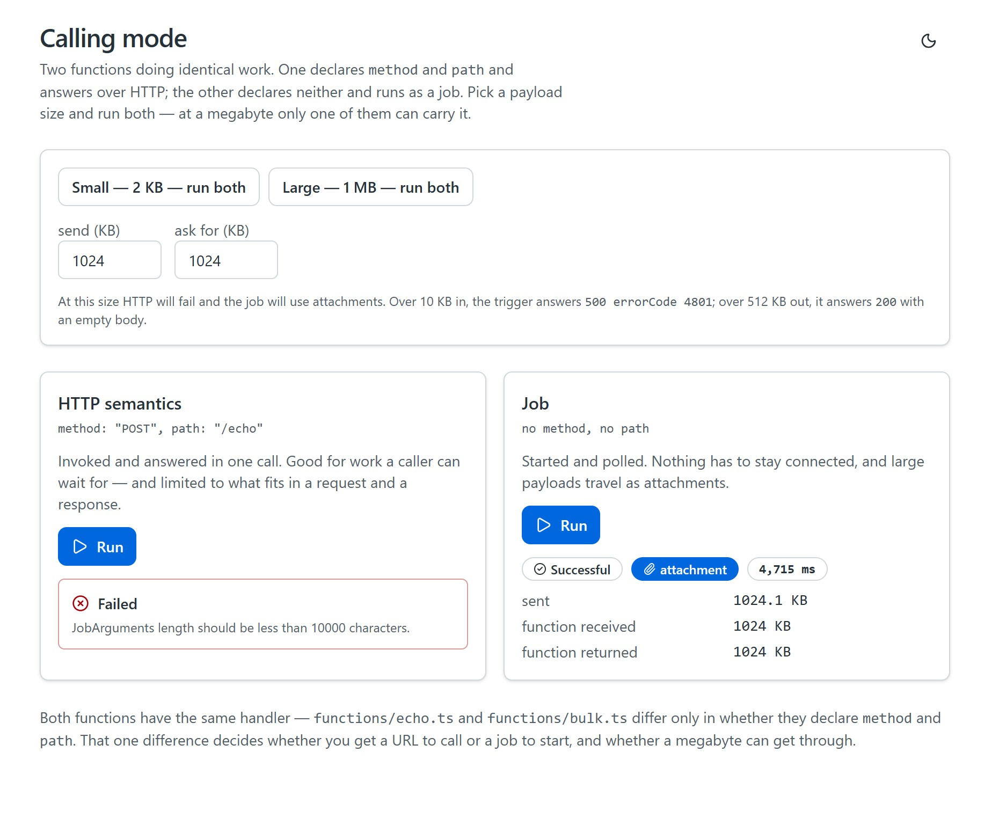
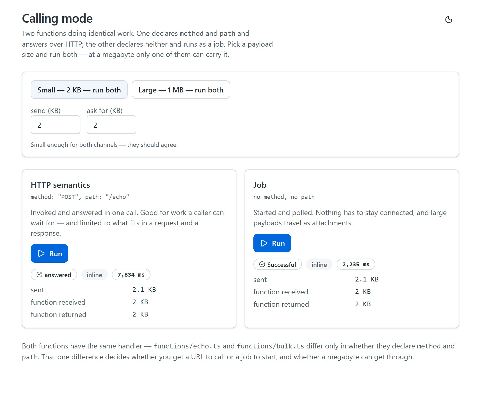
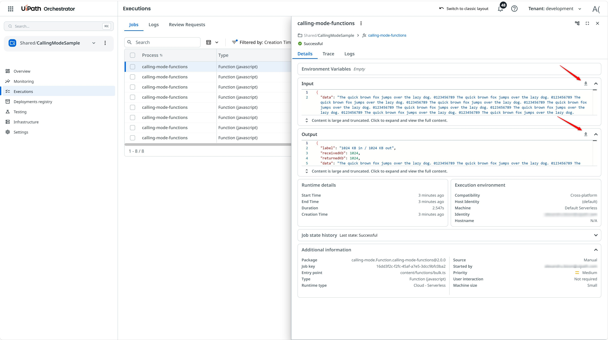
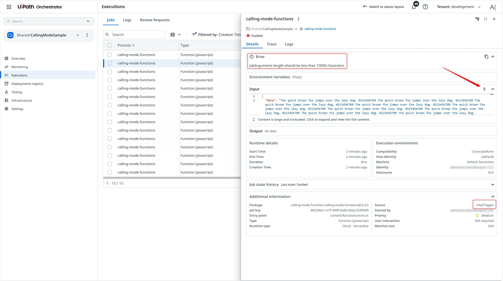

# Calling Mode: HTTP Semantics Or A Job

Two functions with **identical handlers**. One declares `method` and `path`; the other declares
neither. That single difference decides how you call it — and what it can carry.

```ts
// functions/echo.ts          HTTP semantics
method: "POST", path: "/echo"

// functions/bulk.ts          job
// (no method, no path)
```

| | HTTP semantics | Job |
|---|---|---|
| How you call it | `Functions.invoke()` | `Processes.start()`, then poll |
| What you get | the answer, in one call | a job key; the result when it finishes |
| Caller must stay connected | yes | no |
| Input over ~10 KB | **fails** — `500 errorCode 4801` | uploaded as an **attachment** |
| Output over ~512 KB | **`200` with an empty body** | returned as an **attachment** |

## Preview



---

## Which to use

**HTTP semantics** for work a caller can wait for: one round trip, the answer in hand, ordinary
error handling, a `404` that means what it says. This is the default.

**A job** when any of these is true:

- the payload will not fit — see the numbers below
- nobody is waiting, and the work should survive the caller navigating away
- you want Orchestrator's queueing, retention and audit around the run
- the thing you are starting is not a JS function at all. `Processes.start()` runs a Python
  function, an RPA process or an agent the same way — the channel is a property of the call, not of
  what you wrote

"It takes a while" is not on that list. A slow HTTP function still answers; past roughly 25 seconds
the gateway switches the client to polling and the payload arrives intact.

## The payload limits, measured

Both channels hold the same amount **inline**. They differ entirely in what happens past it.

**Input — about 10,000 characters.**

```text
HTTP     9.7 KB → 200 OK
HTTP    10   KB → 500  {"message":"JobArguments length should be less than 10000
                        characters.","errorCode":4801}
job      1   MB → Successful, input carried as an attachment, 1024 KB received
```

**Output — about 512 KB.**

```text
HTTP   480 KB → 200, body 491,589 bytes          fine
HTTP   512 KB → 200, body 0 bytes                empty, and no error at all
job      1 MB → Successful, result as an attachment, 1024 KB returned
```

> The empty `200` is the one to remember. Over HTTP there is nowhere for an oversized response to
> go, and nothing tells you it happened — you get a success with no data. A job has somewhere to put
> it, and `Jobs.getOutput()` reads it back without you asking.

---

## Pre-requisites

- **Node.js** 20.x or later, **npm** 8.x or later
- A **UiPath Automation Cloud** tenant
- The [UiPath CLI](https://github.com/UiPath/cli#installation) and its tools

  ```bash
  npm i -g @uipath/cli

  uip tools install @uipath/solution-tool
  uip tools install @uipath/orchestrator-tool
  uip tools install @uipath/admin-tool
  ```

---

## Setup

### 1. Register an OAuth application

```bash
uip login

uip admin external-apps create "Calling Mode Sample" \
  --non-confidential \
  --redirect-uri "http://localhost:5173,https://<org>.uipath.host/calling-mode-sample" \
  --user-scope "OR.Execution,OR.Folders,OR.Jobs"
```

Put the returned client id in the deploy config:

```bash
uip solution deploy config set deploy-config.json calling-mode-app externalClientId <client-id>
```

`OR.Jobs` is load-bearing here: the app starts jobs and reads their output, not just invokes
functions.

### 2. Install and build

```bash
cd calling-mode-functions && npm install && cd ..
cd calling-mode-app/source && npm install && npm run build && cd ../..
```

Both are needed — the functions project so `pack` can read the SDK, the app because `pack` takes
the bundle prebuilt. Skipping the first fails with
`Manifest generation failed for JS/TS Functions project`, which does not mention the missing install.

### 3. Deploy

```bash
uip solution pack . ./out -n calling-mode -v 1.0.0
uip solution publish ./out/calling-mode_1.0.0.zip --wait

uip solution deploy run \
  --name CallingModeSample \
  --package-name calling-mode --package-version 1.0.0 \
  --folder-name CallingModeSample --parent-folder-path Shared \
  --config-file deploy-config.json
```

One HTTP trigger is created, for `echo`. `bulk` gets none — check
**Deployments registry → Resources → Triggers: API** and you will find a single row. That is the
declaration difference showing up in Orchestrator.

> **Bump the version whenever the code changes.** Re-deploying the same version number is unsafe:
> the functions package refuses with `4424 … different content`, but the app package is silently
> reused and serves the **old** bundle.

### 4. Run locally (optional)

```bash
cd calling-mode-app/source
cp uipath.json.example uipath.json    # client id, org, tenant, base URL
cp .env.example .env                  # VITE_UIPATH_FOLDER_ID = the folder's NUMERIC id
npm run dev
```

Only the app runs locally — both functions are called on the deployed solution, so step 3 comes
first. Use the `api.*` host in `uipath.json`, not the portal domain, or the browser blocks every
call on CORS.

---

## How each call is made

Both functions take `{ data, outputKb }` and return `{ receivedKb, returnedKb, data }`, so the two
channels are directly comparable. `src/api.ts` has both paths.

**HTTP** — one call:

```ts
const out = await functions.invoke({ name: 'calling-mode-functions_echo' }, { data, outputKb });
```

**Job** — start, poll, read:

```ts
// over ~10 KB the input has to be uploaded first; create() also uploads the bytes
const inputFile = tooBig
  ? (await attachments.create('input.json', new Blob([json]), { folderId })).id
  : undefined;

const [job] = await processes.start(
  {
    processName: 'calling-mode-functions',
    entryPointPath: 'content/functions/bulk.ts',   // required
    ...(inputFile ? { inputFile } : { inputArguments: json }),
  },
  { folderId },
);

// poll jobs.getById(job.key, folderId) until the state is terminal, then:
const out = await jobs.getOutput(job.key, folderId);   // inline or attachment, handled for you
```

Three things worth knowing:

- **`entryPointPath` is required.** One release covers every function in the package, so without it
  the job starts and then faults rather than being rejected.
- **`Jobs.getOutput()` reads both channels.** It parses the inline result, or downloads the
  attachment. Do not hand-roll this.
- **The job APIs want the folder's numeric id**, but a deployed Coded App is only given its key.
  `src/api.ts` converts it with one `Folders?$filter=Key eq …&$select=Id` lookup — the only raw
  request left in the sample.

---

## Expected results

Sign in at `https://<org>.uipath.host/calling-mode-sample`. Each preset runs both channels at the
same size, side by side.

| Preset | HTTP | Job |
|---|---|---|
| **Small — 2 KB** | `200`, 2 KB each way | `Successful`, inline each way |
| **Large — 1 MB** | **fails**: `500 errorCode 4801` on the way in | `Successful`, **attachment** each way, 1024 KB received and returned |

The point is the second row: same handler, same payload, one channel cannot carry it.

At 2 KB the two channels agree, which is what makes the divergence above worth showing:



Orchestrator records both runs. The job that carried the megabyte shows its input and output as
downloadable attachments, and its entry point as `content/functions/bulk.ts`:



The HTTP trigger's run is there too, faulted before the handler ran — `Source: HttpTrigger`,
`Output: No data`, and the 10,000-character limit as the error:



---

## Updating and removing

```bash
uip solution pack . ./out -n calling-mode -v 1.0.1
uip solution publish ./out/calling-mode_1.0.1.zip --wait
uip solution deploy upgrade <deployment-key> --version 1.0.1

uip solution deploy uninstall CallingModeSample --yes
```

`uip solution deploy list` gives the deployment key, and it **changes after every operation** — read
it again before each upgrade or you get `4005 Another upgrade has already started`.

---

## Troubleshooting

| Symptom | Cause |
|---|---|
| `500 errorCode 4801 JobArguments length should be less than 10000 characters` | The payload is too big for an HTTP trigger. Use the job channel. |
| HTTP returns `200` with an empty body | The response is over ~512 KB. There is no spill on this channel — use a job, or return a reference instead of the data. |
| `Function '<name>' not found in folder` | The registered name is package-prefixed: `calling-mode-functions_echo`. |
| Job starts then faults immediately | `entryPointPath` missing or wrong — it is `content/functions/<name>.ts`. |
| `getOutput` returns null on a big result | You are reading `outputArguments` yourself. Use `Jobs.getOutput()`. |
| The app runs old code after a redeploy | The version number was reused. Bump it. |
| `npm install` fails with `ENOENT spawn cmd.exe` on Windows | `MAX_PATH`. Clone somewhere short, like `C:\src\`. |
