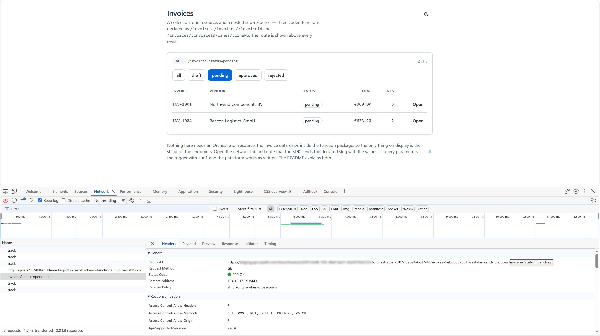
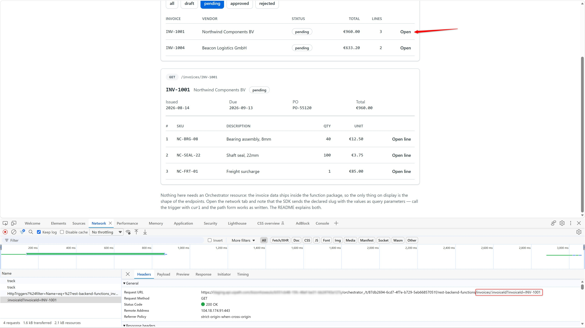
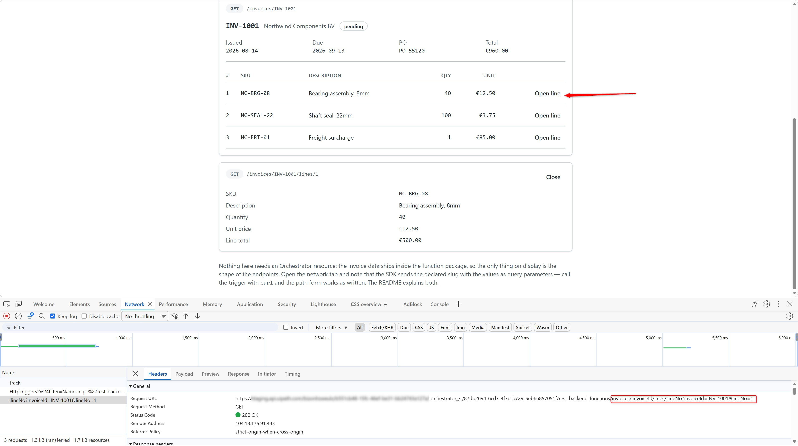
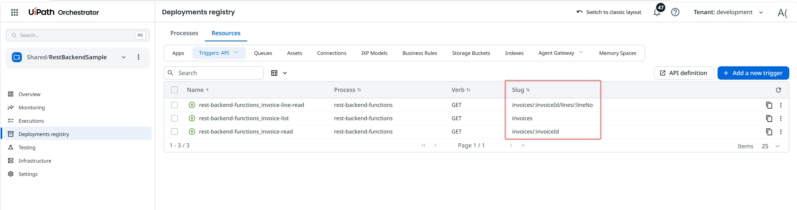

# REST Backend: Invoices Served By Coded Functions

An invoice browser backed by three coded functions, declared as the REST resources a web developer
would expect:

```text
GET /invoices                            the collection, filterable by status
GET /invoices/:invoiceId                 one invoice
GET /invoices/:invoiceId/lines/:lineNo   one line of one invoice
```

The app and the functions ship as **one solution**. The invoice data lives inside the function
package, so this sample provisions no Orchestrator resource, needs no folder permission and makes no
outbound call — the only thing on display is the shape of the endpoints.

## Preview



---

## What this sample is about

The `secrets` sample answers *"why does this have to be a function?"*. This one answers a different
question: **once it is a function, what should it look like from the outside?**

The same three operations could be one function called `POST /doInvoiceThing` with an `action` field.
It would work. It would also be resisted by every web developer who has to consume it, because
nothing about the URL says what it does, the verb carries no meaning, and no cache, proxy or client
library can do anything useful with it.

Three decisions are worth taking from this sample:

- **Filter or address?** `status` selects a *view* of the collection, so it is a query parameter.
  `invoiceId` identifies *one resource*, so it is a path parameter. `/invoices/pending` looks
  reasonable and is the most common REST mistake in review — it makes a filter look like an
  identifier, and it collides the day an invoice is genuinely called "pending".
- **Is it separately addressable?** An invoice line has its own identity, so it gets its own URL.
  That is why opening a line calls a second function instead of reading it out of the invoice
  already on screen.
- **Does the error tell the caller what would have worked?** These routes answer a 404 by naming the
  ids, or the line numbers, that exist. "Not found" sends someone to the docs; this answers the
  question.

`rest-backend-functions/functions/*.ts` carry the routing mechanics in comments — specificity
ordering, string-vs-coerced params, and why a body key can shadow a path param.

## One caveat, and it is visible in the network tab

`Functions.invoke()` in `@uipath/uipath-typescript` **does not substitute path params.** It builds
the URL from the declared slug verbatim and sends the input as query parameters:

```text
declared    GET /invoices/:invoiceId/lines/:lineNo
sent        GET /…/rest-backend-functions/invoices/:invoiceId/lines/:lineNo?invoiceId=INV-1001&lineNo=2
```

The call **succeeds** — the handler receives the right values, from the query string — so the only
symptoms are the URL you see in the network tab and `ctx.params.invoiceId` holding the literal
`":invoiceId"`. Two consequences that are not cosmetic:

- a **regex-constrained** param such as `:lineNo{[0-9]+}` can never match the literal `":lineNo"`,
  so the route 404s. That is why `:lineNo` is plain here.
- the URL undercuts the argument for shaping the function as REST in the first place.

The app prints the declared route above every result, so you can hold the two side by side. The UI
says `GET /invoices/INV-1001`; the request says otherwise:



With two params, both stay literal and both values ride along as query parameters:



A **query** parameter is unaffected, because there is nothing to substitute — `status` goes out as a
real query string, as the preview above shows.

Call the trigger directly and the declared form behaves exactly as written — see
**Calling the functions directly** below, which is also the workaround: resolve the trigger, then
substitute the params yourself.

---

## Pre-requisites

- **Node.js** 20.x or later
- **npm** 8.x or later
- A **UiPath Automation Cloud** tenant
- Install [UiPath CLI](https://github.com/UiPath/cli#installation) and its tools

  ```bash
  npm i -g @uipath/cli

  uip tools install @uipath/solution-tool       # uip solution ...
  uip tools install @uipath/orchestrator-tool   # uip or ...
  uip tools install @uipath/admin-tool          # uip admin ...
  ```

---

## Setup

### 1. Register an OAuth application

A Coded App signs users in with a **non-confidential** (public) OAuth app, because a browser cannot
keep a client secret. The hosted URL is predictable — it comes from `routingName` in
`deploy-config.json` — so register both redirect URIs now:

```bash
uip login

uip admin external-apps create "Rest Backend Sample" \
  --non-confidential \
  --redirect-uri "http://localhost:5173,https://<org>.uipath.host/rest-backend-sample" \
  --user-scope "OR.Execution,OR.Folders,OR.Jobs"
```

Put the returned client id in the deploy config:

```bash
uip solution deploy config set deploy-config.json rest-backend-app externalClientId <client-id>
```

> No `OR.Assets` here: unlike `secrets`, nothing in this sample touches an Orchestrator resource.
> A hosted Coded App requests the scopes from **this registration**, captured when the app is
> deployed; the `scope` field in `uipath.json` applies to local development only (step 4).

### 2. Install dependencies and build the app

**Both** projects need their dependencies installed before the solution can be packed:

```bash
# the functions project — install only, so pack can read the SDK and generate
# the manifest. The functions are never started locally (see step 4).
cd rest-backend-functions
npm install
cd ..

# the app — pack takes the prebuilt bundle, it does not build it for you
cd rest-backend-app/source
npm install
npm run build
cd ../..
```

> Skipping `npm install` in `rest-backend-functions` fails the pack with
> `Manifest generation failed for JS/TS Functions project` — the message does not mention the
> missing dependency.

### 3. Deploy the solution

```bash
uip solution pack . ./out -n rest-backend -v 1.0.0
uip solution publish ./out/rest-backend_1.0.0.zip --wait

uip solution deploy run \
  --name RestBackendSample \
  --package-name rest-backend --package-version 1.0.0 \
  --folder-name RestBackendSample --parent-folder-path Shared \
  --config-file deploy-config.json
```

That one deploy provisions everything:

| Resource | What it is |
|---|---|
| `rest-backend-functions` | the function package and its process |
| `rest-backend-functions_invoice-list` | HTTP trigger, `GET invoices` |
| `rest-backend-functions_invoice-read` | HTTP trigger, `GET invoices/:invoiceId` |
| `rest-backend-functions_invoice-line-read` | HTTP trigger, `GET invoices/:invoiceId/lines/:lineNo` |
| `rest-backend-app` | the Coded App, served at `https://<org>.uipath.host/rest-backend-sample` |

The three triggers appear under **Deployments registry → Resources → Triggers: API**, with the
slugs exactly as declared:



There is no asset and no credential to configure — the invoice data is in
`rest-backend-functions/lib/invoices.ts` and ships inside the package.

> `-n rest-backend` pins the package name. Without it the name comes from the directory being
> packed — fine in a normal clone, but a renamed copy would publish a differently named package and
> `deploy run --package-name rest-backend` would then find nothing.

### 4. Run the app locally (optional)

**Only the app runs locally.** These functions have no robot-identity dependency, so
`uip function serve` genuinely works for them — but the app calls the **deployed** trigger either
way: `Functions.invoke()` resolves the function through Orchestrator's `/odata/HttpTriggers` and
calls it there, so a local server would not be reached. Serve locally to iterate on handler logic
with `uip function run`; use the deployed trigger for the app.

```bash
cd rest-backend-app/source
cp uipath.json.example uipath.json    # client id, org, tenant, base URL
cp .env.example .env                  # VITE_UIPATH_FOLDER_ID = the folder's NUMERIC id
npm run dev
```

Fill in only `clientId`, `orgName` and `tenantName`. **Leave `scope` as the example ships it** — it
has to be a subset of what your registration grants, plus `OR.Default`, and the example is already
aligned with the `--user-scope` above. Requesting a scope the registration does not grant fails the
sign-in rather than the call, which reads like a broken app.

The base URL must be the **API** subdomain — `https://api.uipath.com`, not
`https://cloud.uipath.com`. The portal domain sends no CORS headers and the browser blocks every
call.

`uip or folders list --output table` gives the folder key but not the numeric id — read that from
`GET {baseUrl}/{org}/{tenant}/orchestrator_/odata/Folders` and take the `Id` field.

---

## Function Contract

Three functions in `rest-backend-functions/functions/`. Their types live in
`rest-backend-functions/lib/contract.ts` and are shared with the app, so a mismatch between the two
halves is a build error rather than a runtime 400.

### `GET /invoices` — `rest-backend-functions_invoice-list`

| Input | Type | Required | Description |
|---|---|---|---|
| `status` | `draft` \| `pending` \| `approved` \| `rejected` | No | Filters the collection. A **query** param: it selects a view, it does not address a resource. |

| Output | Type | Description |
|---|---|---|
| `invoices` | array | Summary rows: `invoiceId`, `vendor`, `status`, `currency`, `issuedAt`, `dueAt`, `totalEur`, `lineCount`. No lines — those belong to the item route. |
| `totalCount` | number | Rows before filtering, so a UI can say "3 of 5". |

An empty result is `200` with an empty array, never `404`: a collection exists whether or not
anything is in it.

### `GET /invoices/:invoiceId` — `rest-backend-functions_invoice-read`

| Input | Type | Required | Description |
|---|---|---|---|
| `invoiceId` | string | Yes | **Path** param. Case-insensitive, so `inv-1001` resolves. |

Returns the summary fields plus `poReference` and the full `lines` array. Unknown id → `404`
`INVOICE_NOT_FOUND`, whose message lists the ids that exist.

### `GET /invoices/:invoiceId/lines/:lineNo` — `rest-backend-functions_invoice-line-read`

| Input | Type | Required | Description |
|---|---|---|---|
| `invoiceId` | string | Yes | **Path** param. |
| `lineNo` | number | Yes | **Path** param. Arrives as a string; the schema coerces it. |

| Output | Type | Description |
|---|---|---|
| `invoiceId`, `lineNo`, `sku`, `description`, `quantity`, `unitPriceEur` | — | the line |
| `lineTotalEur` | number | `quantity × unitPriceEur`, rounded once in cents |

Two distinct `404`s — `INVOICE_NOT_FOUND` and `LINE_NOT_FOUND` — because "no such invoice" and
"invoice exists, no line 9" send the caller to different fixes.

---

## Calling the functions directly

This is where the declared routes behave exactly as written, and it doubles as the workaround for
the SDK's path-param behaviour. `<folder-key>` comes from `uip or folders list --output table`:

```bash
TRIGGER="{baseUrl}/{org}/{tenant}/orchestrator_/t/<folder-key>/rest-backend-functions"

# the collection, and the same collection filtered
curl -s "$TRIGGER/invoices" -H "Authorization: Bearer <token>"
curl -s "$TRIGGER/invoices?status=pending" -H "Authorization: Bearer <token>"

# one resource — the real path form, no query parameters
curl -s "$TRIGGER/invoices/INV-1001" -H "Authorization: Bearer <token>"

# a nested sub-resource
curl -s "$TRIGGER/invoices/INV-1001/lines/2" -H "Authorization: Bearer <token>"

# and the 404 that names what would have worked
curl -s "$TRIGGER/invoices/INV-9999" -H "Authorization: Bearer <token>"
```

> Send `Content-Type: application/json` only when there is a body. The gateway parses a body
> whenever that header is present, so a bodiless GET carrying it will fail.

---

## Expected Results

Open `https://<org>.uipath.host/rest-backend-sample` and sign in.

1. **The list loads on open** — five invoices, with the route `GET /invoices` shown above the table.
   The status buttons refetch the collection; picking `approved` shows `1 of 5` and the route reads
   `GET /invoices?status=approved`.
2. **Open** on a row calls the item route and shows the invoice with its lines, headed
   `GET /invoices/INV-1001`.
3. **Open line** calls the third function — a separate request for a separately addressable
   resource — and shows the line with its computed total, headed
   `GET /invoices/INV-1001/lines/2`.
4. **Orchestrator** records one job per call under `Shared/RestBackendSample`, each with the
   function's output on its **Details** tab.
5. **Network tab** — each invoke is two requests: the SDK resolves the function by name against
   `/odata/HttpTriggers`, then calls it. The name lookup is not cached, so it is an extra round trip
   per call; the Studio Web licence it also needs is cached, which is most of why the first call is
   slower than the rest. This is also where you can see the declared slug going out verbatim.

---

## Updating and removing the deployment

```bash
uip solution pack . ./out -n rest-backend -v 1.0.1
uip solution publish ./out/rest-backend_1.0.1.zip --wait
uip solution deploy upgrade <deployment-key> --version 1.0.1

uip solution deploy uninstall RestBackendSample --yes
```

`uip solution deploy list` gives `<deployment-key>`. It **rotates on every operation**, so read it
again before each upgrade rather than reusing the one you saw last time.

---

## Troubleshooting

| Symptom | Cause |
|---|---|
| `Function '<name>' not found in folder` | The registered name is package-prefixed — `rest-backend-functions_invoice-read`, not `invoice-read`. The error lists what the folder exposes. |
| The network tab shows `/invoices/:invoiceId?invoiceId=INV-1001` | Expected. `Functions.invoke()` does not substitute path params — see the caveat above. The call still succeeds. |
| A regex-constrained param 404s through the SDK | Same cause. Keep params plain and validate in the handler. |
| `You are not authorized!` on `/odata/HttpTriggers` after signing in | The token is missing a scope. Check what the page actually requests, not what `uipath.json` says: `curl -s "https://<org>.uipath.host/rest-backend-sample" \| grep 'uipath:scope'`. |
| Sign-in fails right after changing the registration's scopes | The deployed app holds a **snapshot** of the scope string from when it was deployed, so it keeps requesting the old set. Re-capture it with `uip solution deploy upgrade`. Adding a scope has no effect until you redeploy. |
| Sign-in redirects then fails | The URL you are on is not in the OAuth app's redirect URIs. The hosted one is `https://<org>.uipath.host/rest-backend-sample`. |
| `routingName 'rest-backend-sample' is already in use` | Routing names are unique per organization. `uip solution deploy config set deploy-config.json rest-backend-app routingName <your-name>`, and register the matching redirect URI. |
| `npm install` fails on Windows with `ENOENT spawn C:\WINDOWS\system32\cmd.exe` | A `MAX_PATH` problem, not a missing shell: the nested `<app>/source/node_modules/...` tree exceeds 260 characters. Clone somewhere short (`C:\src\...`) or enable long-path support. |
| A CORS error running locally | You are calling the portal domain. Use the `api.*` host in `uipath.json`. |
