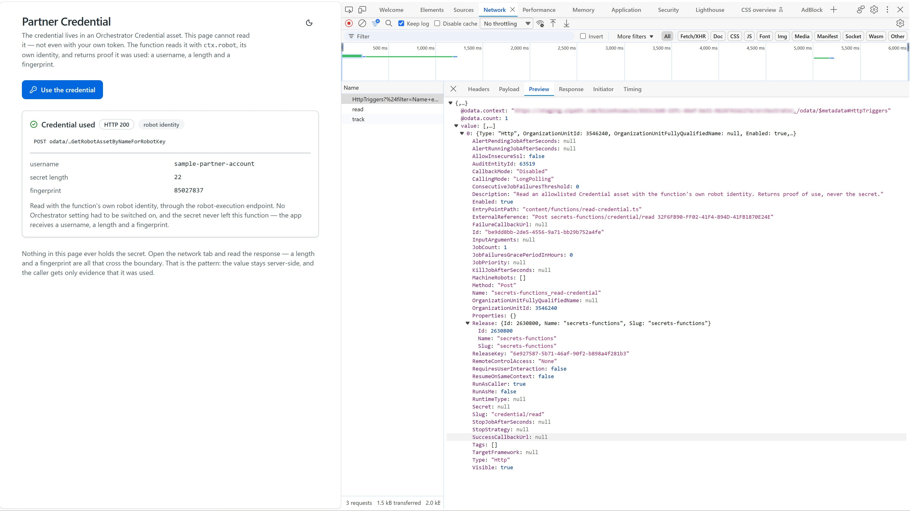
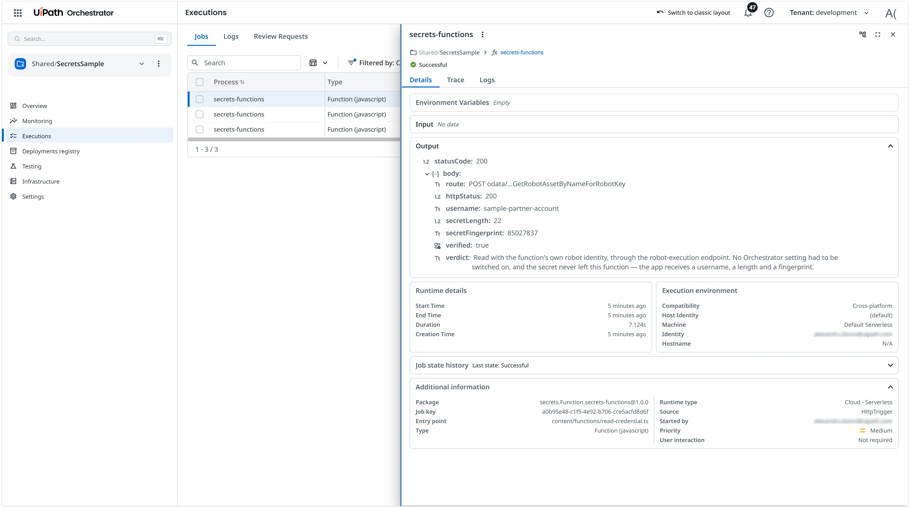

# Secrets: Credential Asset Read By A Function

A Coded App with a single button. Pressing it uses a partner account's credential to do work and
returns proof the credential was used — a username, a length and a fingerprint — without the value
ever reaching the browser.

The app and the function ship as **one solution**: one deploy creates the folder, the Credential
asset, the function, its HTTP trigger and the app together.

## Preview



Each press is a real job, and Orchestrator shows what the function returned:



---

## Why a function is required here

A Credential asset is not merely "hidden in the UI":

- `GET /odata/Assets` returns the row with **no value** — name and type, then `Value: null`.
- The value comes back only from `GetRobotAssetByNameForRobotKey`, which needs a **robot key**. That
  key reaches your code as `ctx.robot.key`, and only a deployed job has one.

So the page cannot read the credential, with or without the SDK. The function is the only place the
read can happen — and the readable set is an **allowlist in code**, because the robot identity is
more privileged than the caller and must not fetch caller-named secrets.

The alternative route, `api/Assets/name/{name}/value` with the caller's own token, requires the
asset's `AllowDirectApiAccess` flag. That flag is identity-blind: switching it on opens the
credential to every identity holding `Assets.View` on the folder, the browser included. It is a
widening, not an enablement step. `secrets-functions/lib/orchestrator.ts` and
`functions/read-credential.ts` carry the full reasoning and the API traps in comments.

---

## Pre-requisites

- **Node.js** 20.x or later
- **npm** 8.x or later
- A **UiPath Automation Cloud** tenant
- Install [UiPath CLI](https://github.com/UiPath/cli#installation) and its tools

  ```bash
  npm i -g @uipath/cli

  uip tools install @uipath/solution-tool       # uip solution ...
  uip tools install @uipath/orchestrator-tool   # uip or ...
  uip tools install @uipath/admin-tool          # uip admin ...
  ```

---

## Setup

### 1. Register an OAuth application

A Coded App signs users in with a **non-confidential** (public) OAuth app, because a browser cannot
keep a client secret. The hosted URL is predictable — it comes from `routingName` in
`deploy-config.json` — so register both redirect URIs now:

```bash
uip login

uip admin external-apps create "Secrets Sample" \
  --non-confidential \
  --redirect-uri "http://localhost:5173,https://<org>.uipath.host/secrets-sample" \
  --user-scope "OR.Execution,OR.Folders,OR.Jobs"
```

Put the returned client id in the deploy config:

```bash
uip solution deploy config set deploy-config.json secrets-app externalClientId <client-id>
```

> **No `OR.Assets`, even though this sample reads an asset.** The *function* does that, with its own
> robot token, inside the job. The app's token only ever resolves and invokes a function, so granting
> it asset access would contradict the point of the sample — and it is not needed: these three scopes
> are verified working against a hosted deployment.
>
> A hosted Coded App requests the scopes from **this registration**, captured when the app is
> deployed. The `scope` field in `uipath.json` applies to local development only (step 5).

### 2. Install dependencies and build the app

**Both** projects need their dependencies installed before the solution can be packed:

```bash
# the functions project — install only, so pack can read the SDK and generate
# the manifest. The function is never started locally (see step 5).
cd secrets-functions
npm install
cd ..

# the app — pack takes the prebuilt bundle, it does not build it for you
cd secrets-app/source
npm install
npm run build
cd ../..
```

The app's bundle goes to `secrets-app/source/dist`, declared as `bundlePath` in
`secrets-app/webAppManifest.json`.

> `-n secrets` on the pack pins the package name. Without it the name comes from the directory being
> packed — fine in a normal clone, where that directory *is* `secrets`, but a renamed or relocated
> copy would publish a differently named package and `deploy run --package-name secrets` would then
> find nothing.

> Skipping `npm install` in `secrets-functions` fails the pack with
> `Manifest generation failed for JS/TS Functions project` — the message does not mention the
> missing dependency.

### 3. Deploy the solution

```bash
uip solution pack . ./out -n secrets -v 1.0.0
uip solution publish ./out/secrets_1.0.0.zip --wait

uip solution deploy run \
  --name SecretsSample \
  --package-name secrets --package-version 1.0.0 \
  --folder-name SecretsSample --parent-folder-path Shared \
  --config-file deploy-config.json
```

That one deploy provisions everything:

| Resource | What it is |
|---|---|
| `SamplePartnerCredential` | the Credential asset, with the dummy values from `deploy-config.json` |
| `secrets-functions` | the function package and its process |
| `secrets-functions_read-credential` | the HTTP trigger, `POST credential/read` |
| `secrets-app` | the Coded App, served at `https://<org>.uipath.host/secrets-sample` |

### 4. Use your own credential (optional)

The shipped credential is a **dummy** — `sample-partner-account` / `sample-secret-value-01` — checked
in so the sample deploys and runs with nothing to fill in. To use your own, set it before step 3:

```bash
uip solution deploy config set deploy-config.json SamplePartnerCredential credentialUserName <username>
uip solution deploy config set deploy-config.json SamplePartnerCredential credentialPassword <password>
```

Note the capital **N** in `credentialUserName`. Nothing in the app or the function depends on the
value; the reported length and fingerprint change with it, which is how you can tell your own value
is the one being read.

### 5. Run the app locally (optional)

**Only the app runs locally. Do not start a local function server.**

`uip function serve` exists and works for functions in general, but it cannot serve *this* one:
`ctx.robot` — the identity the whole sample depends on — is populated only in a deployed job, so a
locally served `read-credential` has no robot key to read the credential with. The function detects
that and fails loudly rather than pretending:

```text
No robot key on this invocation. ctx.robot is always null under local `uip functions serve`,
so this path is deployed-only by design.
```

`Functions.invoke()` resolves the function through Orchestrator's `/odata/HttpTriggers` and calls it
at its trigger URL, so the local app reaches the **deployed** function whether or not anything is
listening on your machine. Step 3 is therefore a prerequisite for step 5, and there is nothing to
start on the backend side.

```bash
cd secrets-app/source
cp uipath.json.example uipath.json    # client id, org, tenant, base URL
cp .env.example .env                  # VITE_UIPATH_FOLDER_ID = the folder's NUMERIC id
npm run dev
```

Fill in only `clientId`, `orgName` and `tenantName`. **Leave `scope` as the example ships it** — it
has to be a subset of what your registration from step 1 grants, plus `OR.Default`, and the example
is already aligned with the `--user-scope` above. Requesting a scope the registration does not grant
fails the sign-in rather than the call, which reads like a broken app.

The base URL must be the **API** subdomain — `https://api.uipath.com`, not
`https://cloud.uipath.com`. The portal domain sends no CORS headers and the browser blocks every
call.

`uip or folders list --output table` gives the folder key but not the numeric id — read that from
`GET {baseUrl}/{org}/{tenant}/orchestrator_/odata/Folders` and take the `Id` field. Only
`npm run dev` needs it; the deployed app gets its folder from an injected meta tag.

---

## Function Contract

One function, defined in `secrets-functions/functions/read-credential.ts`. Its types live in
`secrets-functions/lib/contract.ts` and are shared with the app.

`POST /credential/read` — registered as `secrets-functions_read-credential`

### Inputs

| Field | Type | Required | Description |
|---|---|---|---|
| `assetName` | string | No | Asset to read. Defaults to `SamplePartnerCredential`; anything outside the allowlist is refused with `403`. |

### Outputs

| Field | Type | Required | Description |
|---|---|---|---|
| `route` | string | Yes | The Orchestrator route the value came from |
| `httpStatus` | number | Yes | Status returned by that route |
| `username` | string \| null | No | The credential's username — safe to show |
| `secretLength` | number | Yes | Length of the secret, as evidence it resolved |
| `secretFingerprint` | string \| null | No | Non-reversible hash of the secret |
| `verified` | boolean | Yes | Whether a non-empty secret came back |
| `verdict` | string | Yes | Plain-language summary of what happened |

> The status field is `httpStatus`, not `status`. A numeric top-level `status` is read by the runtime
> as a `FunctionResponse` envelope: it sends that status with an **empty body** and the payload
> disappears, with the job still reporting `Successful`.

---

## Calling the function directly

Without the UI, against the deployed trigger. `<folder-key>` comes from
`uip or folders list --output table`:

```bash
TRIGGER="{baseUrl}/{org}/{tenant}/orchestrator_/t/<folder-key>/secrets-functions"

curl -s -X POST "$TRIGGER/credential/read" \
  -H "Authorization: Bearer <token>" -H "Content-Type: application/json" \
  -d '{}'
```

```json
{
  "route": "POST odata/…GetRobotAssetByNameForRobotKey",
  "httpStatus": 200,
  "username": "sample-partner-account",
  "secretLength": 22,
  "secretFingerprint": "85027837",
  "verified": true,
  "verdict": "Read with the function's own robot identity, …"
}
```

Then ask for something outside the allowlist:

```bash
curl -s -X POST "$TRIGGER/credential/read" \
  -H "Authorization: Bearer <token>" -H "Content-Type: application/json" \
  -d '{"assetName":"SomethingElse"}'
```

```json
{ "error": "\"SomethingElse\" is not in this function's allowlist. … Allowed: SamplePartnerCredential" }
```

> Send `Content-Type: application/json` only when there is a body. The gateway parses a body whenever
> that header is present, so a bodiless GET carrying it fails.

---

## Expected Results

Open `https://<org>.uipath.host/secrets-sample` and sign in.

1. **Use the credential** — returns `HTTP 200` with the username, a secret length of `22` and a
   fingerprint. The `verdict` explains that the read went through the robot-execution endpoint with
   no Orchestrator setting switched on.
2. **Network tab** — two requests make up the call: `Functions.invoke()` resolves the function by
   name against `/odata/HttpTriggers`, then invokes it. The name lookup is not cached, so it is an
   extra round trip on every press; the Studio Web licence the SDK also needs *is* cached, which is
   most of why the first press is slower than the rest. Read the invoke's response — a length and a
   fingerprint are all that cross the boundary.
3. **Orchestrator** — every press is a job under `Shared/SecretsSample`, with the function's output
   on the job's **Details** tab and `content/functions/read-credential.ts` as its entry point.
4. **Theme** — the app follows the system preference and can be toggled from the top-right corner.

---

## Updating and removing the deployment

```bash
# ship a new version in place — keeps the folder and the asset's current value
uip solution pack . ./out -n secrets -v 1.0.1
uip solution publish ./out/secrets_1.0.1.zip --wait
uip solution deploy upgrade <deployment-key> --version 1.0.1

# tear it down, resources included
uip solution deploy uninstall SecretsSample --yes
```

`uip solution deploy list` gives `<deployment-key>`. It **rotates on every operation**, so read it
again before each upgrade rather than reusing the one you saw last time.

---

## Troubleshooting

| Symptom | Cause |
|---|---|
| `Function '<name>' not found in folder` | The registered name is package-prefixed — `secrets-functions_read-credential`, not `read-credential`. The error lists what the folder exposes. |
| `You are not authorized!` on `/odata/HttpTriggers` after signing in | The token is missing a scope. Check what the page actually requests: `curl -s "https://<org>.uipath.host/secrets-sample" \| grep 'uipath:scope'`. |
| Sign-in fails right after changing the registration's scopes | The deployed app holds a **snapshot** of the scope string from when it was deployed, so it keeps requesting the old set. Re-capture it with `uip solution deploy upgrade`. Adding a scope likewise has no effect until you redeploy. |
| Sign-in redirects then fails | The URL you are on is not in the OAuth app's redirect URIs. The hosted one is `https://<org>.uipath.host/secrets-sample`. |
| `routingName 'secrets-sample' is already in use` | Routing names are unique per organization. `uip solution deploy config set deploy-config.json secrets-app routingName <your-name>`, and register the matching redirect URI. |
| `deploy run` stops because the package is already deployed | Upgrade in place, or `uip solution deploy uninstall SecretsSample --yes` first. Re-running `deploy run` does not upgrade anything. |
| A CORS error running locally | You are calling the portal domain. Use the `api.*` host in `uipath.json`. |
| `403` mentioning the allowlist | Working as intended — see **Why a function is required here**. |
| `No robot key on this invocation` / `No robot token` | You are hitting a locally served function. `ctx.robot` exists only in a deployed job — run the app against the deployed function instead (step 5). |
| `npm install` fails on Windows with `ENOENT spawn C:\WINDOWS\system32\cmd.exe` | A `MAX_PATH` problem, not a missing shell: the nested `<app>/source/node_modules/...` tree exceeds 260 characters. Clone somewhere short (`C:\src\...`) or enable long-path support. |
| `deploy uninstall` returns `FailedUninstall`, and nothing can be deployed afterwards | A failed uninstall leaves the record in `Uninstall/Failed`, and `uninstall`, `activate`, `upgrade` and `deploy run` are all then refused — the last one per **package**, so renaming the deployment does not help. `deploy run … --yes` creates a second deployment beside it; clearing the record itself needs Orchestrator. |
