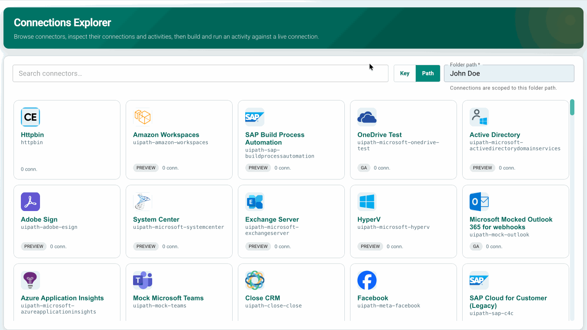

# UiPath Connections Sample App

A sample React + TypeScript application for browsing **UiPath connectors**, inspecting their connections and activities, and executing an activity against a live connection — with the equivalent SDK code generated as you fill in the form. Deploys as a UiPath Coded App.

## Preview



## What it does

The app is a three-level drill-down:

1. **Connectors** — every connector available on the tenant, searchable by name or key, plus the required folder scope.
2. **Connector detail** — that connector's connections (with lifecycle state) side by side with its callable activities.
3. **Activity runner** — an input form generated from the activity's own metadata, a live `execute()` snippet, and the response.

### Folder scope

Connections live in folders, so the app requires a folder before it will open a connector. The Connections API accepts either a **folder key** (a GUID) or a **folder path** (`Shared/Finance`), and the two are mutually exclusive here: a Key/Path toggle switches which one you're entering, and there is only ever a single value behind it, so both can never be sent at once. Switching the toggle clears the field, since a key is never a valid path.

The SDK itself treats folder scope as optional for Connections — an unscoped call returns every folder you can access, and if several folder fields are supplied it forwards them all and lets the server decide. Requiring exactly one is this app's choice, to keep the connection list unambiguous.

The interesting part is level 3. Nothing about any specific connector is hard-coded: the form is generated from the connector's declared field schema, so the same code renders a Slack message form and a Salesforce record form. The code snippet and the request actually sent are both derived from a single `builtRequest` value, so the snippet you copy is always the call you just ran.

## SDK Usage

### Importing the SDK

```typescript
// Core SDK for authentication
import { UiPath, UiPathError } from '@uipath/uipath-typescript/core';

// Connections services — connectors, connections, element metadata and
// activity execution all live in one module.
import {
  Connectors,
  Elements,
  execute,
  type ConnectionGetResponse,
  type ConnectorGetResponse,
  type ElementActivity,
  type ElementObjectMetadataResponse,
  type ExecuteResult,
} from '@uipath/uipath-typescript/connections';
```

### Initializing the SDK

```typescript
// Create SDK instance — empty config is fine for Coded Apps;
// the SDK reads from <meta name="uipath:*"> tags injected by the platform
// (or by the @uipath/coded-apps-dev Vite plugin during local dev).
const sdk = new UiPath();
await sdk.initialize();

// Create service instances
const connectors = new Connectors(sdk);
const elements = new Elements(sdk);
```

### Browsing connectors and their connections

```typescript
// The connector catalogue for the tenant
const allConnectors = await connectors.getAll();

// Connections for one connector, scoped to a folder. The Connections API
// accepts a folder key *or* a folder path — this app requires exactly one.
const connections = await connectors.getConnections(connectorKey, {
  folderKey: '<folderKey>', // or: folderPath: 'Shared/Finance'
  pageSize: 100,
});

// The activities the connector exposes — triggers are filtered out here
// because this app only runs request/response operations.
const activities = await elements.getActivities(connectorKey);
const callable = activities.filter((a) => !a.trigger && !a.isTrigger);
```

### Generating the input form

An activity names an object (`objectName`) and usually a method (`methodName`). The object's metadata carries both the method's parameter list and the object's writable field schema, which is what the form is built from:

```typescript
const metadata = await elements.getObjectMetadata(connectorKey, objectName, {
  hydrateParameters: true,
});

// metadata.metadata.method[methodName] → { method: 'POST', parameters: [...] }
// metadata.fields                      → per-field { method: { POST: { request, required } } }
```

`src/pages/connections.ts` holds the pure helpers that read these shapes: `resolveMethod()` picks the HTTP verb and parameter list, and `bodyFieldsFor()` derives the request-body fields for a write verb.

### Executing an activity

`execute()` is a passthrough to the connector's own API. Unlike most SDK methods it **does not throw on non-2xx** — the connector's error body is what you want to show the user, so inspect `ok` / `status` instead:

```typescript
const result = await execute(sdk, connectionId, path, 'POST', {
  body: { channel: '#general', text: 'Hello from the SDK' },
  queryParams: { verbose: 'true' },
  folderKey: '<folderKey>', // or: folderPath: 'Shared/Finance'
});

if (result.ok) {
  console.log(result.body);
} else {
  console.error(`${result.status} ${result.statusText}`, result.body);
}
```

## Setup

### 1. Create an OAuth external application

In **Admin → External Applications**, create a confidential-or-public OAuth app with these scopes:

`IS.Connections.Read` · `IS.Connectors.Read` · `OR.Users.Read`

That is the full set the app needs to browse connectors, list their connections, read activity
metadata, and execute an activity against a connection.

Add `http://localhost:5173` as a redirect URI for local development.

### 2. Configure the app

```bash
cp uipath.json.example uipath.json
```

Fill in `clientId`, `orgName`, and `tenantName`. `uipath.json` is gitignored — it holds tenant-specific values and is never committed.

> **Troubleshooting — if `execute()` returns `403 {"error":"Forbidden","message":"This API endpoint is not authorized"}`**, switch `baseUrl` between the portal host (`https://cloud.uipath.com`) and the API-gateway host (`https://api.uipath.com`). The identical request — same path, same token, same folder key — can succeed on one and fail on the other, while the read calls (`connectors.getAll()`, `elements.getActivities()`, `elements.getObjectMetadata()`) work on both. The passthrough route exists on both hosts (an invalid token returns `401` either way), so this is an authorization decision made after authentication rather than a missing route.

> **Troubleshooting — if `execute()` returns `401` with a `providerMessage` such as `scope does not match`**, the failure is from the third-party provider, not UiPath. `providerErrorCode` and `providerMessage` carry the provider's own response, so the OAuth scopes above are fine and the connection itself needs re-authorizing with the scopes that specific endpoint requires.

Optionally, create a `.env` file to pre-fill the folder scope. Set **one** of:

```bash
VITE_UIPATH_FOLDER_KEY=<folderKey>
# or
VITE_UIPATH_FOLDER_PATH=Shared/Finance
```

If both are set, the key wins.

### 3. Install and run

```bash
npm install
npm run dev
```

Open http://localhost:5173 and sign in.

## Project structure

```
src/
  App.tsx                      # Coded App OAuth flow + app shell
  main.tsx                     # React entry point
  App.css, index.css           # Design tokens and page styles
  pages/
    ConnectorsPage.tsx         # The three-level drill-down
    connections.ts             # Pure metadata helpers (React-free)
```

## Notes

- This app targets `@uipath/uipath-typescript@1.7.0-beta.2`. The Connections module (`/connections`) is experimental and its export path may change before the stable release.
- Triggers are filtered out of the activity list — the app only runs request/response operations.
- Activities with no bound `objectName` are shown but disabled, since there is no schema to build a form from.
