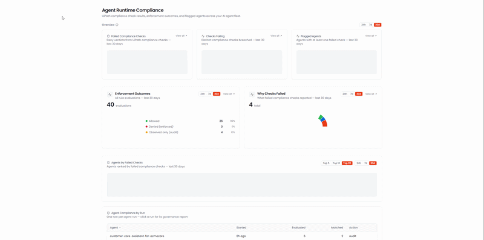

# Agent Runtime Compliance Dashboard

A sample React + TypeScript dashboard showing how your AI agents perform against **UiPath runtime
compliance checks** — failed checks with prior-period deltas, enforcement outcomes
(allowed / denied / observed-only), failure reasons, agents ranked by failed checks, and a
per-run compliance report with the full decision log. Built on the UiPath TypeScript SDK's
Agent Traces governance APIs. Deploys as a UiPath Coded App.

> **Preview feature:** Agent runtime compliance is currently in **preview** — capabilities and
> APIs may evolve, and availability may depend on your organization's enrollment.

> **Checks, not policies:** this dashboard reports UiPath *compliance checks* — recommendations
> from governance packs such as ISO/IEC 42001, evaluated at runtime on every agent run. These
> are not admin-deployed UiPath policies (Automation Ops / Access).

## Preview




## SDK Usage

### Importing the SDK

```typescript
// Core SDK for authentication
import { UiPath } from '@uipath/uipath-typescript/core';

// Agent Traces service — runtime governance decisions + summaries
import {
  AgentTraces,
  AgentGovernanceVerdict,
  AgentGovernanceMode,
} from '@uipath/uipath-typescript/traces';
```

### Initializing the SDK

```typescript
// Empty config is fine for Coded Apps — the SDK reads from <meta name="uipath:*">
// tags injected by the platform (or by @uipath/coded-apps-dev during local dev).
const sdk = new UiPath();
await sdk.initialize();

const traces = new AgentTraces(sdk);

// Aggregated posture over a window: totals + breakdowns by policy/agent/hook/pack
const summary = await traces.getGovernanceSummary(startDate, { endTime: endDate });

// The record grain: one row per policy check, paginated
const page = await traces.getGovernanceDecisions(startDate, {
  endTime: endDate,
  violationsOnly: true,
  pageSize: 200,
});
```

### SDK methods exercised by this sample

| Service | Method | Where it's used |
| ------- | ------ | --------------- |
| `AgentTraces` | `getGovernanceSummary` | KPI tiles (Failed Compliance Checks with prior-period delta, Checks Failing, Flagged Agents) and the Agents by Failed Checks ranking |
| `AgentTraces` | `getGovernanceDecisions` | Enforcement Outcomes donut, Why Checks Failed donut, Agent Compliance by Run table, the per-run compliance report, and every record drill-down |

Each widget's data fetch lives in its own module under `src/metrics/` — small, readable
functions that show idiomatic SDK calls (cursor pagination via a `fetchAll` helper,
prior-window deltas, enum comparisons with `AgentGovernanceVerdict` / `AgentGovernanceMode`).

## Installation

```bash
npm install
```

## Setup Instructions

### 1. Prerequisites

- [Node.js 20+](https://uipath.github.io/uipath-typescript/getting-started/#prerequisites)
- UiPath Cloud tenant access
- An OAuth External Application configured in UiPath Admin Center
- AI agents running with runtime compliance checks enabled (the dashboard lights up as soon as
  check results exist in your tenant)

### 2. Configure OAuth Application

1. In UiPath Cloud: **Admin → External Applications**
2. Click **Add Application → Non Confidential Application**
3. Configure:
   - **Name**: e.g., "Agent Runtime Compliance Dashboard"
   - **Redirect URI**: `http://localhost:25173` (for development)
   - **Scopes** (user scopes): `OR.Folders.Read`, `Insights`, `Insights.RealTimeData`, `Traces.Api`
4. Save and copy the **Client ID**

Or via the CLI:

```bash
uip admin external-apps create "Agent Runtime Compliance Dashboard" --non-confidential --redirect-uri "http://localhost:25173" --user-scope "OR.Folders.Read,Insights,Insights.RealTimeData,Traces.Api" --output json
```

### 3. Local Configuration

Copy the template and fill in your tenant values:

```bash
cp uipath.json.example uipath.json
```

Edit `uipath.json`:

```json
{
  "scope": "OR.Folders.Read Insights Insights.RealTimeData Traces.Api",
  "clientId": "<your-oauth-external-app-client-id>",
  "orgName": "<your-org-name>",
  "tenantName": "<your-tenant-name>",
  "baseUrl": "https://api.uipath.com",
  "redirectUri": "http://localhost:25173"
}
```

> `uipath.json` is `.gitignore`d on purpose — it carries tenant-specific credentials. Only
> `uipath.json.example` is committed. For **deploy-only** use, `clientId` is the single required
> field: org, tenant, and redirect URI are injected automatically at deploy time from the org
> you're logged into.

### 4. Run

```bash
npm run dev -- --port 25173
```

Open `http://localhost:25173` and sign in — the port must match the external app's registered
redirect URI.

## Application Structure

```
src/
├── dashboard/
│   ├── Dashboard.tsx       # Layout: KPI row (shared Overview range toggle), charts, tables
│   ├── widgets/            # One component per widget — KPIs, donuts, ranked tables
│   ├── views/              # Drill-down pages, incl. the per-run compliance report
│   └── components/         # Header, cards, segmented toggles, records table, states
├── metrics/                # Data modules — one per widget; ALL SDK calls live here
├── hooks/useAuth.ts        # SDK init + OAuth sign-in state
└── lib/                    # Time windows, cursor pagination, number/date formatting
```

## Key Features

- **Overview KPIs** with a shared 24h / 7d / 30d toggle — Failed Compliance Checks (delta vs the
  equal-length prior window), Checks Failing, Flagged Agents; every tile clicks through to the
  underlying records
- **Enforcement Outcomes** donut with a count + percentage legend — allowed vs denied (enforced)
  vs observed-only (audit) across all evaluations
- **Why Checks Failed** — free-text failure reasons normalized into categories (top 4 + Other)
- **Agents by Failed Checks** — Top 5/10/20 ranking; click an agent for its individual records
- **Agent Compliance by Run** — one row per run; click through to a full report: stat tiles,
  allowed-vs-denied per lifecycle hook, denial breakdowns, and the chronological decision log
- Per-card time-range toggles that re-fetch just that card's data

## Technologies Used

- **React 18** + **TypeScript** + **Vite**
- **@uipath/uipath-typescript** — the SDK under test
- **@uipath/coded-apps-dev** — Vite plugin emitting `<meta name="uipath:*">` tags during local dev
- **Tailwind CSS** + **Recharts**
- **OAuth 2.0** (handled by the SDK) for authentication

## Building for Production

```bash
npm run build
```

Built bundle lives in `dist/`. Deploy it to your tenant as a Coded App with the `uip` CLI
(one-time: `uip tools install @uipath/codedapp-tool` and `@uipath/orchestrator-tool`):

```bash
uip codedapp pack dist -n "Agent Runtime Compliance" --version 1.0.0
uip codedapp publish -n "Agent Runtime Compliance" --version 1.0.0
uip codedapp deploy -n "Agent Runtime Compliance" --path-name "agent-runtime-compliance" --folder-key "<FOLDER_KEY>" --tags "governance,dashboard"
```

Find your folder key with `uip or folders list --output json`. On later updates, bump
`--version` on pack/publish and omit `--path-name` (and never pass `--version` to `deploy`).
The deploy output prints your app URL: `https://<org>.uipath.host/agent-runtime-compliance`.
