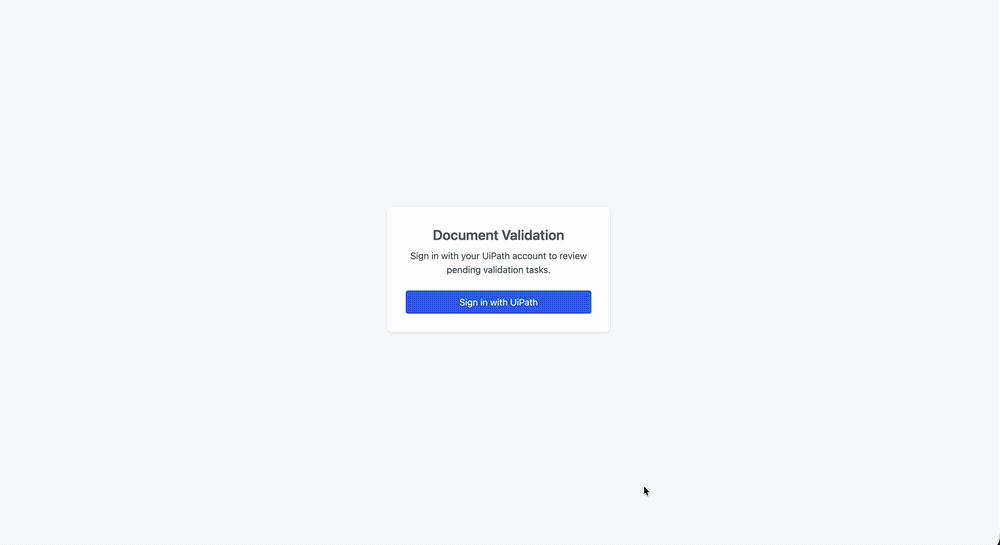

# UiPath Document Validation App

A sample React + TypeScript + Vite application that demonstrates building a human-in-the-loop document validation inbox on top of UiPath Action Center. It lists Document Validation tasks from Orchestrator, grouped into **Pending**, **Unassigned**, and **Completed** tabs, renders the document and extracted fields in UiPath's validation station web component, and lets a reviewer save, submit, or report an exception on a task back to Action Center.

## Preview



## What this sample demonstrates

- OAuth 2.0 authorization code + PKCE login against UiPath Cloud using the `@uipath/uipath-typescript` SDK
- Listing Document Validation tasks by status (`Tasks.getAll` with an OData filter) across Pending / Unassigned / Completed tabs
- Loading a single task with full validation data (`Tasks.getById` with `TaskType.DocumentValidation`)
- Embedding `@uipath/ui-widgets-validation-station` to render the document, fields, and validation actions
- Saving in-progress edits (save as draft) and submitting the completed task (`Task.complete`)
- Reporting a document as an exception via `OrchestratorDuModule.submitExceptionReport`
- Opening Unassigned and Completed tasks in read-only mode

## Prerequisites

- Node.js 20+ and npm
- A UiPath Cloud organization and tenant with Action Center enabled
- At least one pending Document Validation task in the tenant (produced by a Document Understanding process)
- An OAuth External Application registered in the UiPath Admin Center (see below)

## Configure the OAuth External Application

1. In UiPath Cloud: **Admin → External Applications → Add Application**.
2. Choose **Non Confidential Application** (this is a browser SPA — no client secret is used or stored).
3. Set:
   - **Name**: e.g., `Document Validation Sample`
   - **Redirect URI**: the exact URL the app runs on, including scheme, host, port, and path. For local development this is `http://localhost:5173/`. The redirect URI is matched **exactly** by UiPath — a trailing-slash or port mismatch will fail the callback.
   - **Scopes** (least-privilege set used by this sample):
     - `OR.Tasks` — list and complete validation tasks
     - `OR.Buckets` — fetch the document binary referenced by the task
     - `OR.Folders` — resolve the folder the task belongs to
4. Save and copy the generated **Application ID** — this is the `clientId` value below.

> Add a separate Redirect URI entry for any other environment (e.g., a staging URL). Do not use wildcards.

## Configure `uipath.json`

Copy the template and fill in the values:

```bash
cp uipath.example.json uipath.json
```

| Field | Where to find it | Example |
|-------|------------------|---------|
| `clientId` | Application ID from the External Application you just created | `12345678-aaaa-bbbb-cccc-1234567890ab` |
| `orgName` | The organization slug in your UiPath Cloud URL (`cloud.uipath.com/<org>/<tenant>/...`) | `acme` |
| `tenantName` | The tenant slug, in the same URL | `DefaultTenant` |
| `baseUrl` | UiPath Cloud API host. Leave as the default unless you use a regional endpoint | `https://api.uipath.com` |
| `redirectUri` | Must match the Redirect URI registered on the External Application **exactly** | `http://localhost:5173/` |
| `scope` | Space-separated scopes — must be a subset of the scopes granted to the External Application | `OR.Tasks OR.Buckets OR.Folders` |

Never commit `uipath.json`. The client ID is not a secret, but the file is gitignored to keep environment-specific values out of source control. The `@uipath/coded-apps-dev` Vite plugin reads `uipath.json` and injects the values as `<meta>` tags during local dev; in production, the UiPath platform injects them at deploy time.

## Install, run, and build

```bash
npm install      # install dependencies
npm run dev      # start Vite dev server at http://localhost:5173
npm run build    # type-check and produce a production bundle in dist/
npm run preview  # serve the built bundle locally for verification
```

On first load the app shows a **Sign in with UiPath** button. Clicking it kicks off the OAuth redirect; after returning from UiPath Cloud the inbox shows Document Validation tasks the signed-in user can access, split across the **Pending**, **Unassigned**, and **Completed** tabs. Selecting a Pending task loads the document into the validation station, where you can edit fields and **Save**, **Submit**, or **Report exception**. Tasks in the Unassigned and Completed tabs open read-only.

## Project layout

```
src/
├── components/
│   ├── TaskList.tsx          # Left-pane task list for the active tab
│   ├── ValidationInbox.tsx   # Inbox shell: tabs, fetches tasks, owns selection
│   └── ValidationPanel.tsx   # Right-pane validation station host + task actions
├── hooks/
│   └── useAuth.tsx           # AuthProvider wrapping the UiPath SDK + OAuth flow
├── App.tsx                   # Top-level layout, sign-in / sign-out
└── main.tsx                  # Entry point
```

### Validation station runtime assets

The validation station web component resolves several files at runtime (relative to its own bundle): the `du-assets/` folder (PDF.js worker, cmaps, wasm, i18n) plus `styles.css`, `fonts.css`, and `media/`. `vite.config.ts` handles these in two ways:

- **Build** — a `closeBundle` plugin copies `du-assets/`, `media/`, `styles.css`, and `fonts.css` from `@uipath/du-validation-station-wc` next to the emitted JS chunks so `import.meta.url` resolution finds them.
- **Dev** — Vite rewrites `.css` requests into JS modules, which would break the component's runtime `fetch("styles.css")`. A dev-only middleware detects that raw fetch (`Sec-Fetch-Dest: empty`) and returns the real CSS instead.

The web component bundle is also excluded from Vite's dependency pre-bundling (`optimizeDeps.exclude`), since pre-bundling rewrites `import.meta.url` and breaks the runtime asset resolution. If these steps are missing, the component silently 404s at runtime — PDFs fail to render and icons fall back to empty boxes.

## Troubleshooting

- **Callback fails with `redirect_uri_mismatch`** — the `redirectUri` in `uipath.json` and the URL you opened in the browser must both match the External Application's Redirect URI character-for-character (scheme, host, port, path, trailing slash).
- **`insufficient_scope` when loading tasks** — the External Application is missing one of `OR.Tasks`, `OR.Buckets`, or `OR.Folders`. Update the app, then sign out and sign back in to get a new token.
- **A tab is empty** — the signed-in user has no tasks in that status (Pending / Unassigned / Completed), or no access to the folder the tasks live in. Verify in Action Center first.
- **Validation station shows a blank panel in production but works in dev** — the asset copy step in `vite.config.ts` did not run, so `du-assets/`, `styles.css`, `fonts.css`, or `media/` are missing from the bundle. Confirm the copy plugin is registered and rebuild.
- **Icons render as empty boxes or PDFs don't load in dev** — the dev raw-CSS middleware in `vite.config.ts` isn't serving `styles.css`/`fonts.css` to the web component's runtime `fetch`. Confirm the `serve`-only plugin is registered.

## Further reading

- [UiPath TypeScript SDK docs](https://uipath.github.io/uipath-typescript/)
- [OAuth scopes reference](https://uipath.github.io/uipath-typescript/oauth-scopes/)
- [Action Center Tasks](https://docs.uipath.com/action-center/)
