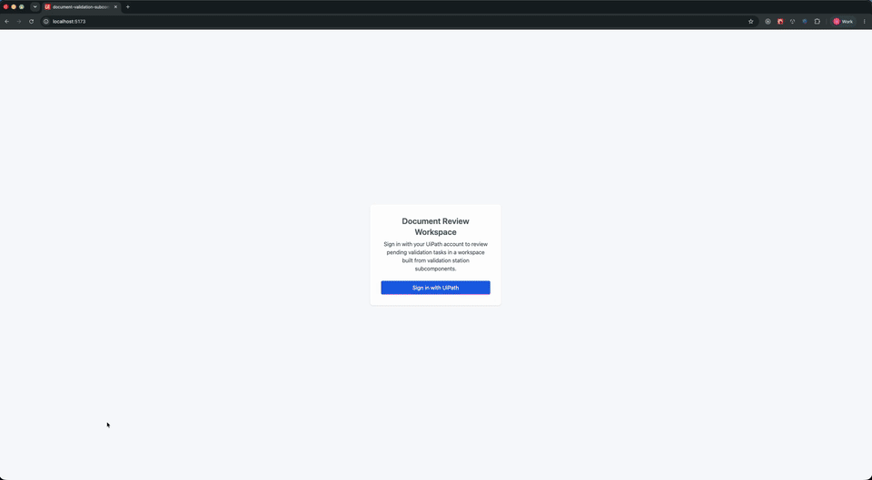

# UiPath Document Review Workspace (Validation Station subcomponents)

A sample React + TypeScript + Vite application that builds a **custom** human-in-the-loop document review screen by composing the individual **subcomponents** exported by `@uipath/ui-widgets-validation-station` — rather than the all-in-one `ValidationStation` component.

It lists pending Document Validation tasks from UiPath Action Center and, for the selected task, lays out five compact subcomponents in a grid: the document viewer, a document-type field, the extraction fields form, a line-items table editor, and a business-rules panel. All five share a single `instanceId`, so they mirror one store — selecting a field in the form highlights it in the viewer, picking a table field opens the table editor, and clicking a rule focuses the offending field, with no cross-wiring.

> **Monolithic vs. compose-your-own.** The sibling [`document-validation-app`](../document-validation-app) renders the same task with the single `ValidationStation` component — the fastest path when you want the standard layout. **This** sample shows the other path: drop the subcomponents into your own layout when you need to rearrange, hide, or embed individual panels. Both talk to the same tasks and the same bucket artifacts.

## Preview



## What this sample demonstrates

- OAuth 2.0 authorization code + PKCE login against UiPath Cloud using the `@uipath/uipath-typescript` SDK
- Listing Document Validation tasks (`Tasks.getAll` with an OData filter) and hydrating one with its full validation payload (`Tasks.getById` with `TaskType.DocumentValidation`)
- Fetching the document artifacts **once** with the `useDuDocumentArtifacts` hook and sharing them across subcomponents
- Composing `DocumentViewer`, `CompactDocTypeField`, `CompactFieldsForm`, `CompactTableEditor`, and `CompactBusinessRules` into a custom layout linked by a shared `instanceId`
- Using `options` flags (`hideBusinessRules`, `hideDocumentTypeField`, `emitDtoStateChanges`) so the fields form drops the panels that are rendered standalone
- Submitting the completed task (`Task.complete`), saving in-progress edits (save as draft), and reporting a document as an exception via `OrchestratorDuModule.submitExceptionReport`

## Prerequisites

- Node.js 20+ and npm
- A UiPath Cloud organization and tenant with Action Center enabled
- At least one pending Document Validation task in the tenant (produced by a Document Understanding process)
- An OAuth External Application registered in the UiPath Admin Center (see below)

## Configure the OAuth External Application

1. In UiPath Cloud: **Admin → External Applications → Add Application**.
2. Choose **Non Confidential Application** (this is a browser SPA — no client secret is used or stored).
3. Set:
   - **Name**: e.g., `Document Review Subcomponents Sample`
   - **Redirect URI**: the exact URL the app runs on, including scheme, host, port, and path. For local development this is `http://localhost:5173/`. The redirect URI is matched **exactly** by UiPath — a trailing-slash or port mismatch will fail the callback.
   - **Scopes** (least-privilege set used by this sample):
     - `OR.Tasks` — list and complete validation tasks
     - `OR.Buckets` — read the source document and write the validated/draft result back to the bucket on submit and save-as-draft
     - `OR.Folders.Read` — resolve the folder a task belongs to
4. Save and copy the generated **Application ID** — this is the `clientId` value below.

> Add a separate Redirect URI entry for any other environment (e.g., a staging URL). Do not use wildcards.

## Configure `uipath.json`

Copy the template and fill in the values:

```bash
cp uipath.json.example uipath.json
```

| Field | Where to find it | Example |
|-------|------------------|---------|
| `clientId` | Application ID from the External Application you just created | `12345678-aaaa-bbbb-cccc-1234567890ab` |
| `orgName` | The organization slug in your UiPath Cloud URL (`cloud.uipath.com/<org>/<tenant>/...`) | `acme` |
| `tenantName` | The tenant slug, in the same URL | `DefaultTenant` |
| `baseUrl` | UiPath Cloud API host. Leave as the default unless you use a regional endpoint | `https://api.uipath.com` |
| `redirectUri` | Must match the Redirect URI registered on the External Application **exactly** | `http://localhost:5173/` |
| `scope` | Space-separated scopes — must be a subset of the scopes granted to the External Application | `OR.Tasks OR.Buckets OR.Folders.Read` |

The client ID is not a secret, but `uipath.json` is gitignored to keep environment-specific values out of source control. The `@uipath/coded-apps-dev` Vite plugin reads `uipath.json` and injects the values as `<meta>` tags during local dev; in production, the UiPath platform injects them at deploy time.

## Install, run, and build

```bash
npm install      # install dependencies
npm run dev      # start Vite dev server at http://localhost:5173
npm run build    # type-check and produce a production bundle in dist/
npm run preview  # serve the built bundle locally for verification
```

On first load the app shows a **Sign in with UiPath** button. After returning from UiPath Cloud, pick a pending task from the left to open the review workspace. Edit fields, select a table field to open the line-items editor, then **Submit**, **Save as draft**, or **Report exception** from the fields form's built-in actions. The status bar at the bottom of the workspace shows the shared store id and the last cross-component interaction.

## Project layout

```
src/
├── components/
│   ├── TaskList.tsx          # Left-pane list of pending tasks
│   ├── ReviewInbox.tsx       # Owns task fetch/selection + the SDK mutations
│   ├── ReviewWorkspace.tsx   # The 5-subcomponent composition (shared instance-id)
│   ├── Panel.tsx             # Grid-area panel wrapper
│   └── CenteredMessage.tsx   # Empty / loading / error placeholder
├── hooks/
│   └── useAuth.tsx           # AuthProvider wrapping the UiPath SDK + OAuth flow
├── App.tsx                   # Top-level layout, sign-in / sign-out
└── main.tsx                  # Entry point
```

### Validation station runtime assets

The validation station ships as a **separate web-component bundle** — `main.js`, `polyfills.js`, their chunks, `styles.css`, `fonts.css` and the PDF and font assets — that is loaded at runtime rather than imported.

- **Staging** — `scripts/stage-du-wc.mjs` copies that bundle out of `node_modules/@uipath/du-validation-station-wc` into `public/du-vs-wc`. It runs automatically via the `predev` and `prebuild` hooks, so `npm run dev` and `npm run build` both take care of it. Vite serves `public/` verbatim in dev and copies it to `dist/` on build, which keeps these prebuilt Angular bundles out of Vite's module graph.
- **Loading** — `src/main.tsx` calls `configureValidationStationWc({ includeFonts: true })`, which loads the component from `<app base>/du-vs-wc` and registers its custom elements. Without this call the elements are never defined and the widgets render nothing. `includeFonts` pulls in `fonts.css`, which carries the Apollo and Material Icons faces — omit it and the icons render blank.

After `npm run build`, `dist/du-vs-wc/` should contain `main.js`, `polyfills.js`, `styles.css` and `du-assets/`.

> **Use `persistent: false`.** With `persistent` on, StrictMode's throwaway unmount triggers `forceDestroy()` on the underlying element, so it never re-renders (a blank panel). These panels live in a static grid and are never re-parented, so `false` is safe.

## Troubleshooting

- **Callback fails with `redirect_uri_mismatch`** — the `redirectUri` in `uipath.json` and the URL you opened in the browser must both match the External Application's Redirect URI character-for-character (scheme, host, port, path, trailing slash).
- **`insufficient_scope` when loading tasks** — the External Application is missing one of `OR.Tasks`, `OR.Buckets`, or `OR.Folders.Read`. Update the app, then sign out and sign back in to get a new token.
- **The list is empty** — the signed-in user has no pending / unassigned Document Validation tasks, or no access to the folder the tasks live in. Verify in Action Center first.
- **A panel is blank** — either the asset copy step in `vite.config.ts` did not run (production), the dev raw-CSS middleware is not registered (dev), or `persistent` was left `true` (see the note above).

## Further reading

- [UiPath TypeScript SDK docs](https://uipath.github.io/uipath-typescript/)
- [OAuth scopes reference](https://uipath.github.io/uipath-typescript/oauth-scopes/)
- [Action Center Tasks](https://docs.uipath.com/action-center/)
