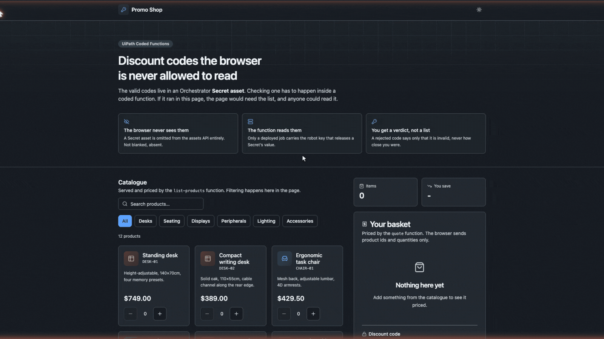

# Promo Shop: a Coded Functions sample

A small shop that demonstrates the **Functions** service. You browse a catalogue, add items to a
basket, and enter a discount code at checkout.

The discount code is the point. **The list of valid codes lives in an Orchestrator Secret asset**,
which the browser cannot read, even with the signed-in user's own token. So checking a code has to
happen inside a coded function. If validation ran in the page, the page would need the list, and
anyone could open the source and use codes they were never given.

That is the whole point of the sample: **a value that must never reach the client, used by a
function on the client's behalf.**

## Preview



## SDK usage

```typescript
import { UiPath } from '@uipath/uipath-typescript/core';
import { Functions } from '@uipath/uipath-typescript/functions';

// Deployed, the platform injects configuration; locally the coded-apps-dev
// Vite plugin injects the same values from uipath.json.
const sdk = new UiPath();
await sdk.initialize();

const functions = new Functions(sdk);

const quote = await functions.invoke<QuoteInput, Quote>(
  { name: 'promo-shop-fn_quote' },
  { items: [{ productId: 'p-1001', quantity: 2 }], promoCode: 'SPRING25' },
  { folderId },
);
```

A deployed function's registered name is **package-prefixed**: `quote` inside the
`promo-shop-fn` package registers as `promo-shop-fn_quote`. Passing the bare name returns a
not-found error listing what the folder actually exposes.

`coded-functions/lib/contract.ts` is the single source of truth for every input and output type.
The functions import it directly; the app imports it with `import type`, so the two halves share
one definition and nothing is bundled across the boundary.

## Why a coded function is required here

A Secret asset is not merely "hidden in the UI":

- It is **omitted entirely** from the ordinary assets listing. A query returns zero rows, not a
  row with a blank value.
- Its value is returned only by `GetRobotAssetByNameForRobotKey`, which requires a **robot key**.
  That key reaches your code as `ctx.robot.key`, and only a deployed job has one.

So the browser cannot read the codes by any route, with or without the SDK. The function is the
only place the check can happen. See `coded-functions/lib/orchestrator.ts`.

> For a Secret asset the value arrives in the **`SecretValue`** field. `StringValue`, the field
> that works for Text assets, is an empty string, so reading that instead looks exactly like a
> broken feature.

---

# Setup

Follow these in order. Steps 1 to 4 stand up the backend, step 6 runs the app locally, and step 7
deploys it as a hosted Coded App.

## 1. Install the CLI and sign in

```bash
npm install -g @uipath/cli

uip tools install @uipath/functions-tool      # uip functions ...
uip tools install @uipath/codedapp-tool       # uip codedapp ...
uip tools install @uipath/orchestrator-tool   # uip or ...

uip login
```

For a non-production environment, point the login at that authority:

```bash
uip login --authority https://alpha.uipath.com
```

## 2. Collect the values you will need

You need three things, and two of them are easy to confuse.

```bash
uip or folders list --output table
```

| value | looks like | used by |
|---|---|---|
| folder **key** | a GUID, `717ede25-...` | `uip functions publish --feed-id`, `uip codedapp deploy --folder-key` |
| folder **numeric id** | `1543099` | the app, via `VITE_UIPATH_FOLDER_ID` |
| base URL | see below | `uipath.json` |

If `folders list` does not show the numeric id, read it from
`GET {baseUrl}/{org}/{tenant}/orchestrator_/odata/Folders` and take the `Id` field.

**The base URL must be the API subdomain, not the portal domain.** The portal domain sends no CORS
headers and the browser will block every call.

| environment | base URL |
|---|---|
| Production | `https://api.uipath.com` |
| Alpha | `https://alpha.api.uipath.com` |
| Staging | `https://staging.api.uipath.com` |

## 3. Create your own Secret asset

The functions look for an asset named `promo-codes`, declared in
`coded-functions/lib/contract.ts`. Its value is a JSON array of `{ code, percentOff, label }`.
**Choose your own codes**; the ones below are only an example.

A Secret asset needs a credential store, so find one first:

```bash
uip or credential-stores list --output table
```

Then create the asset, substituting your store key and folder key:

```bash
uip or assets create "promo-codes" \
  '[{"code":"WELCOME10","percentOff":10,"label":"Welcome offer"},{"code":"SPRING25","percentOff":25,"label":"Spring sale"}]' \
  --type Secret \
  --credential-store-key <credential-store-key> \
  --folder-key <folder-key>
```

It must be `--type Secret`. A Text asset would be readable from the browser, which defeats the
entire sample.

Whatever codes you put here are the ones the app will accept. Nothing in the app or the functions
hardcodes them.

## 4. Deploy the functions

```bash
cd coded-functions
npm install
uip functions pack
uip functions publish --feed-id <folder-key>

uip or processes create \
  --name promo-shop-fn \
  --package-key promo-shop-fn --package-version 1.2.0 \
  --folder-key <folder-key> \
  --auto-create-triggers
```

Publishing alone does not activate anything. The release has to point at the version before
Orchestrator re-reads the manifest and syncs triggers. When you publish a new version later,
recreate the process at that version.

Confirm the two triggers exist:

```bash
uip or triggers list --folder-key <folder-key> --output table
```

You should see `promo-shop-fn_list-products` and `promo-shop-fn_quote`.

Schema bounds in `defineFunction` must be literal numbers, not identifiers, or the extractor
silently drops the whole schema. To check after a pack:

```bash
node -e "const e=require('./entry-points.json');for(const p of e.entryPoints)console.log(p.filePath, JSON.stringify(p.input))"
```

## 5. Register an OAuth application

A Coded App signs users in with a **non-confidential** (public) OAuth app, because a browser
cannot keep a client secret.

```bash
uip admin external-apps create "promo-shop" \
  --non-confidential \
  --redirect-uri "http://localhost:5173" \
  --user-scope "OR.Execution,OR.Folders.Read"
```

Keep the returned client id. When you later deploy to a hosted URL, add that URL as a second
redirect URI:

```bash
uip admin external-apps update <client-id> \
  --redirect-uri "http://localhost:5173,https://<org>.uipath.host/promo-shop" \
  --user-scope "OR.Execution,OR.Folders.Read"
```

> The scope string in `uipath.json` must include **`OR.Default`** or the HTTP trigger returns 403.
> It is auto-granted to every registered external app, so it does not appear as a grantable scope
> on the registration, but it still has to be requested.

## 6. Configure and run locally

```bash
cp uipath.json.example uipath.json
cp .env.example .env
```

Fill in `uipath.json` with your client id, org, tenant and base URL, then set
`VITE_UIPATH_FOLDER_ID` in `.env` to the folder's **numeric** id.

```bash
npm install
npm run dev
```

Open `http://localhost:5173`, sign in, add something to the basket, and try one of your codes.

## 7. Deploy as a hosted Coded App

```bash
npm run build            # produces dist/

uip codedapp pack dist -n promo-shop --version 1.0.0 --content-type webapp
uip codedapp publish --name promo-shop --version 1.0.0 --type Web
uip codedapp deploy  --name promo-shop --version 1.0.0 \
  --folder-key <folder-key> \
  --client-id <your-oauth-client-id>
```

Deploy prints the app URL. Add that URL to your OAuth app's redirect URIs (step 5) or sign-in
fails. Bump the version to re-publish, and keep `.uipath/` between publish and deploy.

## 8. Verify

Check every asset serves, since a deploy can succeed while a file fails to upload:

```bash
BASE="https://<org>.uipath.host/promo-shop"
for a in $(curl -s "$BASE" | grep -oE '\./assets/[^"]+' | sed 's|^\./||'); do
  echo "$(curl -s -o /dev/null -w '%{http_code}' "$BASE/$a")  $a"
done
```

Every line should read `200`.

To exercise the functions directly, without the UI:

```bash
TRIGGER="{baseUrl}/{org}/{tenant}/orchestrator_/t/<folder-key>/promo-shop-fn"

curl -s "$TRIGGER/products" -H "Authorization: Bearer <token>"

curl -s -X POST "$TRIGGER/quote" \
  -H "Authorization: Bearer <token>" -H "Content-Type: application/json" \
  -d '{"items":[{"productId":"p-1001","quantity":1}],"promoCode":"SPRING25"}'
```

A valid code returns a `discount` above zero and `promo.applied: true`. An invalid one returns
`applied: false` with a reason, and no hint about what a real code looks like.

> Send `Content-Type: application/json` only on POST. The gateway parses a body whenever that
> header is present, so a bodiless GET carrying it will fail.

---

## Structure

```
functions-app/
├── coded-functions/            deploy this first
│   ├── functions/
│   │   ├── list-products.ts    GET  /products, the catalogue
│   │   └── quote.ts            POST /quote, prices and checks the code
│   └── lib/
│       ├── contract.ts         shared I/O types, the single source of truth
│       ├── catalogue.ts        products and prices
│       ├── promo.ts            parsing and matching codes
│       └── orchestrator.ts     reads the Secret asset
└── src/
    ├── api.ts                  one wrapper per function
    ├── auth.ts                 the sign-in gate
    └── components/             Hero, Catalogue, Basket, CheckoutDialog
```

| function | route | purpose |
|---|---|---|
| `list-products` | `GET /products` | the catalogue, with prices |
| `quote` | `POST /quote` | prices the basket and validates the promo code |

## Notes

- A rejected code says only that it is not valid. It reveals nothing about how many codes exist
  or what they look like, since a hint would undo the point of hiding the list.
- Prices come from the function too. The browser only ever sends product ids and quantities; open
  the Network tab on a `quote` call and there is no money in the request.
- Search and category filtering run **in the page**, not in a function. The catalogue is already
  loaded, so a round trip per keystroke would spend a job filtering data the browser is holding
  anyway. A function earns its place when the browser cannot be trusted with something, and
  filtering is not that.
- Sign-in is an explicit gate. `sdk.initialize()` starts a PKCE redirect, so calling it lazily
  from the first data fetch paints the app for a moment before navigating away.

## Troubleshooting

**`Function '<name>' not found in folder`.** The registered name is package-prefixed
(`promo-shop-fn_quote`, not `quote`). The error lists what the folder actually exposes.

**403 from the HTTP trigger.** `OR.Default` is missing from the scope string in `uipath.json`.

**Every code is rejected.** Check the asset is `Secret`, has a value, and holds valid JSON. A
malformed value is treated as "no codes are valid" rather than erroring, so the symptom is silent.

**`No robot identity on this run`.** `ctx.robot` is populated only in a deployed job, so the
functions have to be deployed rather than served locally.

**A CORS error in the browser.** You are calling the portal domain. Use the `api.*` host from
step 2.

**Sign-in redirects then fails.** The URL you are on is not in the OAuth app's redirect URIs.
