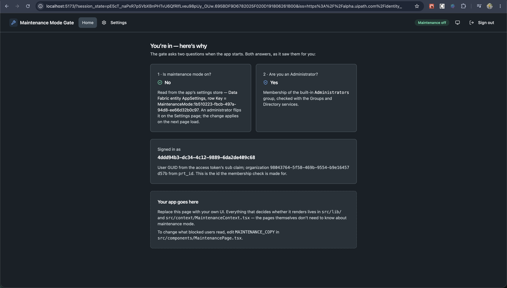
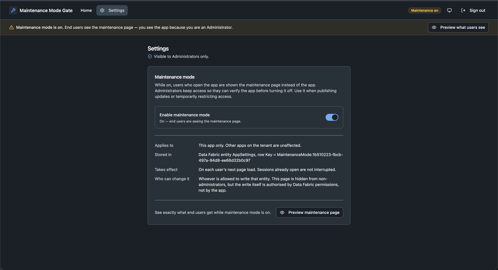
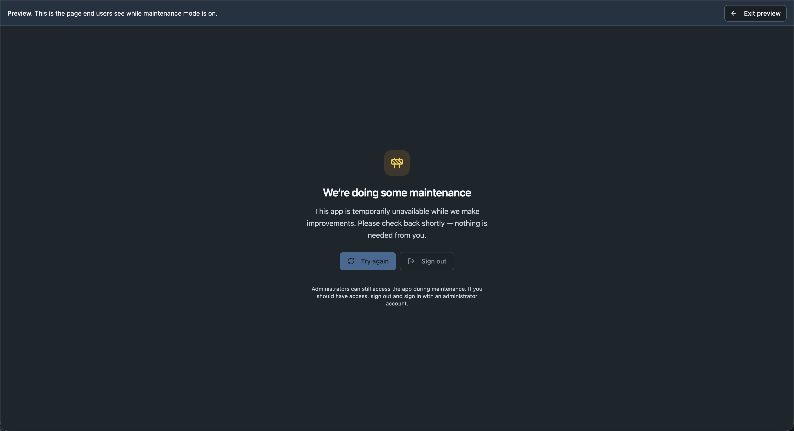

# UiPath Maintenance Mode Sample App

A sample React + TypeScript Coded App that can be put into **maintenance mode from inside the app**. An administrator flips a switch on a Settings page; from then on, end users see a maintenance page instead of the app, while members of the organization's built-in **Administrators** group still reach it, so they can verify the app before turning maintenance off. Deploys as a UiPath Coded App.

The admin check uses the SDK's **Groups** and **Directory** services. The switch itself is kept behind a tiny storage interface, backed today by a **Data Fabric entity** holding key/value rows — the same shape as platform-level app settings, so the storage can be swapped later without touching anything else.

## What it looks like

An administrator, maintenance off. The Home page prints both answers the gate used, so the decision is never a black box.



The Settings page, admin only. Flipping the switch writes it for everyone; the amber bar appears because an admin keeps access while users do not.



What an end user gets while maintenance is on. "Try again" re-runs the checks, so they get back in without signing in again.



## How the gate decides

Two questions are asked once, in parallel, when the app starts:

| Question | Answered by | If the call fails |
| --- | --- | --- |
| **Is maintenance mode on?** | `MaintenanceStore.read()` — today, this app's row in the `AppSettings` Data Fabric entity | Treated as **off**. A switch that can't be read must not take the app down for everyone. |
| **Is this user an Administrator?** | `groups.getAll()` to find the built-in `Administrators` group, then `directory.getGroupMembership(userId, [adminGroupId])` | Treated as **not an admin**. A privilege that can't be confirmed is not granted. |

Then:

- Maintenance **on** and user is **not** an admin → the maintenance page.
- Otherwise → the app. Admins additionally get a banner while maintenance is on, plus a **Settings** page with the switch and a "Preview what users see" button.

Checks run at startup only: a session that is already open is not interrupted when the switch is flipped; users meet the maintenance page on their next page load.

## SDK Usage

### Importing the SDK

```typescript
// Core SDK for authentication
import { UiPath, UiPathError } from '@uipath/uipath-typescript/core';

// The admin check: groups + directory membership
import { Groups, PlatformGroupType } from '@uipath/uipath-typescript/groups';
import { Directory } from '@uipath/uipath-typescript/platform';

// Today's storage for the switch: a Data Fabric entity
import { Entities } from '@uipath/uipath-typescript/entities';
```

### Initializing the SDK

```typescript
// Create SDK instance — empty config is fine for Coded Apps;
// the SDK reads from <meta name="uipath:*"> tags injected by the platform
// (or by the @uipath/coded-apps-dev Vite plugin during local dev).
const sdk = new UiPath();
await sdk.initialize();
```

### Who is the user

The access token is a JWT. Its `sub` claim is the user's GUID and `prt_id` is the organization's GUID. `src/lib/identity.ts` decodes the payload:

```typescript
const { userId, organizationId } = getCurrentUser(sdk);
```

Only the payload is read — the signature is not verified in the browser, and it doesn't need to be: these values only decide *which* user to ask the Directory API about, and that request carries the same token, so the server enforces the truth.

### Which group counts as admin, and is the user in it

```typescript
const groups = new Groups(sdk);
const adminGroup = (await groups.getAll()).find(
  (g) => g.type === PlatformGroupType.BuiltIn && g.name === 'Administrators',
);
if (!adminGroup) return false; // no admin group → nobody is an admin

const directory = new Directory(sdk);
const memberships = await directory.getGroupMembership(userId, [adminGroup.id]);
const isAdmin = memberships.some((g) => g.id === adminGroup.id);
```

### The switch, behind an interface

```typescript
export interface MaintenanceStore {
  read(): Promise<boolean>;            // is maintenance on?
  write(enabled: boolean): Promise<void>; // turn it on/off for everyone
  describe(): string;                  // where it lives, for the Settings page
}
```

`createMaintenanceStore(sdk)` returns the one implementation shipped here, `DataFabricMaintenanceStore`:

```typescript
const entity = await new Entities(sdk).getByName('AppSettings');
const { items } = await entity.getAllRecords();
const row = items.find((r) => r.Key === MAINTENANCE_SETTING_KEY);

// read
const enabled = row?.Value?.toLowerCase() === 'true';

// write — update the row if it exists, create it on the first toggle
row
  ? await entity.updateRecord(row.Id, { Value: 'true' })
  : await entity.insertRecord({ Key: MAINTENANCE_SETTING_KEY, Value: 'true' });
```

**The switch is per app.** The entity belongs to the tenant, so the row key carries the app's identity — `MaintenanceMode:<client id>`, taken from the `uipath:client-id` meta tag the platform injects. Without that, two apps following this pattern would share one switch. Override it with `VITE_MAINTENANCE_SETTING_KEY` to pin a key of your own; that is worth doing if the app's client id may be changed later, since a new client id means a new row and the switch reads as off until it is set again.

The entity is a generic key/value store, so it can hold other app settings too. When platform-level app settings become available, return a different implementation from `createMaintenanceStore()` and nothing else changes.

### SDK methods exercised by this sample

| Service | Method | Where it's used |
| ------- | ------ | --------------- |
| `Groups` | `getAll` | Find the built-in `Administrators` group (`lib/access.ts`) |
| `Directory` | `getGroupMembership` | Check the signed-in user against it (`lib/access.ts`) |
| `Entities` | `getByName` | Locate the `AppSettings` entity, once per session (`lib/data-fabric-store.ts`) |
| `Entities` | `getAllRecords` (bound `entity.getAllRecords`) | Read the settings rows (`lib/data-fabric-store.ts`) |
| `Entities` | `insertRecord` / `updateRecord` (bound) | Write the switch from Settings (`lib/data-fabric-store.ts`) |
| `UiPath` | `getToken` | Read `sub` / `prt_id` from the access token (`lib/identity.ts`) |

## Installation

```bash
npm install
```

> This sample needs an SDK version that includes the **Groups** and **Directory** services (`@uipath/uipath-typescript/groups`, and `Directory` from `/platform`), which arrived after 1.7.2.

## Setup Instructions

### 1. Prerequisites

- [Node.js 20+](https://uipath.github.io/uipath-typescript/getting-started/#prerequisites)
- UiPath Cloud tenant access with Data Fabric enabled
- An OAuth External Application configured in UiPath Admin Center (scopes below)
- To see both sides of the gate: one account that **is** in the organization's Administrators group and one that **is not**

### 2. Configure OAuth Application

1. In UiPath Cloud: **Admin → External Applications**
2. Click **Add Application → Non Confidential Application**
3. Configure:
   - **Name**: e.g., "Maintenance Mode Sample App"
   - **Redirect URI**: `http://localhost:5173` (for development)
   - **Scopes**: `DataFabric.Schema.Read`, `DataFabric.Data.Read`, `DataFabric.Data.Write`, `PM.Group.Read`, `PM.Directory.Read`
4. Save and copy the **Client ID**

### 3. Create the settings entity

In **Data Fabric**, create an entity:

| | |
| --- | --- |
| Entity name | `AppSettings` |
| Field | `Key` — Text |
| Field | `Value` — Text |

No rows are needed up front: the first time an administrator turns the switch on, the app creates its own row. Field names must match exactly (`Key`, `Value`) — Data Fabric returns user-defined fields with their original casing and the app does not transform them.

**Permissions matter here.** Every user of the app must be able to **read** the entity — that is how a non-admin's browser learns the switch is on. Only administrators need **write**. Grant those through the entity's Data Fabric permissions; the app's Settings page is hidden from non-admins, but the write itself is authorised by Data Fabric, not by the app.

One entity serves every app on the tenant — each gets its own row, keyed `MaintenanceMode:<client id>`. The entity name is configurable with `VITE_SETTINGS_ENTITY_NAME` and the row key with `VITE_MAINTENANCE_SETTING_KEY` (see `.env.example`); both are resolved in `lib/data-fabric-store.ts`, and the Settings page shows the key in use.

### 4. Local Configuration

Copy the template and fill in your tenant values:

```bash
cp uipath.json.example uipath.json
```

```json
{
  "clientId": "<your-oauth-external-app-client-id>",
  "scope": "DataFabric.Schema.Read DataFabric.Data.Read DataFabric.Data.Write PM.Group.Read PM.Directory.Read",
  "orgName": "<your-org-name>",
  "tenantName": "<your-tenant-name>",
  "baseUrl": "https://api.uipath.com",
  "redirectUri": "http://localhost:5173"
}
```

> `uipath.json` holds no secrets — the client ID of a non-confidential external app and your org/tenant names are safe to share. Just avoid committing your own values back.

No folder configuration is needed: the entity is tenant-level, and nothing in the sample is folder-scoped.

### 5. Run

```bash
npm run dev
```

Open `http://localhost:5173`.

### 6. Try it

1. Sign in with a **non-admin** account. You get the app, and the header badge reads **Maintenance off**.
2. Sign out. Sign in with an **admin** account. Open **Settings** and turn **Enable maintenance mode** on. The banner appears; click **Preview what users see** to see the maintenance page, then **Exit preview**.
3. Sign out. Sign in as the non-admin again. You get the **maintenance page**. **Try again** re-checks without a new sign-in; it will keep showing the page until an admin turns the switch off.
4. Look at the `AppSettings` entity in Data Fabric — this app's row now reads `true`. (The Settings page prints the exact key under "Stored in".) Edit it there directly to `false`: the app has no special knowledge of where the change came from; the next page load simply reads the new value.

Sign-out ends the platform session too (`sdk.logout({ endSession: true })`), which is what makes switching between the two accounts possible.

### 7. Authentication Flow

1. Click **"Sign in with UiPath"**.
2. You'll be redirected to UiPath Cloud for OAuth.
3. After login you return to the app, which initializes the SDK from the `<meta>` tags emitted by `@uipath/coded-apps-dev`, then runs the two checks.

## Application Structure

```
src/
├── components/
│   ├── Header.tsx              # App bar: nav (Settings for admins), maintenance badge, theme, sign out
│   ├── HomePage.tsx            # The "app" — shows the live inputs the gate used
│   ├── LoginScreen.tsx         # OAuth sign-in card
│   ├── MaintenanceBanner.tsx   # Admin-only banner while maintenance is on
│   ├── MaintenancePage.tsx     # What end users see; copy lives in MAINTENANCE_COPY
│   ├── SettingsPage.tsx        # Admin-only: the switch + preview
│   ├── ThemeProvider.tsx       # next-themes (light/dark/system)
│   └── ThemeToggle.tsx
├── context/
│   ├── AuthContext.tsx         # UiPath SDK init + OAuth lifecycle
│   └── MaintenanceContext.tsx  # Runs both checks; owns the gate's state
├── lib/
│   ├── identity.ts             # getCurrentUser(): sub / prt_id from the access token
│   ├── access.ts               # isAccessAdmin(): Groups.getAll + Directory.getGroupMembership
│   ├── maintenance-store.ts    # MaintenanceStore interface + createMaintenanceStore()
│   └── data-fabric-store.ts    # Today's implementation: a Key/Value row in a Data Fabric entity
├── App.tsx                     # MaintenanceGate: the one decision this sample is about
└── main.tsx
```

The pages know nothing about maintenance mode or where the switch is stored. Everything that decides whether they render is in `src/lib/` and `MaintenanceContext.tsx` — drop your own UI into `HomePage.tsx` and the gate keeps working.

## Behaviour worth knowing

- **It protects the user interface, not the data.** The app bundle is still served and the APIs still answer; a determined user could bypass the page. The maintenance page *informs*; it is not an access control. Your data stays protected by the platform's permissions regardless of which screen is showing.
- **Startup-only check.** Flipping the switch does not interrupt sessions already open. That is deliberate and mirrors the platform's low-code behaviour.
- **Who may toggle it** is decided by Data Fabric's permissions on the entity, not by the app. The Settings page is hidden from non-admins as a courtesy.
- **Public coded apps** have no sign-in, so admin exclusion by identity cannot work there. You can still show every visitor the maintenance page; an admin would preview through an authenticated route instead.
- **Coded action apps** run inside an Action Center task. A maintenance page there would block someone from completing assigned work, so this pattern is generally not appropriate for them.
- **The name `Administrators` is the built-in group's identity name.** It is compared exactly and only among built-in groups, so a custom group that happens to be called "Administrators" does not count. To gate on a different group, change `ADMINISTRATORS_GROUP_NAME` in `lib/access.ts`.

## Adapting this to your app

1. Copy `src/lib/identity.ts`, `access.ts`, `maintenance-store.ts`, `data-fabric-store.ts` and `src/context/MaintenanceContext.tsx`.
2. Wrap your authenticated app in `<MaintenanceProvider>` and reproduce the three-line decision from `MaintenanceGate` in `App.tsx`.
3. Replace `MaintenancePage.tsx` with your own — or just edit `MAINTENANCE_COPY`.
4. Create the `AppSettings` entity, grant read to your users and write to your admins, and add the scopes above to your external application.
5. When you have a different place to keep the switch, implement `MaintenanceStore` for it and return it from `createMaintenanceStore()`.

## Building for Production

```bash
npm run build
```

Built bundle lives in `dist/`. From there:

```bash
# One-time: install the codedapp tool plugin for the uip CLI.
uip tools install codedapp

# Sign in with the uip CLI (interactive — pick the org + tenant to deploy to).
uip login --interactive

uip codedapp pack ./dist --name maintenance-mode-app --version 1.0.0
uip codedapp publish
uip codedapp deploy
```

Add the deployed app's URL to the external application's redirect URIs.

See the [Coded Apps CLI reference](https://uipath.github.io/uipath-typescript/coded-apps/cli-reference/) for full options.

## Troubleshooting

### Common issues

1. **"Entity 'AppSettings' not found"** — the entity doesn't exist in this tenant, or is named differently. Create it as in step 3, or set `VITE_SETTINGS_ENTITY_NAME`. The Home page shows this under "Couldn't read the maintenance switch"; the app is shown because an unreadable switch is treated as off.

2. **Non-admins never see the maintenance page even though it's on** — they can't read the entity. Grant read permission on `AppSettings` to all app users in Data Fabric.

3. **An admin still sees the maintenance page** — the admin check returned false or failed. The Home page (reachable once maintenance is off) shows the reason under "Couldn't confirm administrator access". Usually a missing `PM.Group.Read` / `PM.Directory.Read` scope, or the account isn't actually in the built-in Administrators group.

4. **Toggling from Settings fails** — the signed-in user lacks write permission on the entity, or the external app is missing `DataFabric.Data.Write`. The error toast carries the server's message.

5. **The switch reads as off although the row says `true`** — check the field names on the entity are exactly `Key` and `Value`; the app looks them up by name and does not transform casing. Then check the row key: the app reads `MaintenanceMode:<client id>`, and the Settings page prints the exact key it is using under "Stored in".

6. **The switch reset itself after the app's client id changed** — the key embeds the client id, so a new client means a new row. Copy the value across, or set `VITE_MAINTENANCE_SETTING_KEY` to a fixed key so the switch survives client changes.

7. **Authentication fails / "Invalid redirect URI"** — verify the redirect URI on the External App matches `http://localhost:5173` for dev, and your deployed URL for production.

### Getting help

- [UiPath TypeScript SDK documentation](https://uipath.github.io/uipath-typescript/)
- [UiPath Data Fabric documentation](https://docs.uipath.com/data-service/automation-cloud/latest)
