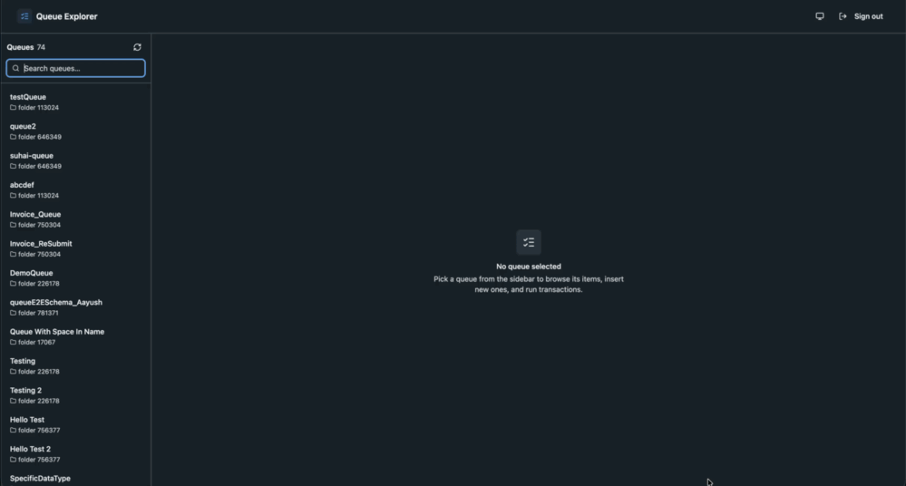

# UiPath Queues Sample App

A sample React + TypeScript application for working with **UiPath Orchestrator queues** via the UiPath TypeScript SDK: browse queues across folders or scoped to one folder, look queues up by name or key, inspect and insert queue items, and run the transaction lifecycle (start a transaction, complete it with output data or failure details). Deploys as a UiPath Coded App.

## Preview



## SDK Usage

### Importing the SDK

```typescript
// Core SDK for authentication
import { UiPath, UiPathError } from '@uipath/uipath-typescript/core';

// Queues service + types
import {
  Queues,
  QueueItemStatus,
  QueuePriority,
  QueueExceptionType,
  QueueTransactionOutcome,
} from '@uipath/uipath-typescript/queues';
import type {
  QueueGetWithMethodsResponse,
  QueueItem,
} from '@uipath/uipath-typescript/queues';
```

### Initializing the SDK

```typescript
// Create SDK instance — empty config is fine for Coded Apps;
// the SDK reads from <meta name="uipath:*"> tags injected by the platform
// (or by the @uipath/coded-apps-dev Vite plugin during local dev).
const sdk = new UiPath();
await sdk.initialize();

const queues = new Queues(sdk);

// Queues returned by getAllWithMethods / getByIdWithMethods / getByName /
// getByKey carry their own folder and come with the operational methods
// bound — no folder threading needed:
const all = await queues.getAllWithMethods();
const queue = all.items[0];

// Folder scoping — every method accepts folderId, folderKey, or folderPath:
const scoped = await queues.getAllWithMethods({ folderId: 756377 });
const byName = await queues.getByName('Invoices', { folderPath: 'Shared/Finance' });
const byKey = await queues.getByKey('<queue-key-guid>', { folderKey: '<folder-key>' });

const page = await queue.getAllItems({ pageSize: 10 });
const item = await queue.insertItem({ invoiceId: 'INV-1001', amount: 1520 });

// Transaction lifecycle (acquisition requires a robot session — see note below)
const transaction = await queue.startTransaction();
if (transaction) {
  await queue.completeTransaction(transaction.id, QueueTransactionOutcome.Successful, {
    outputData: { resultCode: 'OK' },
  });
}
```

### SDK methods exercised by this sample

| Service | Method | Where it's used |
| ------- | ------ | --------------- |
| `Queues` | `getAllWithMethods` | Sidebar queue list — across folders by default, folder-scoped via the folder dropdown (`useQueues`) |
| `Queues` | `getByIdWithMethods` | "Refresh" on the queue detail header (`QueueDetail`) |
| `Queues` | `getByName` | Sidebar search — press Enter on a non-GUID term (`QueuesList`) |
| `Queues` | `getByKey` | Sidebar search — press Enter on a GUID (`QueuesList`) |
| `Queues` | `getAllItems` (bound `queue.getAllItems`) | Items table with status filter + pagination (`useQueueItems`) |
| `Queues` | `insertItemByName` (bound `queue.insertItem`) | "Insert item" dialog (`InsertItemDialog`) |
| `Queues` | `startTransaction` (bound `queue.startTransaction`) | "Start transaction" button (`QueueDetail`) |
| `Queues` | `completeTransaction` (bound `queue.completeTransaction`) | "Complete transaction" dialog on InProgress items (`CompleteTransactionDialog`) |

> The deprecated `getAll`/`getById` are intentionally not used — they return
> plain queue data without the bound methods this app relies on.

> **`startTransaction` requires a robot session.** Orchestrator allocates the
> next item to the robot that sent the request, so user and application
> identities (like this app's OAuth sign-in) always receive `null`, however
> many items are waiting. The app surfaces this as an informational toast —
> it's expected SDK behavior, not an error. Inserting, listing, and
> completing items all work with a user identity.

## Installation

```bash
npm install
```

## Setup Instructions

### 1. Prerequisites

- [Node.js 20+](https://uipath.github.io/uipath-typescript/getting-started/#prerequisites)
- UiPath Cloud tenant access with at least one Orchestrator queue
- An OAuth External Application configured in UiPath Admin Center (Orchestrator queue scopes)

### 2. Configure OAuth Application

1. In UiPath Cloud: **Admin → External Applications**
2. Click **Add Application → Non Confidential Application**
3. Configure:
   - **Name**: e.g., "Queues Sample App"
   - **Redirect URI**: `http://localhost:5173` (for development)
   - **Scopes**: `OR.Queues`
4. Save and copy the **Client ID**

### 3. Local Configuration

Copy the template and fill in your tenant values:

```bash
cp uipath.json.example uipath.json
```

Edit `uipath.json`:

```json
{
  "clientId": "<your-oauth-external-app-client-id>",
  "scope": "OR.Queues",
  "orgName": "<your-org-name>",
  "tenantName": "<your-tenant-name>",
  "baseUrl": "https://api.uipath.com",
  "redirectUri": "http://localhost:5173"
}
```

> `uipath.json` is `.gitignore`d on purpose — it carries tenant-specific credentials. Only `uipath.json.example` is committed.

### 4. Run

```bash
npm run dev
```

Open `http://localhost:5173`.

### 5. Authentication Flow

1. Click **"Sign in with UiPath"**.
2. You'll be redirected to UiPath Cloud for OAuth.
3. After login you return to the app, which initializes the SDK from the `<meta>` tags emitted by `@uipath/coded-apps-dev`.

## Application Structure

```
src/
├── components/
│   ├── Header.tsx                    # App bar: title, theme toggle, sign out
│   ├── LoginScreen.tsx               # OAuth sign-in card
│   ├── QueuesList.tsx                # Sidebar: all queues across folders (+ search)
│   ├── QueueDetail.tsx               # Definition card, items, transaction actions
│   ├── ItemsTable.tsx                # One page of items with row actions
│   ├── ItemInspector.tsx             # Payloads, timing, failure details
│   ├── InsertItemDialog.tsx          # New item: payload + metadata
│   ├── CompleteTransactionDialog.tsx # Outcome, output data, failure details
│   ├── StatusBadge.tsx               # QueueItemStatus / QueuePriority badges
│   ├── ThemeProvider.tsx             # next-themes (light/dark/system)
│   └── ThemeToggle.tsx
├── context/
│   └── AuthContext.tsx               # UiPath SDK init + OAuth lifecycle
├── hooks/
│   ├── useQueues.ts                  # Queues.getAllWithMethods()
│   └── useQueueItems.ts              # queue.getAllItems() with filter + cursors
├── lib/
│   └── format.ts                     # Date + JSON formatting helpers
├── App.tsx                           # Layout: sidebar + detail pane
└── main.tsx
```
